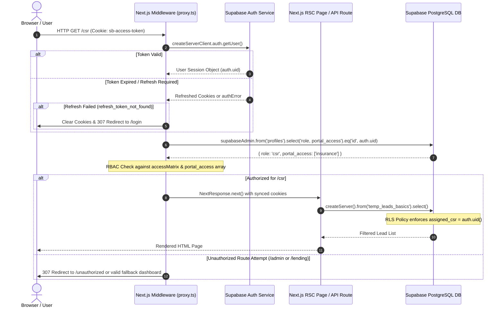

# 07. Exhaustive Authentication & Authorization Architecture
**System Name:** Moonstar Enterprise Insurance, Mortgage & Commercial Lending CRM  

---

## 1. Authentication Engine & Dual-Client Strategy

The CRM relies on Supabase Authentication (`@supabase/ssr@0.8.0` and `@supabase/supabase-js@2.99.1`), implementing a **Server-Side Rendering (SSR) cookie-based session architecture**. To securely balance user-facing operations with system-level administrative tasks, the codebase utilizes two distinct Supabase client instances:

### 1.1 User Session Client (`createServerClient`)
- **Initialized In**: `lib/supabaseServer.ts` (`createServer()`) and `proxy.ts` (Middleware).
- **Credentials**: `NEXT_PUBLIC_SUPABASE_URL` + `NEXT_PUBLIC_SUPABASE_ANON_KEY`.
- **Session Storage**: Reads and sets browser cookies (`request.cookies` / `next/headers` `cookies()`).
- **Behavior**: Every database query executed via this client is bound to the active user's JWT (`auth.uid()`). All queries automatically pass through PostgreSQL Row-Level Security (RLS) policies. If a CSR executes a query without filtering, RLS ensures they only receive their assigned leads (`assigned_csr = auth.uid()`).

### 1.2 Administrative Service Role Client (`supabaseServer` / `supabaseAdmin`)
- **Initialized In**: `lib/supabaseServer.ts` (`supabaseServer`) and `proxy.ts` (`supabaseAdmin`).
- **Credentials**: `NEXT_PUBLIC_SUPABASE_URL` + `SUPABASE_SERVICE_ROLE_KEY`.
- **Session Storage**: Disabled (`auth: { persistSession: false }`).
- **Behavior**: Completely bypasses PostgreSQL RLS. Strictly reserved for Next.js API route handlers (`/api/*`) that have already executed independent role verification (`authenticateApiRequest()`) or background cron operations (`/api/reminder-check`) needing system-wide visibility.

---

## 2. End-to-End Authentication & Session Lifecycle



### Key Session Events:
1. **Login (`/login`, `/lending/login`, `/mortgage/login`)**: When a user submits credentials, the browser client calls `supabase.auth.signInWithPassword()`. Supabase sets HTTP-only, secure cookies (`sb-access-token`, `sb-refresh-token`) on the domain.
2. **Middleware Interception & Cookie Synchronization (`proxy.ts`)**: On every subsequent page request, `proxy.ts` calls `supabase.auth.getUser()`. If the short-lived access token is expired, `@supabase/ssr` silently exchanges the refresh token and writes new cookies to both the request and response objects (`response.cookies.set(...)`), preventing session dropouts during active workflows.
3. **Logout**: Calling `supabase.auth.signOut()` clears local session tokens and instructs the server to expire the browser cookies, redirecting the user back to `/login`.

---

## 3. Role-Based Access Control (RBAC) & Access Matrix

The system governs authorization across two axes: **Global Role (`profiles.role`)** and **Portal Access Array (`profiles.portal_access TEXT[]`)**.

### 3.1 Allowed Role Enumeration
The database check constraint and TypeScript definitions (`utils/auth.ts`, `companyRoles.ts`) restrict `role` to exactly 7 values:
- `csr`: Insurance Customer Service Representative.
- `admin`: Insurance Team Lead / Supervisory Administrator.
- `superadmin`: Global System Architect & Configurator.
- `accounting`: Financial Reconciliation & Commission Officer.
- `lending` / `accurate_lending`: Commercial Real Estate & Business Loan Officer.
- `mortgage`: Residential Mortgage Loan Officer / Processor.

### 3.2 Route Access Matrix (`proxy.ts`)
Middleware enforces explicit path boundary protection before any code is executed:

```typescript
const accessMatrix: Record<string, string[]> = {
  csr: ['/csr'],
  admin: ['/admin', '/csr', '/mortgage'],
  accounting: ['/accounting'],
  superadmin: ['/superadmin', '/admin', '/csr', '/accounting', '/lending', '/accurate_lending', '/mortgage'],
  lending: ['/lending'],
  accurate_lending: ['/lending'],
  mortgage: ['/mortgage']
};
```

### 3.3 Portal Access Array (`portal_access TEXT[]`)
Introduced in migration `20260705_accurate_lending_rbac.sql`, the `portal_access` array allows multi-departmental employees to access more than one portal without changing their primary role:
- If a user attempts to enter `/lending/*`, `proxy.ts` verifies: `portalAccess.includes('lending') || portalAccess.includes('accurate_lending') || isLendingRole || role === 'superadmin'`.
- If a user attempts to enter `/mortgage/*`, `proxy.ts` verifies: `portalAccess.includes('mortgage') || isMortgageRole || role === 'superadmin' || role === 'admin' || user.email?.toLowerCase().includes('moonstar.com')`.

---

## 4. Defensive Backend API Verification (`authenticateApiRequest`)

To guarantee security across serverless endpoints (`app/api/*`), every API route handler executes an independent validation step before processing mutations using `authenticateApiRequest(req, allowedRoles)` (`utils/auth.ts`):

```typescript
export async function authenticateApiRequest(req: Request, allowedRoles?: UserRole[], requireAuth: boolean = true) {
  let user;
  
  // 1. Check Bearer Token (Enables Postman / External API integrations)
  const authHeader = req.headers.get('authorization');
  if (authHeader && authHeader.startsWith('Bearer ')) {
    const token = authHeader.replace('Bearer ', '');
    const { data } = await supabaseServer.auth.getUser(token);
    user = data?.user;
  }

  // 2. Fallback to SSR Cookie Session (Web App Client Requests)
  if (!user) {
    const supabase = await createServer();
    const { data } = await supabase.auth.getUser();
    user = data?.user;
  }

  if (!user && requireAuth) return { error: 'Unauthorized', status: 401 };

  // 3. Verify Role against allowedRoles array
  let profile = null;
  if (allowedRoles && allowedRoles.length > 0) {
    const { data: userProfile } = await supabaseServer
      .from('profiles')
      .select('*')
      .eq('id', user.id)
      .single();

    if (!userProfile || !allowedRoles.includes(userProfile.role)) {
      return { error: 'Forbidden', status: 403 };
    }
    profile = userProfile;
  }

  return { user, profile };
}
```

This ensures dual-layer verification: even if a malicious user bypasses browser middleware by crafting direct `curl` or `fetch` requests against `/api/superadmin/users` or `/api/update-stage`, the API handler blocks them with `403 Forbidden`.
