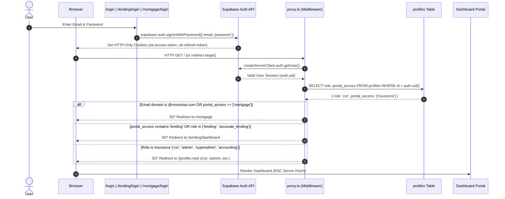
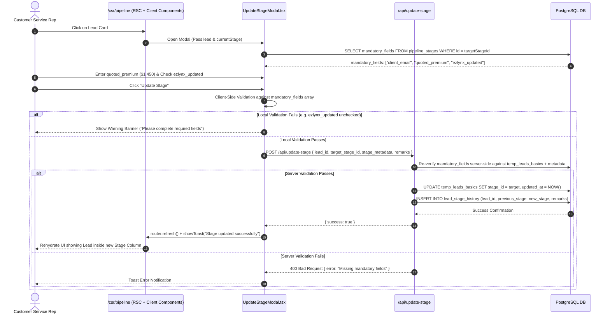
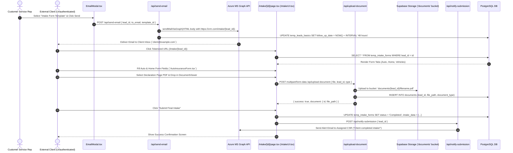
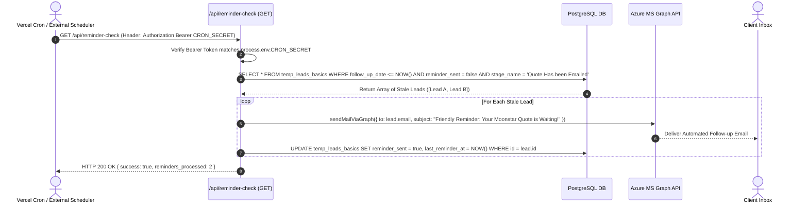
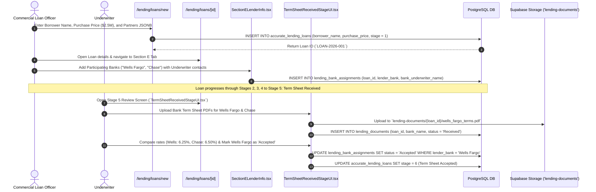
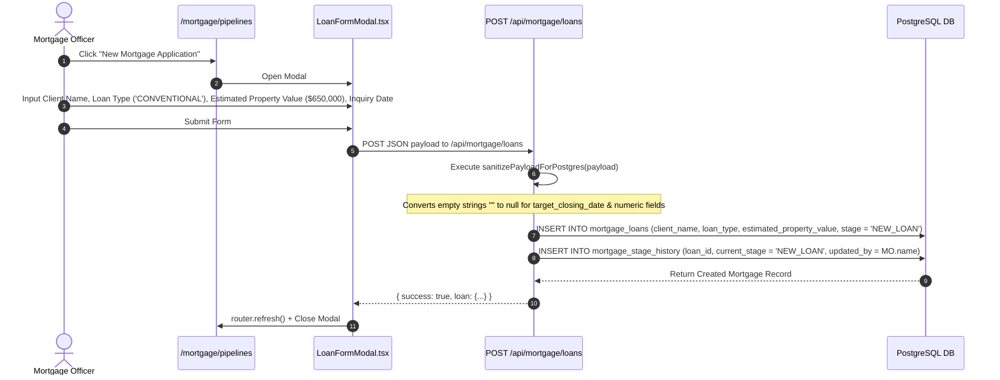
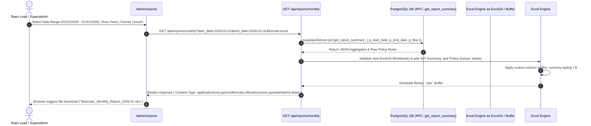

# 09. Comprehensive User Flows & Journey Mapping
**System Name:** Moonstar Enterprise Insurance, Mortgage & Commercial Lending CRM  

---

## 1. Multi-Portal Authentication & Routing Flow

This flow illustrates how incoming login requests are processed, how sessions are verified via cookies (`@supabase/ssr`), and how users are routed across the three isolated domain portals (`Insurance`, `Lending`, `Mortgage`).

---

## 2. CSR Lead Processing & Stage Transition Flow

This journey traces how a Customer Service Representative interacts with a lead card, validates required underwriting fields, and advances the lead through the insurance pipeline.

---

## 3. Unauthenticated Client Intake & Document Upload Flow

This critical workflow illustrates how external customers securely submit personal insurance data and upload prior policy declaration pages via tokenized web links without requiring an account.

---

## 4. Automated SLA Follow-Up & Reminder Flow

This background operational flow demonstrates how hourly serverless cron jobs enforce SLA limits and re-engage non-responsive clients automatically.

---

## 5. Accurate Lending 21-Stage Commercial Loan & Term Sheet Flow

This comprehensive flow tracks a commercial real estate application through multi-bank underwriting (`SectionELenderInfo.tsx`) and term sheet review (`TermSheetReceivedStageUI.tsx`).

---

## 6. Moonstar Mortgage Borrower Application Flow

This journey highlights the residential mortgage application lifecycle and strict payload cleansing (`sanitizePayloadForPostgres()`).

---

## 7. Admin/Superadmin Analytics Reporting & Export Flow

This administrative flow demonstrates how managers generate multi-sheet Excel workbooks (`exceljs`) using sub-second RPC aggregations.

