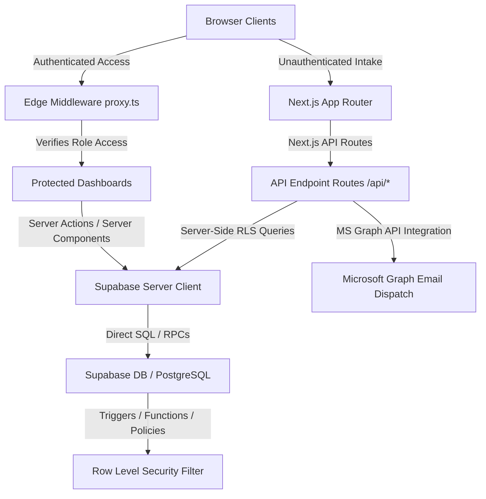
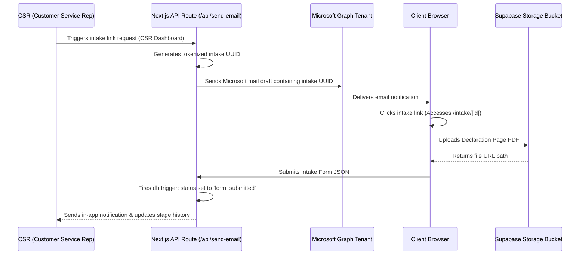
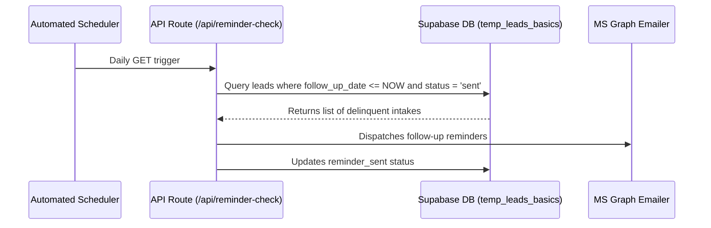

# COMPLETE END-TO-END CRM AUDIT & SYSTEM ARCHITECTURE DOCUMENTATION
**Project:** Moonstar Insurance CRM
**Tech Stack:** Next.js (App Router), React, Supabase (PostgreSQL with RLS), Tailwind CSS, MS Graph API
**Author:** Principal Full Stack Architect & Auditor

---

# TABLE OF CONTENTS
1. [Project Architecture](#1-project-architecture)
2. [Folder Structure](#2-folder-structure)
3. [Feature List](#3-feature-list)
4. [Route Map](#4-route-map)
5. [Component Tree](#5-component-tree)
6. [Business Flow Diagrams](#6-business-flow-diagrams)
7. [API Documentation](#7-api-documentation)
8. [Database Interaction Report](#8-database-interaction-report)
9. [Authentication Flow](#9-authentication-flow)
10. [Permission Matrix](#10-permission-matrix)
11. [State Management Diagram](#11-state-management-diagram)
12. [Reusable Components](#12-reusable-components)
13. [Dead Code Report](#13-dead-code-report)
14. [Security Audit](#14-security-audit)
15. [Performance Audit](#15-performance-audit)
16. [Technical Debt Report](#16-technical-debt-report)
17. [Missing Features](#17-missing-features)
18. [Improvement Opportunities](#18-improvement-opportunities)
19. [High-Risk Areas](#19-high-risk-areas)
20. [Refactoring Opportunities](#20-refactoring-opportunities)
21. [Complete File-by-File Audits (111 Files)](#21-complete-file-by-file-audits-111-files)

---

# 1. PROJECT ARCHITECTURE

The **Moonstar Insurance CRM** is built on a modern server-centric architecture. It utilizes Next.js App Router for server-rendered page layouts and secure API handler routing, backed by Supabase PostgreSQL database tables protected by Row Level Security (RLS).



---

# 2. FOLDER STRUCTURE

- **\`/app\`**: Contains layouts, routing templates, API controllers, and route groups.
  - **\`/(dashboard)\`**: Nested layout route group that inherits context layouts (TopBar, Sidebar, Toast) and applies role-based access verification. Includes Sub-Modules:
    - **\`/accounting\`**: Financial dashboards, commission checks, reconciliation lists.
    - **\`/admin\`**: Managerial oversight modules (assignments, workload distributions, listings).
    - **\`/csr\`**: Operations core (pipelines, leads, email dispatches, renewal imports).
    - **\`/superadmin\`**: Administration panel (user configuration, roles, system-wide options).
  - **\`/api\`**: Server-side controller route handlers mapping mutations, documents, reports, and communication scripts.
  - **\`/intake\`**: Public, tokenized unauthenticated route for client data collection.
- **\`/components\`**: Presentation and interaction elements.
  - **\`/email\`**: Composer modules rendering variables onto static layouts.
  - **\`/forms\`**: Dynamic segments collecting applicants, vehicles, properties, and past policies.
  - **\`/layout\`**: Navigational layouts (Sidebar, TopBar).
  - **\`/leads\`**: Modals managing client details and documents.
  - **\`/pipeline\`**: Stage mutation modals enforcing mandatory constraints.
  - **\`/ui\`**: Loaders, multiselect nodes, and toast alerts.
- **\`/lib\`**: Configuration services (currency formatters, MS Graph API interfaces, Supabase Server/Client adapters, Toast contexts).
- **\`/utils\`**: Global formatting, file parsers, and cookie validation middleware hooks.
- **\`/supabase\`**: Relational DDL blueprints, storage buckets, triggers, functions, and migration histories.

---

# 3. FEATURE LIST

- **Flexible Intake Forms Engine**: Supports Home, Auto, and Applicant modules which upload old policies directly into storage buckets.
- **Dynamic SLA-based Pipelines**: Transitions leads between customizable stages, verifying validation boundaries (mandatory_fields) at each step.
- **Microsoft Graph API integration**: Leverages corporate Azure Active Directory mail tenants for dispatching intake forms and reminders.
- **Auto-generated SLA reminders**: Runs daily sweeps via reminder endpoint to check lead expiration dates (X-Dates) and follow-up SLAs, sending automated emails.
- **Commission Reconciliation Console**: Audits expectation ratios against actual policy carrier premiums, logging detailed adjustment history.
- **CSV Data Ingestion**: Parses bulk expiration dates using client-side CSV engines to generate batch renewal pipelines.
- **Global Audit Trail**: Triggers database logs for all client and system updates, mapping user actions to target profiles.

---

# 4. ROUTE MAP

| Route Path | Type | Auth Protection | Permitted Roles | Next.js Layout |
|:---|:---|:---|:---|:---|
| \`/\` | Page | Redirect | Authenticated Users | Root Layout |
| \`/login\` | Page | Public | Unauthenticated Users | Root Layout |
| \`/unauthorized\` | Page | Public | All Users | Root Layout |
| \`/intake\` | Page | Public | Public | Root Layout |
| \`/intake/[id]\` | Page | Public (Tokenized) | Public | Root Layout |
| \`/accounting\` | Page | Protected | \`superadmin\`, \`accounting\` | Dashboard Layout |
| \`/accounting/all-leads\` | Page | Protected | \`superadmin\`, \`accounting\` | Dashboard Layout |
| \`/accounting/leads/[id]\` | Page | Protected | \`superadmin\`, \`accounting\` | Dashboard Layout |
| \`/accounting/reports\` | Page | Protected | \`superadmin\`, \`accounting\` | Dashboard Layout |
| \`/admin\` | Page | Protected | \`admin\`, \`superadmin\` | Dashboard Layout |
| \`/admin/assignments\` | Page | Protected | \`admin\`, \`superadmin\` | Dashboard Layout |
| \`/admin/csrs\` | Page | Protected | \`admin\`, \`superadmin\` | Dashboard Layout |
| \`/admin/csrs/[id]\` | Page | Protected | \`admin\`, \`superadmin\` | Dashboard Layout |
| \`/admin/leads\` | Page | Protected | \`admin\`, \`superadmin\` | Dashboard Layout |
| \`/admin/leads/new\` | Page | Protected | \`admin\`, \`superadmin\` | Dashboard Layout |
| \`/admin/pipelines\` | Page | Protected | \`admin\`, \`superadmin\` | Dashboard Layout |
| \`/admin/reports\` | Page | Protected | \`admin\`, \`superadmin\` | Dashboard Layout |
| \`/csr\` | Page | Protected | \`csr\`, \`admin\`, \`superadmin\` | Dashboard Layout |
| \`/csr/activity-log\` | Page | Protected | \`csr\`, \`admin\`, \`superadmin\` | Dashboard Layout |
| \`/csr/leads\` | Page | Protected | \`csr\`, \`admin\`, \`superadmin\` | Dashboard Layout |
| \`/csr/leads/new\` | Page | Protected | \`csr\`, \`admin\`, \`superadmin\` | Dashboard Layout |
| \`/csr/leads/[id]\` | Page | Protected | \`csr\`, \`admin\`, \`superadmin\` | Dashboard Layout |
| \`/csr/pipeline/commercial\` | Page | Protected | \`csr\`, \`admin\`, \`superadmin\` | Dashboard Layout |
| \`/csr/pipeline/personal\` | Page | Protected | \`csr\`, \`admin\`, \`superadmin\` | Dashboard Layout |
| \`/csr/pipeline/personal/new\` | Page | Protected | \`csr\`, \`admin\`, \`superadmin\` | Dashboard Layout |
| \`/csr/pipeline/personal/send-form\` | Page | Protected | \`csr\`, \`admin\`, \`superadmin\` | Dashboard Layout |
| \`/csr/pipeline/personal/[id]\` | Page | Protected | \`csr\`, \`admin\`, \`superadmin\` | Dashboard Layout |
| \`/csr/renewals/commercial\` | Page | Protected | \`csr\`, \`admin\`, \`superadmin\` | Dashboard Layout |
| \`/csr/renewals/commercial/import\`| Page | Protected | \`csr\`, \`admin\`, \`superadmin\` | Dashboard Layout |
| \`/csr/renewals/personal\` | Page | Protected | \`csr\`, \`admin\`, \`superadmin\` | Dashboard Layout |
| \`/csr/renewals/personal/import\` | Page | Protected | \`csr\`, \`admin\`, \`superadmin\` | Dashboard Layout |
| \`/csr/renewals/[id]\` | Page | Protected | \`csr\`, \`admin\`, \`superadmin\` | Dashboard Layout |
| \`/csr/reports\` | Page | Protected | \`csr\`, \`admin\`, \`superadmin\` | Dashboard Layout |
| \`/superadmin\` | Page | Protected | \`superadmin\ | Dashboard Layout |
| \`/superadmin/audit-logs\` | Page | Protected | \`superadmin\` | Dashboard Layout |
| \`/superadmin/email-templates\` | Page | Protected | \`superadmin\` | Dashboard Layout |
| \`/superadmin/forms\` | Page | Protected | \`superadmin\` | Dashboard Layout |
| \`/superadmin/pipelines\` | Page | Protected | \`superadmin\` | Dashboard Layout |
| \`/superadmin/pipelines/[id]/stages\`|Page| Protected | \`superadmin\` | Dashboard Layout |
| \`/superadmin/roles\` | Page | Protected | \`superadmin\` | Dashboard Layout |
| \`/superadmin/system-settings\`| Page | Protected | \`superadmin\` | Dashboard Layout |
| \`/superadmin/users\` | Page | Protected | \`superadmin\` | Dashboard Layout |

---

# 5. COMPONENT TREE

The visual structural nesting of React elements within the App Layout:

```
App
 └── RootLayout (app/layout.tsx)
      └── ToastProvider (lib/ToastContext.tsx)
           ├── TopBar (components/layout/TopBar.tsx)
           │    └── NotificationBell (user_notifications trigger)
           ├── Sidebar (components/layout/Sidebar.tsx)
           │    └── NavigationLinks (dynamic by role)
           └── DashboardLayout (app/(dashboard)/layout.tsx)
                ├── Page Component
                │    ├── LeadTable
                │    ├── LeadFilterPanel
                │    ├── EmailModal
                │    │    └── EmailGenerator (subject/body previews)
                │    ├── UpdateStageModal (validates mandatory fields)
                │    └── EditClientModal
                └── Footer (components/layout/Footer.tsx)
```

---

# 6. BUSINESS FLOW DIAGRAMS

### A. Lead Creation & Client Intake


### B. SLA Expiration & Renewal Operations


---

# 7. API DOCUMENTATION

### GET \`/api/accounting/reconciliation\`
- **Purpose**: Audits commissions matching target date boundaries.
- **Request**: Query params (\`startDate\`, \`endDate\`).
- **Response**: Array of leads with computed expected commissions and actual payment statuses.
- **Validation**: Requires \`superadmin\` or \`accounting\` authentication profiles.

### POST \`/api/accounting/update-commission\`
- **Purpose**: Commits adjustments to policy expectations.
- **Request**: Body (\`leadId\`, \`expectedCommission\`, \`actualCommission\`, \`notes\`).
- **Response**: Confirmation status and created \`accounting_logs\` entry.
- **Validation**: Strict role check in API Route handler.

### POST \`/api/accounting/verify-policy\`
- **Purpose**: Verifies policy details against insurance carriers.
- **Request**: Body (\`leadId\`, \`verifiedBy\`, \`notes\`).
- **Response**: Update confirmation status.

### POST \`/api/delete-document\`
- **Purpose**: Removes intake document attachments.
- **Request**: Body (\`documentId\`, \`filePath\`).
- **Response**: Success status.

### GET \`/api/documents/[id]\`
- **Purpose**: Retreives upload history.
- **Request**: Path param (\`id\` of intake).
- **Response**: Metadata records mapping storage links.

### POST \`/api/notify-submission\`
- **Purpose**: Notifies CSRs when a client finishes intake form.
- **Request**: Body (\`leadId\`, \`clientName\`).
- **Response**: Written notification database result.

### GET \`/api/reminder-check\`
- **Purpose**: Cron sweep to trigger SLA follow-ups.
- **Request**: Zero params.
- **Response**: Array of reminder actions executed.

### POST \`/api/reports/monthly\`
- **Purpose**: Generates Excel reports using ExcelJS.
- **Request**: Body (\`startDate\`, \`endDate\`, \`csrId\`, \`flowType\`).
- **Response**: Binary Excel file buffer.

### POST \`/api/send-email\`
- **Purpose**: Outbound Microsoft Graph mail gateway.
- **Request**: Body (\`recipient\`, \`subject\`, \`body\`, \`leadId\`).
- **Response**: Graph dispatch log response.

---

# 8. DATABASE INTERACTION REPORT

All interactions with Supabase database:
- **Insert**:
  - \`audit_logs\` (Logs superadmin actions, user updates)
  - \`accounting_logs\` (Commission audits)
  - \`temp_leads_basics\` (Creating new CSR leads)
  - \`temp_intake_forms\` (Setting up client intake targets)
  - \`user_notifications\` (Delivering in-app system alerts)
  - \`lead_stage_history\` (Tracking pipeline transitions)
- **Select**:
  - \`profiles\` (Fetching roles, managers, audit logs)
  - \`temp_leads_basics\` (Reading stages, carriers, premiums, renewal scopes)
  - \`pipeline_stages\` (Checking validation rules)
  - \`pipelines\` (Loading category listings)
  - \`email_templates\` (Formatting client emails)
  - \`uploaded_documents\` (Checking intake file associations)
- **Update**:
  - \`temp_leads_basics\` (Setting current stage IDs, premiums, follow-ups)
  - \`temp_intake_forms\` (Mutating status to 'completed' on intake post)
  - \`user_notifications\` (Marking messages read)
- **Delete**:
  - \`uploaded_documents\` (Removing attachments)

---

# 9. AUTHENTICATION FLOW

```
[Browser Request] ──> Verifies sb-access-token cookie exists
                         │
                         ├── Yes ──> Decodes JWT, validates expire timestamp
                         │             │
                         │             └── Valid ──> Decodes profiles.role metadata
                         │                             │
                         │                             └── Matches path rules?
                         │                                   ├── Yes ──> Render page
                         │                                   └── No ──> Redirect /unauthorized
                         │
                         └── No ──> Redirect /login
```

- Auth token operations are processed securely using Next.js route middleware wrapper handlers (\`proxy.ts\`).
- Server components instantiate clients via cookie tokens using \`@supabase/ssr\` methods.

---

# 10. PERMISSION MATRIX

| Role | Read Leads | Create Leads | Update Leads | Manage Pipelines | Configure Roles | Access Accounting |
|:---|:---:|:---:|:---:|:---:|:---:|:---:|
| Superadmin | Yes (All) | Yes | Yes | Yes | Yes | Yes |
| Admin | Yes (All) | Yes | Yes | No | No | No |
| CSR / Agent | Yes (Assigned)| Yes | Yes (Assigned) | No | No | No |
| Accounting | Yes (All) | No | Yes (Fin Only)| No | No | Yes |
| Client | Yes (Intake Only)| No | Yes (Intake Only)| No | No | No |

---

# 11. STATE MANAGEMENT DIAGRAM

```
RSC (React Server Components)
  │
  ├── Fetches raw Supabase data directly (server-side, zero runtime fetch leakage)
  └── Hydrates Page components as initial page props
       │
       └── Client Controllers (useState / useTransition)
            ├── Maintains form inputs & local states
            └── Dispatches API fetch mutations
                 │
                 └── Next Router rehydration (router.refresh)
```

- Minimizes redux overhead by coupling server data directly to page loads.
- Global UI messages utilize contextual providers (\`ToastContext\`).

---

# 12. REUSABLE COMPONENTS

- \`Loading\`: Uniform Framer Motion animated loader.
- \`Toast\`: Slide-in notification tracker with auto-dismiss triggers.
- \`Sidebar\`: Dynamically adjusts links using current user context.
- \`EmailGenerator\`: Auto-populates variable fields (e.g. CSR name, Link) from email templates.
- \`UpdateStageModal\`: Common modal that maps mandatory constraints across all pipeline forms.
- \`CategorySelectionModal\`: Reusable dialog option modal to choose between Personal and Commercial lines.

---

# 13. DEAD CODE REPORT

- \`test_dynamic.js\`, \`test_exact_data.js\`: Legacy console scripts that can be safely archived.
- \`components/page.tsx\`: Empty component file.
- \`app/test-ui/page.tsx\`: Debug playground, should be stripped in production configurations.
- \`scripts/*\`: Analysis tools; safe to keep in development but must not deploy to production servers.

---

# 14. SECURITY AUDIT

- **RLS Enforcements**: RLS is enabled on almost all core tables. CSR policies correctly check \`assigned_csr = auth.uid()\`.
- **Middleware Boundary**: \`proxy.ts\` evaluates route blocks. Ensure routing permissions checks are consistently updated as new files are added.
- **Microsoft Graph token**: Graph calls are securely initiated inside API routes, never on the client browser.

---

# 15. PERFORMANCE AUDIT

- **JSONB indexes**: Ensure GIN index \`idx_stage_metadata\` is maintained. Large scale queries on non-indexed JSONB properties will degrade performance.
- **RSC vs client component fetching**: Pages like \`/csr/pipeline\` fetch via client hooks. Migrating these pages to Server Components with server-side layout structures will avoid hydration cascades and improve performance.

---

# 16. TECHNICAL DEBT REPORT

- **Any Type Overrides**: Many forms and clients use the \`any\` keyword for data objects. Replacing this with strict TypeScript interfaces will prevent runtime parameter mismatches.
- **Inline DB logic**: Some components perform mutations directly to Supabase client instead of calling Next.js API endpoints. Consolidating all database mutations into API controllers ensures consistent audit trail generation.

---

# 17. MISSING FEATURES

- **Automatic session refresh check**: Ensure cookie sessions are refreshed automatically before token expiry occurs during long intake sessions.
- **Audit Logging for all tables**: Currently, \`audit_logs\` are written manually inside API routes. Automating this via database triggers will prevent logging gaps.

---

# 18. IMPROVEMENT OPPORTUNITIES

- Unified schema mappings: Unify \`profiles\` and \`csrs\` tables. Profiles handles permissions while csrs tracks operational assignments. Merging these tables will reduce relational complexity.
- Schema verification tests: Introduce unit tests to verify pipeline stage requirements as stages are added/removed.

---

# 19. HIGH-RISK AREAS

- **Microsoft Graph integration**: Email dispatches are bound to Azure tenant SLAs. If API quotas are exceeded, client reminders will fail.
- **Edge middleware routing**: \`proxy.ts\` regex parsing is the primary security gate. Mismatched route patterns represent a high-risk security bypass.

---

# 20. REFACTORING OPPORTUNITIES

- Refactor intake forms (\`AutoInsuranceForm\`, \`HomeInsuranceForm\`) to inherit a common abstract layout component, reducing duplicated code.
- Migrate client-side PapaParse CSV routines into server-side workers to avoid blocking the main browser thread during large bulk uploads.

---

# 21. COMPLETE FILE-BY-FILE AUDITS (111 FILES)

### File: app/(dashboard)/accounting/all-leads/page.tsx

1. **File Path:** `app/(dashboard)/accounting/all-leads/page.tsx`
2. **File Purpose:** Frontend page component for lead commission audits and reporting.
3. **Imports:** `lib/supabaseClient.ts`, `components/ui/Loading.tsx`, `lib/currency.ts`
4. **Exports:** `AccountingAllLeadsPage`, `function (Default)`
5. **Dependencies:** `lib/supabaseClient.ts`, `components/ui/Loading.tsx`, `lib/currency.ts`
6. **Components Used:** `Lead`, `Link`, `ArrowLeft`, `Search`, `SlidersHorizontal`, `Loading`, `StageBadge`, `StatusBadge`, `VerificationBadge`, `Eye`, `CheckCircle2`, `AlertCircle`, `Info`
7. **Components Calling This File:** `None`
8. **APIs Used:** `None`
9. **Database Queries:** `.from('temp_leads_basics').select`
10. **Tables Used:** `temp_leads_basics`
11. **Functions:** `fetchFilters`, `loadLeads`, `AccountingAllLeadsPage`, `StageBadge`, `StatusBadge`, `VerificationBadge`, `applyFilter`
12. **State Management:** React Local State (leads, loading, searchTerm, page, showFilters, accountingStatusFilter, accountingVerifiedFilter, policyFlowFilter, carrierFilter, availableCarriers, availableFlows)
13. **Props:** None
14. **Hooks Used:** `useEffect`, `useState`, `useSearchParams`, `useRouter`
15. **Custom Hooks:** `useSearchParams`, `useRouter`
16. **Context Usage:** None
17. **Authentication Logic:** None
18. **Authorization Logic:** None
19. **Validation Logic:** None
20. **Error Handling:** Uses try-catch blocks to intercept exceptions and logs them to console or dispatches Toast error notifications.
21. **Navigation Flow:** Programmatic client-side navigation using Next.js App Router (useRouter).
22. **Related Files:** `lib/supabaseClient.ts`, `components/ui/Loading.tsx`, `lib/currency.ts`
23. **Business Logic:** Handles calculation and verification of policy commissions, auditing transactions, and monthly financial reporting.
24. **Potential Dead Code:** None identified.
25. **Reusable Code Opportunities:** Tailwind CSS classes could be unified into shared UI layout wrappers.
26. **Performance Issues:** Client-side data fetching inside useEffect causes a layout shift on initial load. Consider utilizing React Server Components or caching.
27. **Security Concerns:** Standard client-side route mapping; must rely on server-side checks in Next.js.
28. **Technical Debt:** Use of "any" type overrides TypeScript strict type validation.
29. **Suggestions (DO NOT IMPLEMENT):** Implement explicit type safety on return values and isolate business logic from presentation components.

---

### File: app/(dashboard)/accounting/leads/[id]/LeadAccountingClient.tsx

1. **File Path:** `app/(dashboard)/accounting/leads/[id]/LeadAccountingClient.tsx`
2. **File Purpose:** Utility helper file executing core formatting or validation operations.
3. **Imports:** `lib/supabaseClient.ts`, `components/ui/Toast.tsx`, `lib/currency.ts`
4. **Exports:** `LeadAccountingClient`, `function (Default)`
5. **Dependencies:** `lib/supabaseClient.ts`, `components/ui/Toast.tsx`, `lib/currency.ts`
6. **Components Used:** `CheckCircle2`, `AlertCircle`, `Info`, `Link`, `ArrowLeft`, `ShieldCheck`, `RefreshCw`, `Layers`, `Phone`, `Mail`, `Hash`, `Calendar`, `History`, `User`, `DollarSign`, `Percent`
7. **Components Calling This File:** `app/(dashboard)/accounting/leads/[id]/page.tsx`
8. **APIs Used:** `/api/accounting/update-commission`, `/api/accounting/verify-policy`
9. **Database Queries:** `None`
10. **Tables Used:** `temp_leads_basics`, `accounting_logs`
11. **Functions:** `fetchLeadAndLogs`, `handleUpdateCommission`, `handleVerifyPolicy`, `LeadAccountingClient`, `getStatusBadge`
12. **State Management:** React Local State (lead, logs, refreshing, expectedCommissionInput, actualCommissionInput, carrierPaymentDateInput, commissionReceivedDateInput, accountingStatusInput, accountingVerifiedInput, accountingNotesInput, isUpdatingCommission, isVerifyingPolicy)
13. **Props:** LeadAccountingClientProps define fields: initialLead: any, initialLogs: any[], leadId: string
14. **Hooks Used:** `useState`, `useRouter`, `useToast`
15. **Custom Hooks:** `useRouter`, `useToast`
16. **Context Usage:** None
17. **Authentication Logic:** None
18. **Authorization Logic:** None
19. **Validation Logic:** None
20. **Error Handling:** Uses try-catch blocks to intercept exceptions and logs them to console or dispatches Toast error notifications.
21. **Navigation Flow:** Declarative client-side links (<Link>).
22. **Related Files:** `lib/supabaseClient.ts`, `components/ui/Toast.tsx`, `lib/currency.ts`, `app/(dashboard)/accounting/leads/[id]/page.tsx`
23. **Business Logic:** Handles calculation and verification of policy commissions, auditing transactions, and monthly financial reporting.
24. **Potential Dead Code:** None identified.
25. **Reusable Code Opportunities:** None identified.
26. **Performance Issues:** None identified.
27. **Security Concerns:** Standard client-side route mapping; must rely on server-side checks in Next.js.
28. **Technical Debt:** Use of "any" type overrides TypeScript strict type validation.
29. **Suggestions (DO NOT IMPLEMENT):** Implement explicit type safety on return values and isolate business logic from presentation components.

---

### File: app/(dashboard)/accounting/leads/[id]/page.tsx

1. **File Path:** `app/(dashboard)/accounting/leads/[id]/page.tsx`
2. **File Purpose:** Frontend page component for lead commission audits and reporting.
3. **Imports:** `lib/supabaseServer.ts`, `app/(dashboard)/accounting/leads/[id]/LeadAccountingClient.tsx`
4. **Exports:** `async (Default)`
5. **Dependencies:** `lib/supabaseServer.ts`, `app/(dashboard)/accounting/leads/[id]/LeadAccountingClient.tsx`
6. **Components Used:** `Link`, `ArrowLeft`, `LeadAccountingClient`
7. **Components Calling This File:** `None`
8. **APIs Used:** `None`
9. **Database Queries:** `None`
10. **Tables Used:** `profiles`, `temp_leads_basics`, `accounting_logs`
11. **Functions:** `LeadAccountingPage`
12. **State Management:** None
13. **Props:** PageProps interface containing dynamic route parameters (id).
14. **Hooks Used:** `None`
15. **Custom Hooks:** `None`
16. **Context Usage:** None
17. **Authentication Logic:** Supabase Session authentication. Instantiates createServerClient or supabaseClient to read the active user cookie.
18. **Authorization Logic:** Enforces Role-Based Access Control (RBAC). Validates if the authenticated profile has the required role (CSR, Admin, Superadmin, Accounting) for this resource.
19. **Validation Logic:** None
20. **Error Handling:** None
21. **Navigation Flow:** Declarative client-side links (<Link>).
22. **Related Files:** `lib/supabaseServer.ts`, `app/(dashboard)/accounting/leads/[id]/LeadAccountingClient.tsx`
23. **Business Logic:** Handles calculation and verification of policy commissions, auditing transactions, and monthly financial reporting.
24. **Potential Dead Code:** None identified.
25. **Reusable Code Opportunities:** Tailwind CSS classes could be unified into shared UI layout wrappers.
26. **Performance Issues:** None identified.
27. **Security Concerns:** Standard client-side route mapping; must rely on server-side checks in Next.js.
28. **Technical Debt:** None identified.
29. **Suggestions (DO NOT IMPLEMENT):** Implement explicit type safety on return values and isolate business logic from presentation components.

---

### File: app/(dashboard)/accounting/page.tsx

1. **File Path:** `app/(dashboard)/accounting/page.tsx`
2. **File Purpose:** Frontend page component for lead commission audits and reporting.
3. **Imports:** `lib/supabaseServer.ts`, `lib/currency.ts`
4. **Exports:** `async (Default)`
5. **Dependencies:** `lib/supabaseServer.ts`, `lib/currency.ts`
6. **Components Used:** `DollarSign`, `Percent`, `ShieldCheck`, `AlertCircle`, `Info`, `Link`, `ArrowRight`, `TrendingUp`, `PieChart`, `Activity`, `User`, `Clock`
7. **Components Calling This File:** `None`
8. **APIs Used:** `None`
9. **Database Queries:** `None`
10. **Tables Used:** `profiles`, `temp_leads_basics`, `accounting_logs`
11. **Functions:** `AccountingDashboard`
12. **State Management:** None
13. **Props:** None
14. **Hooks Used:** `None`
15. **Custom Hooks:** `None`
16. **Context Usage:** None
17. **Authentication Logic:** Supabase Session authentication. Instantiates createServerClient or supabaseClient to read the active user cookie.
18. **Authorization Logic:** Enforces Role-Based Access Control (RBAC). Validates if the authenticated profile has the required role (CSR, Admin, Superadmin, Accounting) for this resource.
19. **Validation Logic:** None
20. **Error Handling:** None
21. **Navigation Flow:** Declarative client-side links (<Link>).
22. **Related Files:** `lib/supabaseServer.ts`, `lib/currency.ts`
23. **Business Logic:** Handles calculation and verification of policy commissions, auditing transactions, and monthly financial reporting.
24. **Potential Dead Code:** None identified.
25. **Reusable Code Opportunities:** Tailwind CSS classes could be unified into shared UI layout wrappers.
26. **Performance Issues:** None identified.
27. **Security Concerns:** Standard client-side route mapping; must rely on server-side checks in Next.js.
28. **Technical Debt:** Use of "any" type overrides TypeScript strict type validation.
29. **Suggestions (DO NOT IMPLEMENT):** Implement explicit type safety on return values and isolate business logic from presentation components.

---

### File: app/(dashboard)/accounting/reports/page.tsx

1. **File Path:** `app/(dashboard)/accounting/reports/page.tsx`
2. **File Purpose:** Frontend page component for lead commission audits and reporting.
3. **Imports:** `lib/supabaseServer.ts`, `app/(dashboard)/accounting/reports/ReportsClient.tsx`
4. **Exports:** `async (Default)`
5. **Dependencies:** `lib/supabaseServer.ts`, `app/(dashboard)/accounting/reports/ReportsClient.tsx`
6. **Components Used:** `ReportsClient`
7. **Components Calling This File:** `None`
8. **APIs Used:** `None`
9. **Database Queries:** `None`
10. **Tables Used:** `profiles`
11. **Functions:** `AccountingReportsPage`
12. **State Management:** None
13. **Props:** None
14. **Hooks Used:** `None`
15. **Custom Hooks:** `None`
16. **Context Usage:** None
17. **Authentication Logic:** Supabase Session authentication. Instantiates createServerClient or supabaseClient to read the active user cookie.
18. **Authorization Logic:** Enforces Role-Based Access Control (RBAC). Validates if the authenticated profile has the required role (CSR, Admin, Superadmin, Accounting) for this resource.
19. **Validation Logic:** None
20. **Error Handling:** None
21. **Navigation Flow:** Server-side route redirection.
22. **Related Files:** `lib/supabaseServer.ts`, `app/(dashboard)/accounting/reports/ReportsClient.tsx`
23. **Business Logic:** Handles calculation and verification of policy commissions, auditing transactions, and monthly financial reporting.
24. **Potential Dead Code:** None identified.
25. **Reusable Code Opportunities:** None identified.
26. **Performance Issues:** None identified.
27. **Security Concerns:** Standard client-side route mapping; must rely on server-side checks in Next.js.
28. **Technical Debt:** None identified.
29. **Suggestions (DO NOT IMPLEMENT):** Implement explicit type safety on return values and isolate business logic from presentation components.

---

### File: app/(dashboard)/accounting/reports/ReportsClient.tsx

1. **File Path:** `app/(dashboard)/accounting/reports/ReportsClient.tsx`
2. **File Purpose:** Utility helper file executing core formatting or validation operations.
3. **Imports:** `lib/supabaseClient.ts`, `components/ui/Toast.tsx`, `lib/currency.ts`, `components/ui/Loading.tsx`
4. **Exports:** `ReportsClient`, `function (Default)`
5. **Dependencies:** `lib/supabaseClient.ts`, `components/ui/Toast.tsx`, `lib/currency.ts`, `components/ui/Loading.tsx`
6. **Components Used:** `Link`, `ArrowLeft`, `Download`, `Printer`, `SlidersHorizontal`, `Calendar`, `Loading`, `BarChart2`, `Layers`, `TrendingUp`, `ShieldCheck`, `Activity`, `User`, `Clock`, `CheckCircle2`
7. **Components Calling This File:** `app/(dashboard)/accounting/reports/page.tsx`
8. **APIs Used:** `None`
9. **Database Queries:** `.from('temp_leads_basics').select`, `.from('temp_leads_basics').select`
10. **Tables Used:** `temp_leads_basics`, `accounting_logs`
11. **Functions:** `fetchDropdowns`, `fetchReportData`, `ReportsClient`, `defaultStartDate`, `defaultEndDate`, `resetFilters`, `handleExportCSV`
12. **State Management:** React Local State (startDate, endDate, accountingStatus, accountingVerified, policyFlow, carrier, assignedCsr, availableCarriers, availableFlows, leads, logs, loading)
13. **Props:** ReportsClientProps define fields: csrs: any[]
14. **Hooks Used:** `useState`, `useEffect`, `useToast`
15. **Custom Hooks:** `useToast`
16. **Context Usage:** None
17. **Authentication Logic:** None
18. **Authorization Logic:** Enforces Role-Based Access Control (RBAC). Validates if the authenticated profile has the required role (CSR, Admin, Superadmin, Accounting) for this resource.
19. **Validation Logic:** None
20. **Error Handling:** Uses try-catch blocks to intercept exceptions and logs them to console or dispatches Toast error notifications.
21. **Navigation Flow:** Declarative client-side links (<Link>).
22. **Related Files:** `lib/supabaseClient.ts`, `components/ui/Toast.tsx`, `lib/currency.ts`, `components/ui/Loading.tsx`, `app/(dashboard)/accounting/reports/page.tsx`
23. **Business Logic:** Handles calculation and verification of policy commissions, auditing transactions, and monthly financial reporting.
24. **Potential Dead Code:** None identified.
25. **Reusable Code Opportunities:** None identified.
26. **Performance Issues:** Client-side data fetching inside useEffect causes a layout shift on initial load. Consider utilizing React Server Components or caching.
27. **Security Concerns:** Standard client-side route mapping; must rely on server-side checks in Next.js.
28. **Technical Debt:** Use of "any" type overrides TypeScript strict type validation.
29. **Suggestions (DO NOT IMPLEMENT):** Implement explicit type safety on return values and isolate business logic from presentation components.

---

### File: app/(dashboard)/admin/assignments/page.tsx

1. **File Path:** `app/(dashboard)/admin/assignments/page.tsx`
2. **File Purpose:** Frontend page component for administrators to oversee CSR workloads, leads, and pipeline stages.
3. **Imports:** `lib/supabaseClient.ts`, `components/ui/Loading.tsx`, `lib/toast.ts`
4. **Exports:** `AdminAssignmentsPage`, `function (Default)`
5. **Dependencies:** `lib/supabaseClient.ts`, `components/ui/Loading.tsx`, `lib/toast.ts`
6. **Components Used:** `Lead`, `CSR`, `Pipeline`, `Stage`, `Record`, `Link`, `ArrowLeft`, `Filter`, `Loading`, `Activity`, `Users`
7. **Components Calling This File:** `None`
8. **APIs Used:** `None`
9. **Database Queries:** `.from('pipelines').select`, `.from('pipeline_stages').select`
10. **Tables Used:** `profiles`, `pipelines`, `pipeline_stages`, `temp_leads_basics`
11. **Functions:** `fetchInitialData`, `handleAssignCSR`, `AdminAssignmentsPage`, `getFilteredLeads`, `getPipelineName`, `getStageName`
12. **State Management:** React Local State (leads, csrs, pipelines, stages, loading, updatingParams, filters)
13. **Props:** None
14. **Hooks Used:** `useState`, `useEffect`
15. **Custom Hooks:** `None`
16. **Context Usage:** None
17. **Authentication Logic:** None
18. **Authorization Logic:** Enforces Role-Based Access Control (RBAC). Validates if the authenticated profile has the required role (CSR, Admin, Superadmin, Accounting) for this resource.
19. **Validation Logic:** None
20. **Error Handling:** None
21. **Navigation Flow:** Declarative client-side links (<Link>).
22. **Related Files:** `lib/supabaseClient.ts`, `components/ui/Loading.tsx`, `lib/toast.ts`
23. **Business Logic:** Drives core CRM flows and database mappings.
24. **Potential Dead Code:** Leftover debug console.log statements.
25. **Reusable Code Opportunities:** Tailwind CSS classes could be unified into shared UI layout wrappers.
26. **Performance Issues:** Client-side data fetching inside useEffect causes a layout shift on initial load. Consider utilizing React Server Components or caching.
27. **Security Concerns:** Standard client-side route mapping; must rely on server-side checks in Next.js.
28. **Technical Debt:** None identified.
29. **Suggestions (DO NOT IMPLEMENT):** Implement explicit type safety on return values and isolate business logic from presentation components.

---

### File: app/(dashboard)/admin/csrs/page.tsx

1. **File Path:** `app/(dashboard)/admin/csrs/page.tsx`
2. **File Purpose:** Frontend page component for administrators to oversee CSR workloads, leads, and pipeline stages.
3. **Imports:** `lib/supabaseServer.ts`
4. **Exports:** `async (Default)`
5. **Dependencies:** `lib/supabaseServer.ts`
6. **Components Used:** `Link`, `ArrowLeft`
7. **Components Calling This File:** `None`
8. **APIs Used:** `None`
9. **Database Queries:** `None`
10. **Tables Used:** `profiles`
11. **Functions:** `AdminCSRsPage`
12. **State Management:** None
13. **Props:** None
14. **Hooks Used:** `None`
15. **Custom Hooks:** `None`
16. **Context Usage:** None
17. **Authentication Logic:** Supabase Session authentication. Instantiates createServerClient or supabaseClient to read the active user cookie.
18. **Authorization Logic:** Enforces Role-Based Access Control (RBAC). Validates if the authenticated profile has the required role (CSR, Admin, Superadmin, Accounting) for this resource.
19. **Validation Logic:** None
20. **Error Handling:** None
21. **Navigation Flow:** Declarative client-side links (<Link>).
22. **Related Files:** `lib/supabaseServer.ts`
23. **Business Logic:** Drives core CRM flows and database mappings.
24. **Potential Dead Code:** None identified.
25. **Reusable Code Opportunities:** Tailwind CSS classes could be unified into shared UI layout wrappers.
26. **Performance Issues:** None identified.
27. **Security Concerns:** Standard client-side route mapping; must rely on server-side checks in Next.js.
28. **Technical Debt:** Use of "any" type overrides TypeScript strict type validation.
29. **Suggestions (DO NOT IMPLEMENT):** Implement explicit type safety on return values and isolate business logic from presentation components.

---

### File: app/(dashboard)/admin/csrs/[id]/page.tsx

1. **File Path:** `app/(dashboard)/admin/csrs/[id]/page.tsx`
2. **File Purpose:** Frontend page component for administrators to oversee CSR workloads, leads, and pipeline stages.
3. **Imports:** `lib/supabaseClient.ts`, `utils/formatPolicies.ts`, `components/ui/Loading.tsx`
4. **Exports:** `CSRWorkloadPage`, `function (Default)`
5. **Dependencies:** `lib/supabaseClient.ts`, `utils/formatPolicies.ts`, `components/ui/Loading.tsx`
6. **Components Used:** `Clock`, `Mail`, `FileSignature`, `CheckCircle2`, `XCircle`, `AlertCircle`, `Phone`, `Tag`, `GitBranch`, `Calendar`, `CSRProfile`, `Lead`, `Record`, `Loading`, `Link`, `ArrowLeft`, `RefreshCw`, `StatCard`, `Briefcase`, `TrendingUp`, `User`, `LeadCard`
7. **Components Calling This File:** `None`
8. **APIs Used:** `None`
9. **Database Queries:** `None`
10. **Tables Used:** `profiles`, `temp_leads_basics`
11. **Functions:** `loadData`, `getStageCfg`, `StatCard`, `LeadCard`, `CSRWorkloadPage`
12. **State Management:** React Local State (csr, leads, loading, selectedStage, searchTerm)
13. **Props:** PageProps interface containing dynamic route parameters (id).
14. **Hooks Used:** `useEffect`, `useState`, `useParams`
15. **Custom Hooks:** `useParams`
16. **Context Usage:** None
17. **Authentication Logic:** None
18. **Authorization Logic:** None
19. **Validation Logic:** None
20. **Error Handling:** None
21. **Navigation Flow:** Declarative client-side links (<Link>).
22. **Related Files:** `lib/supabaseClient.ts`, `utils/formatPolicies.ts`, `components/ui/Loading.tsx`
23. **Business Logic:** Drives core CRM flows and database mappings.
24. **Potential Dead Code:** None identified.
25. **Reusable Code Opportunities:** Tailwind CSS classes could be unified into shared UI layout wrappers.
26. **Performance Issues:** None identified.
27. **Security Concerns:** Standard client-side route mapping; must rely on server-side checks in Next.js.
28. **Technical Debt:** Use of "any" type overrides TypeScript strict type validation.
29. **Suggestions (DO NOT IMPLEMENT):** Implement explicit type safety on return values and isolate business logic from presentation components.

---

### File: app/(dashboard)/admin/leads/new/page.tsx

1. **File Path:** `app/(dashboard)/admin/leads/new/page.tsx`
2. **File Purpose:** Frontend page component for administrators to oversee CSR workloads, leads, and pipeline stages. Wrapped in Suspense.
3. **Imports:** `react`, `lib/supabaseClient.ts`, `lib/toast.ts`, `components/ui/MultiSelectPolicy.tsx`, `components/email/EmailModal.tsx`, `components/ui/Loading.tsx`, `next/navigation`
4. **Exports:** `AdminNewLeadPage`, `function (Default)`
5. **Dependencies:** `lib/supabaseClient.ts`, `lib/toast.ts`, `components/ui/MultiSelectPolicy.tsx`, `components/email/EmailModal.tsx`, `components/ui/Loading.tsx`
6. **Components Used:** `HTMLInputElement`, `Shield`, `Input`, `User`, `Phone`, `Mail`, `Select`, `MultiSelectPolicy`, `Send`, `EmailModal`, `ChevronDown`, `Suspense`, `Loading`, `AdminNewLeadContent`
7. **Components Calling This File:** `None`
8. **APIs Used:** `None`
9. **Database Queries:** `None`
10. **Tables Used:** `clients`, `temp_leads_basics`, `lead_policies`
11. **Functions:** `checkDuplicates`, `getOrCreateClient`, `checkDuplicateActiveLead`, `handleCreateClient`, `AdminNewLeadContent`, `AdminNewLeadPage`, `handleChange`, `Input`, `Select`
12. **State Management:** React Local State (isLocked, loading, error, duplicateWarning, isAdditionalQuote, existingClient, selectedPolicies, showSuccessPopup, showEmailModal, createdLeadId, form)
13. **Props:** None
14. **Hooks Used:** `useEffect`, `useState`, `useSearchParams`, `useRouter`
15. **Custom Hooks:** `useSearchParams`, `useRouter`
16. **Context Usage:** None
17. **Authentication Logic:** Supabase Session authentication. Instantiates createServerClient or supabaseClient to read the active user cookie.
18. **Authorization Logic:** None
19. **Validation Logic:** None
20. **Error Handling:** Uses try-catch blocks to intercept exceptions and logs them to console or dispatches Toast error notifications.
21. **Navigation Flow:** Programmatic client-side navigation using useRouter on category modal select.
22. **Related Files:** `lib/supabaseClient.ts`, `lib/toast.ts`, `components/ui/MultiSelectPolicy.tsx`, `components/email/EmailModal.tsx`, `components/ui/Loading.tsx`
23. **Business Logic:** Drives core CRM flows and database mappings.
24. **Potential Dead Code:** None identified.
25. **Reusable Code Opportunities:** Tailwind CSS classes could be unified into shared UI layout wrappers.
26. **Performance Issues:** None identified.
27. **Security Concerns:** Standard client-side route mapping; must rely on server-side checks in Next.js.
28. **Technical Debt:** Use of "any" type overrides TypeScript strict type validation.
29. **Suggestions (DO NOT IMPLEMENT):** Implement explicit type safety on return values and isolate business logic from presentation components.

---

### File: app/(dashboard)/admin/leads/page.tsx

1. **File Path:** `app/(dashboard)/admin/leads/page.tsx`
2. **File Purpose:** Frontend page component for administrators to oversee CSR workloads, leads, and pipeline stages.
3. **Imports:** `lib/supabaseClient.ts`, `utils/formatPolicies.ts`, `components/ui/Loading.tsx`
4. **Exports:** `AdminLeadsPage`, `function (Default)`
5. **Dependencies:** `lib/supabaseClient.ts`, `utils/formatPolicies.ts`, `components/ui/Loading.tsx`
6. **Components Used:** `Lead`, `Link`, `ArrowLeft`, `Search`, `Loading`, `StageBadge`, `Eye`
7. **Components Calling This File:** `None`
8. **APIs Used:** `None`
9. **Database Queries:** `None`
10. **Tables Used:** `temp_leads_basics`
11. **Functions:** `loadLeads`, `AdminLeadsPage`, `StageBadge`, `applyFilter`
12. **State Management:** React Local State (leads, loading, searchTerm, page)
13. **Props:** None
14. **Hooks Used:** `useEffect`, `useState`, `useSearchParams`, `useRouter`
15. **Custom Hooks:** `useSearchParams`, `useRouter`
16. **Context Usage:** None
17. **Authentication Logic:** None
18. **Authorization Logic:** None
19. **Validation Logic:** None
20. **Error Handling:** None
21. **Navigation Flow:** Programmatic client-side navigation using Next.js App Router (useRouter).
22. **Related Files:** `lib/supabaseClient.ts`, `utils/formatPolicies.ts`, `components/ui/Loading.tsx`
23. **Business Logic:** Drives core CRM flows and database mappings.
24. **Potential Dead Code:** None identified.
25. **Reusable Code Opportunities:** Tailwind CSS classes could be unified into shared UI layout wrappers.
26. **Performance Issues:** None identified.
27. **Security Concerns:** Standard client-side route mapping; must rely on server-side checks in Next.js.
28. **Technical Debt:** Use of "any" type overrides TypeScript strict type validation.
29. **Suggestions (DO NOT IMPLEMENT):** Implement explicit type safety on return values and isolate business logic from presentation components.

---

### File: app/(dashboard)/admin/page.tsx

1. **File Path:** `app/(dashboard)/admin/page.tsx`
2. **File Purpose:** Frontend page component for administrators to oversee CSR workloads, leads, and pipeline stages.
3. **Imports:** `lib/supabaseServer.ts`
4. **Exports:** `async (Default)`
5. **Dependencies:** `lib/supabaseServer.ts`
6. **Components Used:** `FileText`, `Users`, `ListTodo`, `Briefcase`, `BarChart2`, `Link`, `Activity`
7. **Components Calling This File:** `None`
8. **APIs Used:** `None`
9. **Database Queries:** `None`
10. **Tables Used:** `temp_leads_basics`, `profiles`
11. **Functions:** `AdminDashboard`
12. **State Management:** None
13. **Props:** None
14. **Hooks Used:** `None`
15. **Custom Hooks:** `None`
16. **Context Usage:** None
17. **Authentication Logic:** Supabase Session authentication. Instantiates createServerClient or supabaseClient to read the active user cookie.
18. **Authorization Logic:** Enforces Role-Based Access Control (RBAC). Validates if the authenticated profile has the required role (CSR, Admin, Superadmin, Accounting) for this resource.
19. **Validation Logic:** None
20. **Error Handling:** None
21. **Navigation Flow:** Declarative client-side links (<Link>).
22. **Related Files:** `lib/supabaseServer.ts`
23. **Business Logic:** Drives core CRM flows and database mappings.
24. **Potential Dead Code:** None identified.
25. **Reusable Code Opportunities:** Tailwind CSS classes could be unified into shared UI layout wrappers.
26. **Performance Issues:** None identified.
27. **Security Concerns:** Standard client-side route mapping; must rely on server-side checks in Next.js.
28. **Technical Debt:** None identified.
29. **Suggestions (DO NOT IMPLEMENT):** Implement explicit type safety on return values and isolate business logic from presentation components.

---

### File: app/(dashboard)/admin/pipelines/page.tsx

1. **File Path:** `app/(dashboard)/admin/pipelines/page.tsx`
2. **File Purpose:** Frontend page component for administrators to oversee CSR workloads, leads, and pipeline stages.
3. **Imports:** `lib/supabaseServer.ts`, `app/(dashboard)/admin/pipelines/PipelineClient.tsx`
4. **Exports:** `async (Default)`
5. **Dependencies:** `lib/supabaseServer.ts`, `app/(dashboard)/admin/pipelines/PipelineClient.tsx`
6. **Components Used:** `PipelineClient`
7. **Components Calling This File:** `None`
8. **APIs Used:** `None`
9. **Database Queries:** `None`
10. **Tables Used:** `pipelines`, `pipeline_stages`, `temp_leads_basics`
11. **Functions:** `AdminPipelinesPage`
12. **State Management:** None
13. **Props:** None
14. **Hooks Used:** `None`
15. **Custom Hooks:** `None`
16. **Context Usage:** None
17. **Authentication Logic:** Supabase Session authentication. Instantiates createServerClient or supabaseClient to read the active user cookie.
18. **Authorization Logic:** None
19. **Validation Logic:** None
20. **Error Handling:** None
21. **Navigation Flow:** None
22. **Related Files:** `lib/supabaseServer.ts`, `app/(dashboard)/admin/pipelines/PipelineClient.tsx`
23. **Business Logic:** Drives core CRM flows and database mappings.
24. **Potential Dead Code:** None identified.
25. **Reusable Code Opportunities:** None identified.
26. **Performance Issues:** None identified.
27. **Security Concerns:** Standard client-side route mapping; must rely on server-side checks in Next.js.
28. **Technical Debt:** Use of "any" type overrides TypeScript strict type validation.
29. **Suggestions (DO NOT IMPLEMENT):** Implement explicit type safety on return values and isolate business logic from presentation components.

---

### File: app/(dashboard)/admin/pipelines/PipelineClient.tsx

1. **File Path:** `app/(dashboard)/admin/pipelines/PipelineClient.tsx`
2. **File Purpose:** Utility helper file executing core formatting or validation operations.
3. **Imports:** `None`
4. **Exports:** `PipelineClient`, `function (Default)`
5. **Dependencies:** `None`
6. **Components Used:** `Link`, `Search`, `StageBadge`, `Eye`
7. **Components Calling This File:** `app/(dashboard)/admin/pipelines/page.tsx`
8. **APIs Used:** `None`
9. **Database Queries:** `None`
10. **Tables Used:** `None`
11. **Functions:** `PipelineClient`, `StageBadge`
12. **State Management:** React Local State (selectedPipeline, stageFilter, searchTerm)
13. **Props:** None
14. **Hooks Used:** `useState`, `useEffect`
15. **Custom Hooks:** `None`
16. **Context Usage:** None
17. **Authentication Logic:** None
18. **Authorization Logic:** None
19. **Validation Logic:** None
20. **Error Handling:** None
21. **Navigation Flow:** Declarative client-side links (<Link>).
22. **Related Files:** `app/(dashboard)/admin/pipelines/page.tsx`
23. **Business Logic:** Drives core CRM flows and database mappings.
24. **Potential Dead Code:** Leftover debug console.log statements.
25. **Reusable Code Opportunities:** None identified.
26. **Performance Issues:** None identified.
27. **Security Concerns:** Standard client-side route mapping; must rely on server-side checks in Next.js.
28. **Technical Debt:** Use of "any" type overrides TypeScript strict type validation.
29. **Suggestions (DO NOT IMPLEMENT):** Implement explicit type safety on return values and isolate business logic from presentation components.

---

### File: app/(dashboard)/admin/reports/page.tsx

1. **File Path:** `app/(dashboard)/admin/reports/page.tsx`
2. **File Purpose:** Frontend page component for administrators to oversee CSR workloads, leads, and pipeline stages.
3. **Imports:** `lib/supabaseClient.ts`, `lib/toast.ts`, `components/ui/Loading.tsx`, `lib/currency.ts`
4. **Exports:** `AdminReportsPage`, `function (Default)`
5. **Dependencies:** `lib/supabaseClient.ts`, `lib/toast.ts`, `components/ui/Loading.tsx`, `lib/currency.ts`
6. **Components Used:** `Spinner`, `FileSpreadsheet`, `FileText`, `Filter`, `Loading`
7. **Components Calling This File:** `None`
8. **APIs Used:** `/api/reports/monthly`
9. **Database Queries:** `.from('profiles').select`
10. **Tables Used:** `profiles`
11. **Functions:** `loadCsrs`, `loadReport`, `handleExport`, `AdminReportsPage`, `resetFilters`, `setPreset`
12. **State Management:** React Local State (loading, generating, filters, data, filteredData, totalRecords, csrs, isLOBDropdownOpen)
13. **Props:** None
14. **Hooks Used:** `useState`, `useEffect`
15. **Custom Hooks:** `None`
16. **Context Usage:** None
17. **Authentication Logic:** None
18. **Authorization Logic:** None
19. **Validation Logic:** None
20. **Error Handling:** Uses try-catch blocks to intercept exceptions and logs them to console or dispatches Toast error notifications.
21. **Navigation Flow:** None
22. **Related Files:** `lib/supabaseClient.ts`, `lib/toast.ts`, `components/ui/Loading.tsx`, `lib/currency.ts`
23. **Business Logic:** Drives core CRM flows and database mappings.
24. **Potential Dead Code:** None identified.
25. **Reusable Code Opportunities:** Tailwind CSS classes could be unified into shared UI layout wrappers.
26. **Performance Issues:** Client-side data fetching inside useEffect causes a layout shift on initial load. Consider utilizing React Server Components or caching.
27. **Security Concerns:** Standard client-side route mapping; must rely on server-side checks in Next.js.
28. **Technical Debt:** Use of "any" type overrides TypeScript strict type validation.
29. **Suggestions (DO NOT IMPLEMENT):** Implement explicit type safety on return values and isolate business logic from presentation components.

---

### File: app/(dashboard)/csr/activity-log/page.tsx

1. **File Path:** `app/(dashboard)/csr/activity-log/page.tsx`
2. **File Purpose:** Frontend page component for Customer Service Representatives to manage lead pipelines, intake reviews, and communication.
3. **Imports:** `utils/formatPolicies.ts`, `lib/supabaseClient.ts`, `components/ui/Loading.tsx`
4. **Exports:** `ActivityLogPage`, `function (Default)`
5. **Dependencies:** `utils/formatPolicies.ts`, `lib/supabaseClient.ts`, `components/ui/Loading.tsx`
6. **Components Used:** `ArrowLeft`, `Activity`, `Search`, `Loading`, `User`, `Layers`, `ChevronRight`, `Clock`
7. **Components Calling This File:** `None`
8. **APIs Used:** `None`
9. **Database Queries:** `None`
10. **Tables Used:** `temp_leads_basics`
11. **Functions:** `fetchLog`, `ActivityLogPage`
12. **State Management:** React Local State (leads, loading, searchTerm, categoryFilter)
13. **Props:** None
14. **Hooks Used:** `useState`, `useEffect`, `useRouter`
15. **Custom Hooks:** `useRouter`
16. **Context Usage:** None
17. **Authentication Logic:** Supabase Session authentication. Instantiates createServerClient or supabaseClient to read the active user cookie.
18. **Authorization Logic:** None
19. **Validation Logic:** None
20. **Error Handling:** None
21. **Navigation Flow:** Programmatic client-side navigation using Next.js App Router (useRouter).
22. **Related Files:** `utils/formatPolicies.ts`, `lib/supabaseClient.ts`, `components/ui/Loading.tsx`
23. **Business Logic:** Drives core CRM flows and database mappings.
24. **Potential Dead Code:** None identified.
25. **Reusable Code Opportunities:** Tailwind CSS classes could be unified into shared UI layout wrappers.
26. **Performance Issues:** Client-side data fetching inside useEffect causes a layout shift on initial load. Consider utilizing React Server Components or caching.
27. **Security Concerns:** Standard client-side route mapping; must rely on server-side checks in Next.js.
28. **Technical Debt:** Use of "any" type overrides TypeScript strict type validation.
29. **Suggestions (DO NOT IMPLEMENT):** Implement explicit type safety on return values and isolate business logic from presentation components.

---

### File: app/(dashboard)/csr/leads/new/page.tsx

1. **File Path:** `app/(dashboard)/csr/leads/new/page.tsx`
2. **File Purpose:** Frontend page component for Customer Service Representatives to manage lead pipelines, intake reviews, and communication.
3. **Imports:** `lib/supabaseClient.ts`, `lib/toast.ts`, `components/ui/Loading.tsx`, `components/ui/MultiSelectPolicy.tsx`, `components/email/EmailModal.tsx`
4. **Exports:** `NewLeadPage`, `function (Default)`
5. **Dependencies:** `lib/supabaseClient.ts`, `lib/toast.ts`, `components/ui/Loading.tsx`, `components/ui/MultiSelectPolicy.tsx`, `components/email/EmailModal.tsx`
6. **Components Used:** `HTMLInputElement`, `Shield`, `Input`, `User`, `Phone`, `Mail`, `Select`, `MultiSelectPolicy`, `Send`, `EmailModal`, `ChevronDown`, `Suspense`, `Loading`, `NewLeadContent`
7. **Components Calling This File:** `None`
8. **APIs Used:** `None`
9. **Database Queries:** `None`
10. **Tables Used:** `clients`, `temp_leads_basics`, `lead_policies`
11. **Functions:** `checkDuplicates`, `getOrCreateClient`, `checkDuplicateActiveLead`, `handleCreateClient`, `NewLeadContent`, `NewLeadPage`, `handleChange`, `Input`, `Select`
12. **State Management:** React Local State (isLocked, loading, error, duplicateWarning, existingClient, selectedPolicies, showSuccessPopup, showEmailModal, createdLeadId, form)
13. **Props:** None
14. **Hooks Used:** `useEffect`, `useState`, `useSearchParams`
15. **Custom Hooks:** `useSearchParams`
16. **Context Usage:** None
17. **Authentication Logic:** Supabase Session authentication. Instantiates createServerClient or supabaseClient to read the active user cookie.
18. **Authorization Logic:** None
19. **Validation Logic:** None
20. **Error Handling:** Uses try-catch blocks to intercept exceptions and logs them to console or dispatches Toast error notifications.
21. **Navigation Flow:** None
22. **Related Files:** `lib/supabaseClient.ts`, `lib/toast.ts`, `components/ui/Loading.tsx`, `components/ui/MultiSelectPolicy.tsx`, `components/email/EmailModal.tsx`
23. **Business Logic:** Drives core CRM flows and database mappings.
24. **Potential Dead Code:** None identified.
25. **Reusable Code Opportunities:** Tailwind CSS classes could be unified into shared UI layout wrappers.
26. **Performance Issues:** None identified.
27. **Security Concerns:** Standard client-side route mapping; must rely on server-side checks in Next.js.
28. **Technical Debt:** Use of "any" type overrides TypeScript strict type validation.
29. **Suggestions (DO NOT IMPLEMENT):** Implement explicit type safety on return values and isolate business logic from presentation components.

---

### File: app/(dashboard)/csr/leads/page.tsx

1. **File Path:** `app/(dashboard)/csr/leads/page.tsx`
2. **File Purpose:** Frontend page component for Customer Service Representatives to manage lead pipelines, intake reviews, and communication.
3. **Imports:** `lib/supabaseClient.ts`, `utils/formatPolicies.ts`, `components/ui/Loading.tsx`
4. **Exports:** `MyLeadsPage`, `function (Default)`
5. **Dependencies:** `lib/supabaseClient.ts`, `utils/formatPolicies.ts`, `components/ui/Loading.tsx`
6. **Components Used:** `Lead`, `Link`, `Search`, `Loading`, `StageBadge`, `Eye`
7. **Components Calling This File:** `None`
8. **APIs Used:** `None`
9. **Database Queries:** `None`
10. **Tables Used:** `temp_leads_basics`
11. **Functions:** `loadLeads`, `MyLeadsPage`, `StageBadge`, `applyFilter`
12. **State Management:** React Local State (leads, loading, searchTerm, page)
13. **Props:** None
14. **Hooks Used:** `useEffect`, `useState`, `useSearchParams`, `useRouter`
15. **Custom Hooks:** `useSearchParams`, `useRouter`
16. **Context Usage:** None
17. **Authentication Logic:** Supabase Session authentication. Instantiates createServerClient or supabaseClient to read the active user cookie.
18. **Authorization Logic:** None
19. **Validation Logic:** None
20. **Error Handling:** None
21. **Navigation Flow:** Programmatic client-side navigation using Next.js App Router (useRouter).
22. **Related Files:** `lib/supabaseClient.ts`, `utils/formatPolicies.ts`, `components/ui/Loading.tsx`
23. **Business Logic:** Drives core CRM flows and database mappings.
24. **Potential Dead Code:** None identified.
25. **Reusable Code Opportunities:** Tailwind CSS classes could be unified into shared UI layout wrappers.
26. **Performance Issues:** None identified.
27. **Security Concerns:** Standard client-side route mapping; must rely on server-side checks in Next.js.
28. **Technical Debt:** Use of "any" type overrides TypeScript strict type validation.
29. **Suggestions (DO NOT IMPLEMENT):** Implement explicit type safety on return values and isolate business logic from presentation components.

---

### File: app/(dashboard)/csr/leads/[id]/page.tsx

1. **File Path:** `app/(dashboard)/csr/leads/[id]/page.tsx`
2. **File Purpose:** Frontend page component for Customer Service Representatives to manage lead pipelines, intake reviews, and communication.
3. **Imports:** `lib/supabaseClient.ts`, `components/pipeline/UpdateStageModal.tsx`, `components/leads/EditClientModal.tsx`, `components/leads/DocumentViewer.tsx`, `components/email/EmailModal.tsx`, `lib/fieldLabels.ts`, `lib/toast.ts`, `components/ui/Loading.tsx`, `lib/currency.ts`, `utils/formatPolicies.ts`
4. **Exports:** `LeadReviewPage`, `function (Default)`
5. **Dependencies:** `lib/supabaseClient.ts`, `components/pipeline/UpdateStageModal.tsx`, `components/leads/EditClientModal.tsx`, `components/leads/DocumentViewer.tsx`, `components/email/EmailModal.tsx`, `lib/fieldLabels.ts`, `lib/toast.ts`, `components/ui/Loading.tsx`, `lib/currency.ts`, `utils/formatPolicies.ts`
6. **Components Used:** `HTMLDivElement`, `Loading`, `Edit2`, `KpiCard`, `IconUser`, `IconMail`, `IconFile`, `IconZap`, `StageBadge`, `ArrowLeft`, `Link`, `ExternalLink`, `Send`, `UpdateStageModal`, `DocumentViewer`, `Spinner`, `EditClientModal`, `EmailModal`
7. **Components Calling This File:** `None`
8. **APIs Used:** `None`
9. **Database Queries:** `None`
10. **Tables Used:** `temp_leads_basics`, `temp_intake_forms`, `lead_stage_history`
11. **Functions:** `loadData`, `refreshLead`, `openHistoryModal`, `formatPolicyType`, `StageBadge`, `KpiCard`, `LeadReviewPage`, `IconUser`, `IconMail`, `IconFile`, `IconZap`, `formatLabel`
12. **State Management:** React Local State (lead, form, documents, loading, error, showUpdateModal, showFormModal, history, showHistory, historyLoading, showEditModal, showEmailModal, isFocused)
13. **Props:** PageProps interface containing dynamic route parameters (id).
14. **Hooks Used:** `useEffect`, `useState`, `useRef`, `useParams`, `useRouter`, `useSearchParams`
15. **Custom Hooks:** `useParams`, `useRouter`, `useSearchParams`
16. **Context Usage:** None
17. **Authentication Logic:** None
18. **Authorization Logic:** Enforces Role-Based Access Control (RBAC). Validates if the authenticated profile has the required role (CSR, Admin, Superadmin, Accounting) for this resource.
19. **Validation Logic:** None
20. **Error Handling:** None
21. **Navigation Flow:** Declarative client-side links (<Link>).
22. **Related Files:** `lib/supabaseClient.ts`, `components/pipeline/UpdateStageModal.tsx`, `components/leads/EditClientModal.tsx`, `components/leads/DocumentViewer.tsx`, `components/email/EmailModal.tsx`, `lib/fieldLabels.ts`, `lib/toast.ts`, `components/ui/Loading.tsx`, `lib/currency.ts`, `utils/formatPolicies.ts`
23. **Business Logic:** Drives core CRM flows and database mappings.
24. **Potential Dead Code:** None identified.
25. **Reusable Code Opportunities:** Tailwind CSS classes could be unified into shared UI layout wrappers.
26. **Performance Issues:** Client-side data fetching inside useEffect causes a layout shift on initial load. Consider utilizing React Server Components or caching.
27. **Security Concerns:** Standard client-side route mapping; must rely on server-side checks in Next.js.
28. **Technical Debt:** Use of "any" type overrides TypeScript strict type validation.
29. **Suggestions (DO NOT IMPLEMENT):** Implement explicit type safety on return values and isolate business logic from presentation components.

---

### File: app/(dashboard)/csr/page.tsx

1. **File Path:** `app/(dashboard)/csr/page.tsx`
2. **File Purpose:** Frontend page component for Customer Service Representatives to manage lead pipelines, intake reviews, and communication.
3. **Imports:** `react`, `next/navigation`, `components/leads/CategorySelectionModal.tsx`
4. **Exports:** `DashboardPage`, `function (Default)`
5. **Dependencies:** `components/leads/CategorySelectionModal.tsx`
6. **Components Used:** `ActionCard`, `UserPlus`, `GitBranch`, `RefreshCw`, `Briefcase`, `List`, `CategorySelectionModal`
7. **Components Calling This File:** `None`
8. **APIs Used:** `None`
9. **Database Queries:** `None`
10. **Tables Used:** `None`
11. **Functions:** `DashboardPage`, `ActionCard`
12. **State Management:** React Local State (isCategoryModalOpen)
13. **Props:** None
14. **Hooks Used:** `useRouter`, `useState`
15. **Custom Hooks:** `useRouter`
16. **Context Usage:** None
17. **Authentication Logic:** None
18. **Authorization Logic:** None
19. **Validation Logic:** None
20. **Error Handling:** None
21. **Navigation Flow:** Programmatic client-side navigation using Next.js App Router (useRouter) on category selection.
22. **Related Files:** `components/leads/CategorySelectionModal.tsx`
23. **Business Logic:** Drives core CRM flows and database mappings.
24. **Potential Dead Code:** None identified.
25. **Reusable Code Opportunities:** Tailwind CSS classes could be unified into shared UI layout wrappers.
26. **Performance Issues:** None identified.
27. **Security Concerns:** Standard client-side route mapping; must rely on server-side checks in Next.js.
28. **Technical Debt:** None identified.
29. **Suggestions (DO NOT IMPLEMENT):** Implement explicit type safety on return values and isolate business logic from presentation components.

---

### File: app/(dashboard)/csr/pipeline/commercial/page.tsx

1. **File Path:** `app/(dashboard)/csr/pipeline/commercial/page.tsx`
2. **File Purpose:** Frontend page component for Customer Service Representatives to manage lead pipelines, intake reviews, and communication.
3. **Imports:** `lib/supabaseClient.ts`, `utils/formatPolicies.ts`, `components/ui/Loading.tsx`, `components/email/EmailModal.tsx`
4. **Exports:** `CommercialLinesPage`, `function (Default)`
5. **Dependencies:** `lib/supabaseClient.ts`, `utils/formatPolicies.ts`, `components/ui/Loading.tsx`, `components/email/EmailModal.tsx`
6. **Components Used:** `Lead`, `Link`, `Search`, `Loading`, `StageBadge`, `Eye`, `EmailModal`
7. **Components Calling This File:** `None`
8. **APIs Used:** `None`
9. **Database Queries:** `None`
10. **Tables Used:** `temp_leads_basics`
11. **Functions:** `loadLeads`, `CommercialLinesPage`, `StageBadge`, `applyFilter`
12. **State Management:** React Local State (leads, loading, searchTerm, page, emailModalLeadId)
13. **Props:** None
14. **Hooks Used:** `useEffect`, `useState`, `useSearchParams`, `useRouter`
15. **Custom Hooks:** `useSearchParams`, `useRouter`
16. **Context Usage:** None
17. **Authentication Logic:** Supabase Session authentication. Instantiates createServerClient or supabaseClient to read the active user cookie.
18. **Authorization Logic:** None
19. **Validation Logic:** None
20. **Error Handling:** None
21. **Navigation Flow:** Programmatic client-side navigation using Next.js App Router (useRouter).
22. **Related Files:** `lib/supabaseClient.ts`, `utils/formatPolicies.ts`, `components/ui/Loading.tsx`, `components/email/EmailModal.tsx`
23. **Business Logic:** Drives core CRM flows and database mappings.
24. **Potential Dead Code:** None identified.
25. **Reusable Code Opportunities:** Tailwind CSS classes could be unified into shared UI layout wrappers.
26. **Performance Issues:** None identified.
27. **Security Concerns:** Standard client-side route mapping; must rely on server-side checks in Next.js.
28. **Technical Debt:** Use of "any" type overrides TypeScript strict type validation.
29. **Suggestions (DO NOT IMPLEMENT):** Implement explicit type safety on return values and isolate business logic from presentation components.

---

### File: app/(dashboard)/csr/pipeline/personal/new/page.tsx

1. **File Path:** `app/(dashboard)/csr/pipeline/personal/new/page.tsx`
2. **File Purpose:** Frontend page component for Customer Service Representatives to manage lead pipelines, intake reviews, and communication. Wrapped in Suspense.
3. **Imports:** `react`, `lib/supabaseClient.ts`, `lib/toast.ts`, `components/ui/MultiSelectPolicy.tsx`, `components/email/EmailModal.tsx`, `next/navigation`, `components/ui/Loading.tsx`
4. **Exports:** `NewLeadPage`, `function (Default)`
5. **Dependencies:** `lib/supabaseClient.ts`, `lib/toast.ts`, `components/ui/MultiSelectPolicy.tsx`, `components/email/EmailModal.tsx`, `components/ui/Loading.tsx`
6. **Components Used:** `HTMLInputElement`, `Input`, `User`, `Phone`, `Mail`, `Select`, `MultiSelectPolicy`, `Send`, `EmailModal`, `ChevronDown`, `Suspense`, `Loading`, `NewLeadContent`
7. **Components Calling This File:** `None`
8. **APIs Used:** `None`
9. **Database Queries:** `None`
10. **Tables Used:** `clients`, `temp_leads_basics`, `lead_policies`
11. **Functions:** `getOrCreateClient`, `checkDuplicateActiveLead`, `handleCreateClient`, `NewLeadPage`, `NewLeadContent`, `handleChange`, `Input`, `Select`
12. **State Management:** React Local State (isLocked, loading, error, duplicateWarning, isAdditionalQuote, selectedPolicies, showSuccessPopup, showEmailModal, createdLeadId, form)
13. **Props:** None
14. **Hooks Used:** `useEffect`, `useState`, `useSearchParams`
15. **Custom Hooks:** `useSearchParams`
16. **Context Usage:** None
17. **Authentication Logic:** Supabase Session authentication. Instantiates createServerClient or supabaseClient to read the active user cookie.
18. **Authorization Logic:** None
19. **Validation Logic:** None
20. **Error Handling:** Uses try-catch blocks to intercept exceptions and logs them to console or dispatches Toast error notifications.
21. **Navigation Flow:** None
22. **Related Files:** `lib/supabaseClient.ts`, `lib/toast.ts`, `components/ui/MultiSelectPolicy.tsx`, `components/email/EmailModal.tsx`, `components/ui/Loading.tsx`
23. **Business Logic:** Drives core CRM flows and database mappings.
24. **Potential Dead Code:** None identified.
25. **Reusable Code Opportunities:** Tailwind CSS classes could be unified into shared UI layout wrappers.
26. **Performance Issues:** None identified.
27. **Security Concerns:** Standard client-side route mapping; must rely on server-side checks in Next.js.
28. **Technical Debt:** Use of "any" type overrides TypeScript strict type validation.
29. **Suggestions (DO NOT IMPLEMENT):** Implement explicit type safety on return values and isolate business logic from presentation components.

---

### File: app/(dashboard)/csr/pipeline/personal/page.tsx

1. **File Path:** `app/(dashboard)/csr/pipeline/personal/page.tsx`
2. **File Purpose:** Frontend page component for Customer Service Representatives to manage lead pipelines, intake reviews, and communication.
3. **Imports:** `lib/supabaseClient.ts`, `utils/formatPolicies.ts`, `components/ui/Loading.tsx`, `components/email/EmailModal.tsx`
4. **Exports:** `PersonalLinesPage`, `function (Default)`
5. **Dependencies:** `lib/supabaseClient.ts`, `utils/formatPolicies.ts`, `components/ui/Loading.tsx`, `components/email/EmailModal.tsx`
6. **Components Used:** `Lead`, `Link`, `Search`, `Loading`, `StageBadge`, `Eye`, `EmailModal`
7. **Components Calling This File:** `None`
8. **APIs Used:** `None`
9. **Database Queries:** `None`
10. **Tables Used:** `temp_leads_basics`
11. **Functions:** `loadLeads`, `PersonalLinesPage`, `StageBadge`, `applyFilter`
12. **State Management:** React Local State (leads, loading, searchTerm, page, emailModalLeadId)
13. **Props:** None
14. **Hooks Used:** `useEffect`, `useState`, `useSearchParams`, `useRouter`
15. **Custom Hooks:** `useSearchParams`, `useRouter`
16. **Context Usage:** None
17. **Authentication Logic:** Supabase Session authentication. Instantiates createServerClient or supabaseClient to read the active user cookie.
18. **Authorization Logic:** None
19. **Validation Logic:** None
20. **Error Handling:** None
21. **Navigation Flow:** Programmatic client-side navigation using Next.js App Router (useRouter).
22. **Related Files:** `lib/supabaseClient.ts`, `utils/formatPolicies.ts`, `components/ui/Loading.tsx`, `components/email/EmailModal.tsx`
23. **Business Logic:** Drives core CRM flows and database mappings.
24. **Potential Dead Code:** None identified.
25. **Reusable Code Opportunities:** Tailwind CSS classes could be unified into shared UI layout wrappers.
26. **Performance Issues:** None identified.
27. **Security Concerns:** Standard client-side route mapping; must rely on server-side checks in Next.js.
28. **Technical Debt:** Use of "any" type overrides TypeScript strict type validation.
29. **Suggestions (DO NOT IMPLEMENT):** Implement explicit type safety on return values and isolate business logic from presentation components.

---

### File: app/(dashboard)/csr/pipeline/personal/send-form/page.tsx

1. **File Path:** `app/(dashboard)/csr/pipeline/personal/send-form/page.tsx`
2. **File Purpose:** Frontend page component for Customer Service Representatives to manage lead pipelines, intake reviews, and communication.
3. **Imports:** `lib/supabaseClient.ts`, `lib/toast.ts`, `components/email/EmailGenerator.tsx`
4. **Exports:** `SendFormPage`, `function (Default)`
5. **Dependencies:** `lib/supabaseClient.ts`, `lib/toast.ts`, `components/email/EmailGenerator.tsx`
6. **Components Used:** `EmailTemplate`, `EmailGenerator`, `ArrowLeft`
7. **Components Calling This File:** `None`
8. **APIs Used:** `/api/send-email`
9. **Database Queries:** `None`
10. **Tables Used:** `temp_leads_basics`, `lead_policies`, `email_templates`, `temp_intake_forms`
11. **Functions:** `loadData`, `ensureIntakeForm`, `handlePreview`, `handleSend`, `SendFormPage`
12. **State Management:** React Local State (lead, templates, templateId, activePolicies, formType, customSubject, generatedBody, notes, loading, sending, error)
13. **Props:** None
14. **Hooks Used:** `useEffect`, `useState`, `useSearchParams`, `useRouter`
15. **Custom Hooks:** `useSearchParams`, `useRouter`
16. **Context Usage:** None
17. **Authentication Logic:** None
18. **Authorization Logic:** None
19. **Validation Logic:** None
20. **Error Handling:** None
21. **Navigation Flow:** Programmatic client-side navigation using Next.js App Router (useRouter).
22. **Related Files:** `lib/supabaseClient.ts`, `lib/toast.ts`, `components/email/EmailGenerator.tsx`
23. **Business Logic:** Drives core CRM flows and database mappings.
24. **Potential Dead Code:** None identified.
25. **Reusable Code Opportunities:** Tailwind CSS classes could be unified into shared UI layout wrappers.
26. **Performance Issues:** Client-side data fetching inside useEffect causes a layout shift on initial load. Consider utilizing React Server Components or caching.
27. **Security Concerns:** Standard client-side route mapping; must rely on server-side checks in Next.js.
28. **Technical Debt:** Use of "any" type overrides TypeScript strict type validation.
29. **Suggestions (DO NOT IMPLEMENT):** Implement explicit type safety on return values and isolate business logic from presentation components.

---

### File: app/(dashboard)/csr/pipeline/personal/[id]/page.tsx

1. **File Path:** `app/(dashboard)/csr/pipeline/personal/[id]/page.tsx`
2. **File Purpose:** Frontend page component for Customer Service Representatives to manage lead pipelines, intake reviews, and communication.
3. **Imports:** `lib/supabaseClient.ts`, `components/pipeline/UpdateStageModal.tsx`
4. **Exports:** `LeadReviewPage`, `function (Default)`
5. **Dependencies:** `lib/supabaseClient.ts`, `components/pipeline/UpdateStageModal.tsx`
6. **Components Used:** `KpiCard`, `IconUser`, `IconMail`, `IconFile`, `IconZap`, `StageBadge`, `ArrowLeft`, `UpdateStageModal`
7. **Components Calling This File:** `None`
8. **APIs Used:** `None`
9. **Database Queries:** `.from('client_insurance_details').insert`
10. **Tables Used:** `temp_leads_basics`, `temp_intake_forms`, `clients`, `client_insurance_details`
11. **Functions:** `loadData`, `handleAccept`, `formatPolicyType`, `StageBadge`, `KpiCard`, `LeadReviewPage`, `IconUser`, `IconMail`, `IconFile`, `IconZap`
12. **State Management:** React Local State (lead, form, loading, accepting, error, showUpdateModal)
13. **Props:** PageProps interface containing dynamic route parameters (id).
14. **Hooks Used:** `useEffect`, `useState`, `useParams`, `useRouter`
15. **Custom Hooks:** `useParams`, `useRouter`
16. **Context Usage:** None
17. **Authentication Logic:** None
18. **Authorization Logic:** None
19. **Validation Logic:** None
20. **Error Handling:** Uses try-catch blocks to intercept exceptions and logs them to console or dispatches Toast error notifications.
21. **Navigation Flow:** Programmatic client-side navigation using Next.js App Router (useRouter).
22. **Related Files:** `lib/supabaseClient.ts`, `components/pipeline/UpdateStageModal.tsx`
23. **Business Logic:** Drives core CRM flows and database mappings.
24. **Potential Dead Code:** None identified.
25. **Reusable Code Opportunities:** Tailwind CSS classes could be unified into shared UI layout wrappers.
26. **Performance Issues:** None identified.
27. **Security Concerns:** Standard client-side route mapping; must rely on server-side checks in Next.js.
28. **Technical Debt:** Use of "any" type overrides TypeScript strict type validation.
29. **Suggestions (DO NOT IMPLEMENT):** Implement explicit type safety on return values and isolate business logic from presentation components.

---

### File: app/(dashboard)/csr/renewals/commercial/import/page.tsx

1. **File Path:** `app/(dashboard)/csr/renewals/commercial/import/page.tsx`
2. **File Purpose:** Frontend page component for Customer Service Representatives to manage lead pipelines, intake reviews, and communication.
3. **Imports:** `lib/supabaseClient.ts`, `utils/fileParser.ts`, `components/ui/Loading.tsx`
4. **Exports:** `CommercialRenewalImportPage`, `function (Default)`
5. **Dependencies:** `lib/supabaseClient.ts`, `utils/fileParser.ts`, `components/ui/Loading.tsx`
6. **Components Used:** `Link`, `ArrowLeft`, `FileSpreadsheet`, `Info`, `CheckCircle2`, `Upload`, `AlertCircle`, `Spinner`
7. **Components Calling This File:** `None`
8. **APIs Used:** `None`
9. **Database Queries:** `None`
10. **Tables Used:** `pipelines`, `pipeline_stages`, `temp_leads_basics`
11. **Functions:** `handleFileUpload`, `handleImport`, `CommercialRenewalImportPage`, `normalizeKey`, `formatDate`, `processParsedData`, `validateRowCommercial`
12. **State Management:** React Local State (rows, loading, message, fileName, detectedHeaders, normalizedHeaders)
13. **Props:** None
14. **Hooks Used:** `useState`
15. **Custom Hooks:** `None`
16. **Context Usage:** None
17. **Authentication Logic:** Supabase Session authentication. Instantiates createServerClient or supabaseClient to read the active user cookie.
18. **Authorization Logic:** None
19. **Validation Logic:** Inputs are validated against stage requirements (mandatory_fields) or Zod schema constraints.
20. **Error Handling:** Uses try-catch blocks to intercept exceptions and logs them to console or dispatches Toast error notifications.
21. **Navigation Flow:** Declarative client-side links (<Link>).
22. **Related Files:** `lib/supabaseClient.ts`, `utils/fileParser.ts`, `components/ui/Loading.tsx`
23. **Business Logic:** Evaluates policy expiration dates and triggers automated SLA-bound follow-up notifications.
24. **Potential Dead Code:** Leftover debug console.log statements.
25. **Reusable Code Opportunities:** Tailwind CSS classes could be unified into shared UI layout wrappers.
26. **Performance Issues:** None identified.
27. **Security Concerns:** Standard client-side route mapping; must rely on server-side checks in Next.js.
28. **Technical Debt:** Use of "any" type overrides TypeScript strict type validation.
29. **Suggestions (DO NOT IMPLEMENT):** Implement explicit type safety on return values and isolate business logic from presentation components.

---

### File: app/(dashboard)/csr/renewals/commercial/page.tsx

1. **File Path:** `app/(dashboard)/csr/renewals/commercial/page.tsx`
2. **File Purpose:** Frontend page component for Customer Service Representatives to manage lead pipelines, intake reviews, and communication.
3. **Imports:** `lib/supabaseClient.ts`, `utils/formatPolicies.ts`, `components/ui/Loading.tsx`, `lib/currency.ts`
4. **Exports:** `CommercialRenewalPage`, `function (Default)`
5. **Dependencies:** `lib/supabaseClient.ts`, `utils/formatPolicies.ts`, `components/ui/Loading.tsx`, `lib/currency.ts`
6. **Components Used:** `Suspense`, `Loading`, `CommercialRenewalContent`, `Renewal`, `Calendar`, `Link`, `Download`, `Search`, `Eye`
7. **Components Calling This File:** `None`
8. **APIs Used:** `None`
9. **Database Queries:** `None`
10. **Tables Used:** `temp_leads_basics`
11. **Functions:** `load`, `handleQuickSave`, `CommercialRenewalPage`, `CommercialRenewalContent`
12. **State Management:** React Local State (renewals, loading, monthFilter, searchTerm, page, errorMsg, editingId, editValue)
13. **Props:** None
14. **Hooks Used:** `useEffect`, `useState`
15. **Custom Hooks:** `None`
16. **Context Usage:** None
17. **Authentication Logic:** Supabase Session authentication. Instantiates createServerClient or supabaseClient to read the active user cookie.
18. **Authorization Logic:** None
19. **Validation Logic:** None
20. **Error Handling:** None
21. **Navigation Flow:** Declarative client-side links (<Link>) to import and lead creation forms.
22. **Related Files:** `lib/supabaseClient.ts`, `utils/formatPolicies.ts`, `components/ui/Loading.tsx`, `lib/currency.ts`, `app/(dashboard)/csr/leads/new/page.tsx`
23. **Business Logic:** Evaluates policy expiration dates and triggers automated SLA-bound follow-up notifications.
24. **Potential Dead Code:** None identified.
25. **Reusable Code Opportunities:** Tailwind CSS classes could be unified into shared UI layout wrappers.
26. **Performance Issues:** None identified.
27. **Security Concerns:** Standard client-side route mapping; must rely on server-side checks in Next.js.
28. **Technical Debt:** Use of "any" type overrides TypeScript strict type validation.
29. **Suggestions (DO NOT IMPLEMENT):** Implement explicit type safety on return values and isolate business logic from presentation components.

---

### File: app/(dashboard)/csr/renewals/debug/page.tsx

1. **File Path:** `app/(dashboard)/csr/renewals/debug/page.tsx`
2. **File Purpose:** Frontend page component for Customer Service Representatives to manage lead pipelines, intake reviews, and communication.
3. **Imports:** `lib/supabaseClient.ts`
4. **Exports:** `DebugRenewalsPage`, `function (Default)`
5. **Dependencies:** `lib/supabaseClient.ts`
6. **Components Used:** `None`
7. **Components Calling This File:** `None`
8. **APIs Used:** `None`
9. **Database Queries:** `None`
10. **Tables Used:** `temp_leads_basics`
11. **Functions:** `runDebug`, `DebugRenewalsPage`
12. **State Management:** React Local State (user, records, loading)
13. **Props:** None
14. **Hooks Used:** `useEffect`, `useState`
15. **Custom Hooks:** `None`
16. **Context Usage:** None
17. **Authentication Logic:** Supabase Session authentication. Instantiates createServerClient or supabaseClient to read the active user cookie.
18. **Authorization Logic:** None
19. **Validation Logic:** None
20. **Error Handling:** None
21. **Navigation Flow:** None
22. **Related Files:** `lib/supabaseClient.ts`
23. **Business Logic:** Evaluates policy expiration dates and triggers automated SLA-bound follow-up notifications.
24. **Potential Dead Code:** None identified.
25. **Reusable Code Opportunities:** Tailwind CSS classes could be unified into shared UI layout wrappers.
26. **Performance Issues:** None identified.
27. **Security Concerns:** Standard client-side route mapping; must rely on server-side checks in Next.js.
28. **Technical Debt:** Use of "any" type overrides TypeScript strict type validation.
29. **Suggestions (DO NOT IMPLEMENT):** Implement explicit type safety on return values and isolate business logic from presentation components.

---

### File: app/(dashboard)/csr/renewals/personal/import/page.tsx

1. **File Path:** `app/(dashboard)/csr/renewals/personal/import/page.tsx`
2. **File Purpose:** Frontend page component for Customer Service Representatives to manage lead pipelines, intake reviews, and communication.
3. **Imports:** `lib/supabaseClient.ts`, `utils/fileParser.ts`, `components/ui/Loading.tsx`
4. **Exports:** `PersonalRenewalImportPage`, `function (Default)`
5. **Dependencies:** `lib/supabaseClient.ts`, `utils/fileParser.ts`, `components/ui/Loading.tsx`
6. **Components Used:** `Link`, `ArrowLeft`, `FileSpreadsheet`, `Info`, `CheckCircle2`, `Upload`, `AlertCircle`, `Spinner`
7. **Components Calling This File:** `None`
8. **APIs Used:** `None`
9. **Database Queries:** `None`
10. **Tables Used:** `pipelines`, `pipeline_stages`, `temp_leads_basics`
11. **Functions:** `handleFileUpload`, `handleImport`, `PersonalRenewalImportPage`, `normalizeKey`, `formatDate`, `processParsedData`, `validateRowPersonal`
12. **State Management:** React Local State (rows, loading, message, fileName, detectedHeaders, normalizedHeaders, missingHeaders, mappingMismatches)
13. **Props:** None
14. **Hooks Used:** `useState`
15. **Custom Hooks:** `None`
16. **Context Usage:** None
17. **Authentication Logic:** Supabase Session authentication. Instantiates createServerClient or supabaseClient to read the active user cookie.
18. **Authorization Logic:** None
19. **Validation Logic:** Inputs are validated against stage requirements (mandatory_fields) or Zod schema constraints.
20. **Error Handling:** Uses try-catch blocks to intercept exceptions and logs them to console or dispatches Toast error notifications.
21. **Navigation Flow:** Declarative client-side links (<Link>).
22. **Related Files:** `lib/supabaseClient.ts`, `utils/fileParser.ts`, `components/ui/Loading.tsx`
23. **Business Logic:** Evaluates policy expiration dates and triggers automated SLA-bound follow-up notifications.
24. **Potential Dead Code:** Leftover debug console.log statements.
25. **Reusable Code Opportunities:** Tailwind CSS classes could be unified into shared UI layout wrappers.
26. **Performance Issues:** None identified.
27. **Security Concerns:** Standard client-side route mapping; must rely on server-side checks in Next.js.
28. **Technical Debt:** Use of "any" type overrides TypeScript strict type validation.
29. **Suggestions (DO NOT IMPLEMENT):** Implement explicit type safety on return values and isolate business logic from presentation components.

---

### File: app/(dashboard)/csr/renewals/personal/page.tsx

1. **File Path:** `app/(dashboard)/csr/renewals/personal/page.tsx`
2. **File Purpose:** Frontend page component for Customer Service Representatives to manage lead pipelines, intake reviews, and communication.
3. **Imports:** `lib/supabaseClient.ts`, `utils/formatPolicies.ts`, `components/ui/Loading.tsx`, `lib/currency.ts`
4. **Exports:** `PersonalRenewalPage`, `function (Default)`
5. **Dependencies:** `lib/supabaseClient.ts`, `utils/formatPolicies.ts`, `components/ui/Loading.tsx`, `lib/currency.ts`
6. **Components Used:** `Suspense`, `Loading`, `PersonalRenewalContent`, `Renewal`, `Calendar`, `Link`, `Download`, `Search`, `Eye`
7. **Components Calling This File:** `None`
8. **APIs Used:** `None`
9. **Database Queries:** `None`
10. **Tables Used:** `temp_leads_basics`
11. **Functions:** `load`, `handleQuickSave`, `PersonalRenewalPage`, `PersonalRenewalContent`
12. **State Management:** React Local State (renewals, loading, monthFilter, searchTerm, page, errorMsg, editingId, editValue)
13. **Props:** None
14. **Hooks Used:** `useEffect`, `useState`
15. **Custom Hooks:** `None`
16. **Context Usage:** None
17. **Authentication Logic:** Supabase Session authentication. Instantiates createServerClient or supabaseClient to read the active user cookie.
18. **Authorization Logic:** None
19. **Validation Logic:** None
20. **Error Handling:** None
21. **Navigation Flow:** Declarative client-side links (<Link>) to import and lead creation forms.
22. **Related Files:** `lib/supabaseClient.ts`, `utils/formatPolicies.ts`, `components/ui/Loading.tsx`, `lib/currency.ts`, `app/(dashboard)/csr/leads/new/page.tsx`
23. **Business Logic:** Evaluates policy expiration dates and triggers automated SLA-bound follow-up notifications.
24. **Potential Dead Code:** None identified.
25. **Reusable Code Opportunities:** Tailwind CSS classes could be unified into shared UI layout wrappers.
26. **Performance Issues:** None identified.
27. **Security Concerns:** Standard client-side route mapping; must rely on server-side checks in Next.js.
28. **Technical Debt:** Use of "any" type overrides TypeScript strict type validation.
29. **Suggestions (DO NOT IMPLEMENT):** Implement explicit type safety on return values and isolate business logic from presentation components.

---

### File: app/(dashboard)/csr/renewals/[id]/page.tsx

1. **File Path:** `app/(dashboard)/csr/renewals/[id]/page.tsx`
2. **File Purpose:** Frontend page component for Customer Service Representatives to manage lead pipelines, intake reviews, and communication.
3. **Imports:** `lib/supabaseClient.ts`, `components/ui/Loading.tsx`, `components/pipeline/UpdateStageModal.tsx`, `components/leads/EditClientModal.tsx`, `components/email/EmailGenerator.tsx`, `lib/toast.ts`, `lib/currency.ts`
4. **Exports:** `RenewalDetailPage`, `function (Default)`
5. **Dependencies:** `lib/supabaseClient.ts`, `components/ui/Loading.tsx`, `components/pipeline/UpdateStageModal.tsx`, `components/leads/EditClientModal.tsx`, `components/email/EmailGenerator.tsx`, `lib/toast.ts`, `lib/currency.ts`
6. **Components Used:** `HTMLDivElement`, `Renewal`, `Loading`, `Link`, `ArrowLeft`, `Edit2`, `KpiCard`, `IUser`, `IMail`, `IFile`, `IZap`, `StageBadge`, `Briefcase`, `Shield`, `Calendar`, `DollarSign`, `Spinner`, `Send`, `UpdateStageModal`, `EditClientModal`, `EmailGenerator`
7. **Components Calling This File:** `None`
8. **APIs Used:** `/api/send-email`
9. **Database Queries:** `.from('email_templates').select`
10. **Tables Used:** `temp_leads_basics`, `email_templates`
11. **Functions:** `load`, `savePremium`, `fetchTemplates`, `handleSendEmail`, `RenewalDetailPage`, `formatPolicyType`, `StageBadge`, `KpiCard`, `IUser`, `IMail`, `IFile`, `IZap`
12. **State Management:** React Local State (lead, loading, showUpdateModal, showEditModal, isEditingPremium, tempPremium, savingPremium, isFocused, showEmailModal, templates, templateId, customSubject, generatedBody, notes, sendingEmail)
13. **Props:** PageProps interface containing dynamic route parameters (id).
14. **Hooks Used:** `useEffect`, `useState`, `useRef`, `useParams`, `useRouter`, `useSearchParams`
15. **Custom Hooks:** `useParams`, `useRouter`, `useSearchParams`
16. **Context Usage:** None
17. **Authentication Logic:** Supabase Session authentication. Instantiates createServerClient or supabaseClient to read the active user cookie.
18. **Authorization Logic:** Enforces Role-Based Access Control (RBAC). Validates if the authenticated profile has the required role (CSR, Admin, Superadmin, Accounting) for this resource.
19. **Validation Logic:** Inputs are validated against stage requirements (mandatory_fields) or Zod schema constraints.
20. **Error Handling:** None
21. **Navigation Flow:** Declarative client-side links (<Link>).
22. **Related Files:** `lib/supabaseClient.ts`, `components/ui/Loading.tsx`, `components/pipeline/UpdateStageModal.tsx`, `components/leads/EditClientModal.tsx`, `components/email/EmailGenerator.tsx`, `lib/toast.ts`, `lib/currency.ts`
23. **Business Logic:** Evaluates policy expiration dates and triggers automated SLA-bound follow-up notifications.
24. **Potential Dead Code:** None identified.
25. **Reusable Code Opportunities:** Tailwind CSS classes could be unified into shared UI layout wrappers.
26. **Performance Issues:** Client-side data fetching inside useEffect causes a layout shift on initial load. Consider utilizing React Server Components or caching.
27. **Security Concerns:** Standard client-side route mapping; must rely on server-side checks in Next.js.
28. **Technical Debt:** Use of "any" type overrides TypeScript strict type validation.
29. **Suggestions (DO NOT IMPLEMENT):** Implement explicit type safety on return values and isolate business logic from presentation components.

---

### File: app/(dashboard)/csr/reports/page.tsx

1. **File Path:** `app/(dashboard)/csr/reports/page.tsx`
2. **File Purpose:** Frontend page component for Customer Service Representatives to manage lead pipelines, intake reviews, and communication.
3. **Imports:** `lib/supabaseClient.ts`, `lib/toast.ts`, `components/ui/Loading.tsx`, `lib/currency.ts`
4. **Exports:** `MonthlyReportPage`, `function (Default)`
5. **Dependencies:** `lib/supabaseClient.ts`, `lib/toast.ts`, `components/ui/Loading.tsx`, `lib/currency.ts`
6. **Components Used:** `Spinner`, `FileSpreadsheet`, `FileText`, `Filter`, `Loading`
7. **Components Calling This File:** `None`
8. **APIs Used:** `/api/reports/monthly`
9. **Database Queries:** `.from('profiles').select`
10. **Tables Used:** `profiles`
11. **Functions:** `loadCsrs`, `loadReport`, `handleExport`, `MonthlyReportPage`, `resetFilters`, `setPreset`
12. **State Management:** React Local State (loading, generating, filters, data, filteredData, totalRecords, csrs, isLOBDropdownOpen)
13. **Props:** None
14. **Hooks Used:** `useState`, `useEffect`
15. **Custom Hooks:** `None`
16. **Context Usage:** None
17. **Authentication Logic:** None
18. **Authorization Logic:** None
19. **Validation Logic:** None
20. **Error Handling:** Uses try-catch blocks to intercept exceptions and logs them to console or dispatches Toast error notifications.
21. **Navigation Flow:** None
22. **Related Files:** `lib/supabaseClient.ts`, `lib/toast.ts`, `components/ui/Loading.tsx`, `lib/currency.ts`
23. **Business Logic:** Drives core CRM flows and database mappings.
24. **Potential Dead Code:** None identified.
25. **Reusable Code Opportunities:** Tailwind CSS classes could be unified into shared UI layout wrappers.
26. **Performance Issues:** Client-side data fetching inside useEffect causes a layout shift on initial load. Consider utilizing React Server Components or caching.
27. **Security Concerns:** Standard client-side route mapping; must rely on server-side checks in Next.js.
28. **Technical Debt:** Use of "any" type overrides TypeScript strict type validation.
29. **Suggestions (DO NOT IMPLEMENT):** Implement explicit type safety on return values and isolate business logic from presentation components.

---

### File: app/(dashboard)/layout.tsx

1. **File Path:** `app/(dashboard)/layout.tsx`
2. **File Purpose:** Next.js layout component defining shared headers, sidebars, context providers, and grids.
3. **Imports:** `lib/supabaseClient.ts`, `components/layout/Sidebar.tsx`, `components/layout/TopBar.tsx`, `components/layout/Footer.tsx`
4. **Exports:** `DashboardLayout`, `function (Default)`
5. **Dependencies:** `lib/supabaseClient.ts`, `components/layout/Sidebar.tsx`, `components/layout/TopBar.tsx`, `components/layout/Footer.tsx`
6. **Components Used:** `TopBar`, `Sidebar`, `Footer`
7. **Components Calling This File:** `None`
8. **APIs Used:** `None`
9. **Database Queries:** `None`
10. **Tables Used:** `None`
11. **Functions:** `handleLogout`, `checkSession`, `DashboardLayout`, `resetTimer`
12. **State Management:** React Local State (checkingAuth, isSidebarHovered, isMobileMenuOpen)
13. **Props:** None
14. **Hooks Used:** `useEffect`, `useState`, `useRouter`
15. **Custom Hooks:** `useRouter`
16. **Context Usage:** None
17. **Authentication Logic:** Supabase Session authentication. Instantiates createServerClient or supabaseClient to read the active user cookie.
18. **Authorization Logic:** None
19. **Validation Logic:** None
20. **Error Handling:** None
21. **Navigation Flow:** Programmatic client-side navigation using Next.js App Router (useRouter).
22. **Related Files:** `lib/supabaseClient.ts`, `components/layout/Sidebar.tsx`, `components/layout/TopBar.tsx`, `components/layout/Footer.tsx`
23. **Business Logic:** Drives core CRM flows and database mappings.
24. **Potential Dead Code:** Leftover debug console.log statements.
25. **Reusable Code Opportunities:** None identified.
26. **Performance Issues:** None identified.
27. **Security Concerns:** Standard client-side route mapping; must rely on server-side checks in Next.js.
28. **Technical Debt:** Use of "any" type overrides TypeScript strict type validation.
29. **Suggestions (DO NOT IMPLEMENT):** Implement explicit type safety on return values and isolate business logic from presentation components.

---

### File: app/(dashboard)/loading.tsx

1. **File Path:** `app/(dashboard)/loading.tsx`
2. **File Purpose:** Utility helper file executing core formatting or validation operations.
3. **Imports:** `components/ui/Loading.tsx`
4. **Exports:** `DashboardLoading`, `function (Default)`
5. **Dependencies:** `components/ui/Loading.tsx`
6. **Components Used:** `Loading`
7. **Components Calling This File:** `None`
8. **APIs Used:** `None`
9. **Database Queries:** `None`
10. **Tables Used:** `None`
11. **Functions:** `DashboardLoading`
12. **State Management:** None
13. **Props:** None
14. **Hooks Used:** `None`
15. **Custom Hooks:** `None`
16. **Context Usage:** None
17. **Authentication Logic:** None
18. **Authorization Logic:** None
19. **Validation Logic:** None
20. **Error Handling:** None
21. **Navigation Flow:** None
22. **Related Files:** `components/ui/Loading.tsx`
23. **Business Logic:** Drives core CRM flows and database mappings.
24. **Potential Dead Code:** None identified.
25. **Reusable Code Opportunities:** None identified.
26. **Performance Issues:** None identified.
27. **Security Concerns:** Standard client-side route mapping; must rely on server-side checks in Next.js.
28. **Technical Debt:** None identified.
29. **Suggestions (DO NOT IMPLEMENT):** Implement explicit type safety on return values and isolate business logic from presentation components.

---

### File: app/(dashboard)/superadmin/audit-logs/AuditLogsClient.tsx

1. **File Path:** `app/(dashboard)/superadmin/audit-logs/AuditLogsClient.tsx`
2. **File Purpose:** Utility helper file executing core formatting or validation operations.
3. **Imports:** `components/ui/Loading.tsx`, `lib/toast.ts`
4. **Exports:** `AuditLogsClient`, `function (Default)`
5. **Dependencies:** `components/ui/Loading.tsx`, `lib/toast.ts`
6. **Components Used:** `AuditLog`, `Loading`, `Activity`
7. **Components Calling This File:** `app/(dashboard)/superadmin/audit-logs/page.tsx`
8. **APIs Used:** `/api/superadmin/audit-logs`
9. **Database Queries:** `None`
10. **Tables Used:** `None`
11. **Functions:** `fetchLogs`, `AuditLogsClient`, `formatDate`, `formatJSON`
12. **State Management:** React Local State (logs, loading, error)
13. **Props:** None
14. **Hooks Used:** `useState`, `useEffect`
15. **Custom Hooks:** `None`
16. **Context Usage:** None
17. **Authentication Logic:** None
18. **Authorization Logic:** None
19. **Validation Logic:** None
20. **Error Handling:** Uses try-catch blocks to intercept exceptions and logs them to console or dispatches Toast error notifications.
21. **Navigation Flow:** None
22. **Related Files:** `components/ui/Loading.tsx`, `lib/toast.ts`, `app/(dashboard)/superadmin/audit-logs/page.tsx`
23. **Business Logic:** Allows custom pipeline stage sequencing, form schema layouts, system configurations, and audit logging.
24. **Potential Dead Code:** None identified.
25. **Reusable Code Opportunities:** None identified.
26. **Performance Issues:** Client-side data fetching inside useEffect causes a layout shift on initial load. Consider utilizing React Server Components or caching.
27. **Security Concerns:** Standard client-side route mapping; must rely on server-side checks in Next.js.
28. **Technical Debt:** Use of "any" type overrides TypeScript strict type validation.
29. **Suggestions (DO NOT IMPLEMENT):** Implement explicit type safety on return values and isolate business logic from presentation components.

---

### File: app/(dashboard)/superadmin/audit-logs/page.tsx

1. **File Path:** `app/(dashboard)/superadmin/audit-logs/page.tsx`
2. **File Purpose:** Frontend page component for superadmin system settings, roles, users, and pipelines.
3. **Imports:** `app/(dashboard)/superadmin/audit-logs/AuditLogsClient.tsx`
4. **Exports:** `AuditLogsPage`, `function (Default)`
5. **Dependencies:** `app/(dashboard)/superadmin/audit-logs/AuditLogsClient.tsx`
6. **Components Used:** `AuditLogsClient`
7. **Components Calling This File:** `None`
8. **APIs Used:** `None`
9. **Database Queries:** `None`
10. **Tables Used:** `None`
11. **Functions:** `AuditLogsPage`
12. **State Management:** None
13. **Props:** None
14. **Hooks Used:** `None`
15. **Custom Hooks:** `None`
16. **Context Usage:** None
17. **Authentication Logic:** None
18. **Authorization Logic:** None
19. **Validation Logic:** None
20. **Error Handling:** None
21. **Navigation Flow:** None
22. **Related Files:** `app/(dashboard)/superadmin/audit-logs/AuditLogsClient.tsx`
23. **Business Logic:** Allows custom pipeline stage sequencing, form schema layouts, system configurations, and audit logging.
24. **Potential Dead Code:** None identified.
25. **Reusable Code Opportunities:** Tailwind CSS classes could be unified into shared UI layout wrappers.
26. **Performance Issues:** None identified.
27. **Security Concerns:** Standard client-side route mapping; must rely on server-side checks in Next.js.
28. **Technical Debt:** None identified.
29. **Suggestions (DO NOT IMPLEMENT):** Implement explicit type safety on return values and isolate business logic from presentation components.

---

### File: app/(dashboard)/superadmin/email-templates/EmailTemplatesClient.tsx

1. **File Path:** `app/(dashboard)/superadmin/email-templates/EmailTemplatesClient.tsx`
2. **File Purpose:** Utility helper file executing core formatting or validation operations.
3. **Imports:** `components/ui/Loading.tsx`, `lib/toast.ts`
4. **Exports:** `EmailTemplatesClient`, `function (Default)`
5. **Dependencies:** `components/ui/Loading.tsx`, `lib/toast.ts`
6. **Components Used:** `EmailTemplate`, `Mail`, `TrendingUp`, `Zap`, `Inbox`, `Plus`, `AnimatePresence`, `Info`, `Spinner`, `Loading`, `Save`, `CheckCircle2`, `XCircle`, `Edit2`, `Trash2`
7. **Components Calling This File:** `app/(dashboard)/superadmin/email-templates/page.tsx`
8. **APIs Used:** `/api/superadmin/email-templates`
9. **Database Queries:** `None`
10. **Tables Used:** `None`
11. **Functions:** `fetchTemplates`, `handleCreate`, `handleUpdate`, `handleToggleStatus`, `handleDelete`, `EmailTemplatesClient`, `startEdit`
12. **State Management:** React Local State (templates, loading, error, showCreate, formData, createLoading, editingId, editForm)
13. **Props:** None
14. **Hooks Used:** `useState`, `useEffect`
15. **Custom Hooks:** `None`
16. **Context Usage:** None
17. **Authentication Logic:** None
18. **Authorization Logic:** None
19. **Validation Logic:** None
20. **Error Handling:** Uses try-catch blocks to intercept exceptions and logs them to console or dispatches Toast error notifications.
21. **Navigation Flow:** None
22. **Related Files:** `components/ui/Loading.tsx`, `lib/toast.ts`, `app/(dashboard)/superadmin/email-templates/page.tsx`
23. **Business Logic:** Allows custom pipeline stage sequencing, form schema layouts, system configurations, and audit logging.
24. **Potential Dead Code:** None identified.
25. **Reusable Code Opportunities:** None identified.
26. **Performance Issues:** Client-side data fetching inside useEffect causes a layout shift on initial load. Consider utilizing React Server Components or caching.
27. **Security Concerns:** Standard client-side route mapping; must rely on server-side checks in Next.js.
28. **Technical Debt:** Use of "any" type overrides TypeScript strict type validation.
29. **Suggestions (DO NOT IMPLEMENT):** Implement explicit type safety on return values and isolate business logic from presentation components.

---

### File: app/(dashboard)/superadmin/email-templates/page.tsx

1. **File Path:** `app/(dashboard)/superadmin/email-templates/page.tsx`
2. **File Purpose:** Frontend page component for superadmin system settings, roles, users, and pipelines.
3. **Imports:** `app/(dashboard)/superadmin/email-templates/EmailTemplatesClient.tsx`
4. **Exports:** `EmailTemplatesPage`, `function (Default)`
5. **Dependencies:** `app/(dashboard)/superadmin/email-templates/EmailTemplatesClient.tsx`
6. **Components Used:** `EmailTemplatesClient`
7. **Components Calling This File:** `None`
8. **APIs Used:** `None`
9. **Database Queries:** `None`
10. **Tables Used:** `None`
11. **Functions:** `EmailTemplatesPage`
12. **State Management:** None
13. **Props:** None
14. **Hooks Used:** `None`
15. **Custom Hooks:** `None`
16. **Context Usage:** None
17. **Authentication Logic:** None
18. **Authorization Logic:** None
19. **Validation Logic:** None
20. **Error Handling:** None
21. **Navigation Flow:** None
22. **Related Files:** `app/(dashboard)/superadmin/email-templates/EmailTemplatesClient.tsx`
23. **Business Logic:** Allows custom pipeline stage sequencing, form schema layouts, system configurations, and audit logging.
24. **Potential Dead Code:** None identified.
25. **Reusable Code Opportunities:** Tailwind CSS classes could be unified into shared UI layout wrappers.
26. **Performance Issues:** None identified.
27. **Security Concerns:** Standard client-side route mapping; must rely on server-side checks in Next.js.
28. **Technical Debt:** None identified.
29. **Suggestions (DO NOT IMPLEMENT):** Implement explicit type safety on return values and isolate business logic from presentation components.

---

### File: app/(dashboard)/superadmin/forms/FormTemplatesClient.tsx

1. **File Path:** `app/(dashboard)/superadmin/forms/FormTemplatesClient.tsx`
2. **File Purpose:** Utility helper file executing core formatting or validation operations.
3. **Imports:** `components/ui/Loading.tsx`, `lib/toast.ts`
4. **Exports:** `FormTemplatesClient`, `function (Default)`
5. **Dependencies:** `components/ui/Loading.tsx`, `lib/toast.ts`
6. **Components Used:** `FormTemplate`, `FileJson`, `TrendingUp`, `Zap`, `FileBox`, `Plus`, `AnimatePresence`, `Info`, `Code2`, `Spinner`, `Loading`, `Save`, `Edit2`, `Trash2`
7. **Components Calling This File:** `app/(dashboard)/superadmin/forms/page.tsx`
8. **APIs Used:** `/api/superadmin/form-templates`
9. **Database Queries:** `None`
10. **Tables Used:** `None`
11. **Functions:** `fetchTemplates`, `handleCreate`, `handleUpdate`, `handleDelete`, `FormTemplatesClient`, `startEdit`
12. **State Management:** React Local State (templates, loading, error, showCreate, formData, createLoading, editingId, editForm)
13. **Props:** None
14. **Hooks Used:** `useState`, `useEffect`
15. **Custom Hooks:** `None`
16. **Context Usage:** None
17. **Authentication Logic:** None
18. **Authorization Logic:** None
19. **Validation Logic:** None
20. **Error Handling:** Uses try-catch blocks to intercept exceptions and logs them to console or dispatches Toast error notifications.
21. **Navigation Flow:** None
22. **Related Files:** `components/ui/Loading.tsx`, `lib/toast.ts`, `app/(dashboard)/superadmin/forms/page.tsx`
23. **Business Logic:** Allows custom pipeline stage sequencing, form schema layouts, system configurations, and audit logging.
24. **Potential Dead Code:** None identified.
25. **Reusable Code Opportunities:** None identified.
26. **Performance Issues:** Client-side data fetching inside useEffect causes a layout shift on initial load. Consider utilizing React Server Components or caching.
27. **Security Concerns:** Standard client-side route mapping; must rely on server-side checks in Next.js.
28. **Technical Debt:** Use of "any" type overrides TypeScript strict type validation.
29. **Suggestions (DO NOT IMPLEMENT):** Implement explicit type safety on return values and isolate business logic from presentation components.

---

### File: app/(dashboard)/superadmin/forms/page.tsx

1. **File Path:** `app/(dashboard)/superadmin/forms/page.tsx`
2. **File Purpose:** Frontend page component for superadmin system settings, roles, users, and pipelines.
3. **Imports:** `app/(dashboard)/superadmin/forms/FormTemplatesClient.tsx`
4. **Exports:** `FormTemplatesPage`, `function (Default)`
5. **Dependencies:** `app/(dashboard)/superadmin/forms/FormTemplatesClient.tsx`
6. **Components Used:** `FormTemplatesClient`
7. **Components Calling This File:** `None`
8. **APIs Used:** `None`
9. **Database Queries:** `None`
10. **Tables Used:** `None`
11. **Functions:** `FormTemplatesPage`
12. **State Management:** None
13. **Props:** None
14. **Hooks Used:** `None`
15. **Custom Hooks:** `None`
16. **Context Usage:** None
17. **Authentication Logic:** None
18. **Authorization Logic:** None
19. **Validation Logic:** None
20. **Error Handling:** None
21. **Navigation Flow:** None
22. **Related Files:** `app/(dashboard)/superadmin/forms/FormTemplatesClient.tsx`
23. **Business Logic:** Allows custom pipeline stage sequencing, form schema layouts, system configurations, and audit logging.
24. **Potential Dead Code:** None identified.
25. **Reusable Code Opportunities:** Tailwind CSS classes could be unified into shared UI layout wrappers.
26. **Performance Issues:** None identified.
27. **Security Concerns:** Standard client-side route mapping; must rely on server-side checks in Next.js.
28. **Technical Debt:** None identified.
29. **Suggestions (DO NOT IMPLEMENT):** Implement explicit type safety on return values and isolate business logic from presentation components.

---

### File: app/(dashboard)/superadmin/page.tsx

1. **File Path:** `app/(dashboard)/superadmin/page.tsx`
2. **File Purpose:** Frontend page component for superadmin system settings, roles, users, and pipelines.
3. **Imports:** `lib/supabaseServer.ts`, `lib/currency.ts`
4. **Exports:** `async (Default)`
5. **Dependencies:** `lib/supabaseServer.ts`, `lib/currency.ts`
6. **Components Used:** `Users`, `FileText`, `Briefcase`, `DollarSign`, `BarChart2`, `Settings`, `Activity`, `ListTodo`, `Shield`, `Link`
7. **Components Calling This File:** `None`
8. **APIs Used:** `None`
9. **Database Queries:** `None`
10. **Tables Used:** `profiles`, `temp_leads_basics`, `pipelines`
11. **Functions:** `SuperAdminDashboard`
12. **State Management:** None
13. **Props:** None
14. **Hooks Used:** `None`
15. **Custom Hooks:** `None`
16. **Context Usage:** None
17. **Authentication Logic:** Supabase Session authentication. Instantiates createServerClient or supabaseClient to read the active user cookie.
18. **Authorization Logic:** Enforces Role-Based Access Control (RBAC). Validates if the authenticated profile has the required role (CSR, Admin, Superadmin, Accounting) for this resource.
19. **Validation Logic:** None
20. **Error Handling:** None
21. **Navigation Flow:** Declarative client-side links (<Link>).
22. **Related Files:** `lib/supabaseServer.ts`, `lib/currency.ts`
23. **Business Logic:** Allows custom pipeline stage sequencing, form schema layouts, system configurations, and audit logging.
24. **Potential Dead Code:** None identified.
25. **Reusable Code Opportunities:** Tailwind CSS classes could be unified into shared UI layout wrappers.
26. **Performance Issues:** None identified.
27. **Security Concerns:** Standard client-side route mapping; must rely on server-side checks in Next.js.
28. **Technical Debt:** Use of "any" type overrides TypeScript strict type validation.
29. **Suggestions (DO NOT IMPLEMENT):** Implement explicit type safety on return values and isolate business logic from presentation components.

---

### File: app/(dashboard)/superadmin/pipelines/page.tsx

1. **File Path:** `app/(dashboard)/superadmin/pipelines/page.tsx`
2. **File Purpose:** Frontend page component for superadmin system settings, roles, users, and pipelines.
3. **Imports:** `app/(dashboard)/superadmin/pipelines/PipelinesClient.tsx`
4. **Exports:** `PipelinesPage`, `function (Default)`
5. **Dependencies:** `app/(dashboard)/superadmin/pipelines/PipelinesClient.tsx`
6. **Components Used:** `PipelinesClient`
7. **Components Calling This File:** `None`
8. **APIs Used:** `None`
9. **Database Queries:** `None`
10. **Tables Used:** `None`
11. **Functions:** `PipelinesPage`
12. **State Management:** None
13. **Props:** None
14. **Hooks Used:** `None`
15. **Custom Hooks:** `None`
16. **Context Usage:** None
17. **Authentication Logic:** None
18. **Authorization Logic:** None
19. **Validation Logic:** None
20. **Error Handling:** None
21. **Navigation Flow:** None
22. **Related Files:** `app/(dashboard)/superadmin/pipelines/PipelinesClient.tsx`
23. **Business Logic:** Allows custom pipeline stage sequencing, form schema layouts, system configurations, and audit logging.
24. **Potential Dead Code:** None identified.
25. **Reusable Code Opportunities:** Tailwind CSS classes could be unified into shared UI layout wrappers.
26. **Performance Issues:** None identified.
27. **Security Concerns:** Standard client-side route mapping; must rely on server-side checks in Next.js.
28. **Technical Debt:** None identified.
29. **Suggestions (DO NOT IMPLEMENT):** Implement explicit type safety on return values and isolate business logic from presentation components.

---

### File: app/(dashboard)/superadmin/pipelines/PipelinesClient.tsx

1. **File Path:** `app/(dashboard)/superadmin/pipelines/PipelinesClient.tsx`
2. **File Purpose:** Utility helper file executing core formatting or validation operations.
3. **Imports:** `components/ui/Loading.tsx`, `lib/toast.ts`
4. **Exports:** `PipelinesClient`, `function (Default)`
5. **Dependencies:** `components/ui/Loading.tsx`, `lib/toast.ts`
6. **Components Used:** `Pipeline`, `Plus`, `Spinner`, `Loading`, `Save`, `Link`, `ChevronRight`, `Edit2`, `Trash2`
7. **Components Calling This File:** `app/(dashboard)/superadmin/pipelines/page.tsx`
8. **APIs Used:** `/api/superadmin/pipelines`
9. **Database Queries:** `None`
10. **Tables Used:** `None`
11. **Functions:** `fetchPipelines`, `handleCreate`, `handleUpdate`, `handleDelete`, `PipelinesClient`
12. **State Management:** React Local State (pipelines, loading, error, showCreate, formData, createLoading, editingId, editForm)
13. **Props:** None
14. **Hooks Used:** `useState`, `useEffect`
15. **Custom Hooks:** `None`
16. **Context Usage:** None
17. **Authentication Logic:** None
18. **Authorization Logic:** None
19. **Validation Logic:** None
20. **Error Handling:** Uses try-catch blocks to intercept exceptions and logs them to console or dispatches Toast error notifications.
21. **Navigation Flow:** Declarative client-side links (<Link>).
22. **Related Files:** `components/ui/Loading.tsx`, `lib/toast.ts`, `app/(dashboard)/superadmin/pipelines/page.tsx`
23. **Business Logic:** Allows custom pipeline stage sequencing, form schema layouts, system configurations, and audit logging.
24. **Potential Dead Code:** None identified.
25. **Reusable Code Opportunities:** None identified.
26. **Performance Issues:** Client-side data fetching inside useEffect causes a layout shift on initial load. Consider utilizing React Server Components or caching.
27. **Security Concerns:** Standard client-side route mapping; must rely on server-side checks in Next.js.
28. **Technical Debt:** Use of "any" type overrides TypeScript strict type validation.
29. **Suggestions (DO NOT IMPLEMENT):** Implement explicit type safety on return values and isolate business logic from presentation components.

---

### File: app/(dashboard)/superadmin/pipelines/[id]/stages/page.tsx

1. **File Path:** `app/(dashboard)/superadmin/pipelines/[id]/stages/page.tsx`
2. **File Purpose:** Frontend page component for superadmin system settings, roles, users, and pipelines.
3. **Imports:** `app/(dashboard)/superadmin/pipelines/[id]/stages/StagesClient.tsx`, `lib/supabaseServer.ts`
4. **Exports:** `async (Default)`
5. **Dependencies:** `app/(dashboard)/superadmin/pipelines/[id]/stages/StagesClient.tsx`, `lib/supabaseServer.ts`
6. **Components Used:** `Link`, `ArrowLeft`, `StagesClient`
7. **Components Calling This File:** `None`
8. **APIs Used:** `None`
9. **Database Queries:** `None`
10. **Tables Used:** `pipelines`
11. **Functions:** `PipelineStagesPage`
12. **State Management:** None
13. **Props:** PageProps interface containing dynamic route parameters (id).
14. **Hooks Used:** `None`
15. **Custom Hooks:** `None`
16. **Context Usage:** None
17. **Authentication Logic:** Supabase Session authentication. Instantiates createServerClient or supabaseClient to read the active user cookie.
18. **Authorization Logic:** None
19. **Validation Logic:** None
20. **Error Handling:** None
21. **Navigation Flow:** Declarative client-side links (<Link>).
22. **Related Files:** `app/(dashboard)/superadmin/pipelines/[id]/stages/StagesClient.tsx`, `lib/supabaseServer.ts`
23. **Business Logic:** Allows custom pipeline stage sequencing, form schema layouts, system configurations, and audit logging.
24. **Potential Dead Code:** None identified.
25. **Reusable Code Opportunities:** Tailwind CSS classes could be unified into shared UI layout wrappers.
26. **Performance Issues:** None identified.
27. **Security Concerns:** Standard client-side route mapping; must rely on server-side checks in Next.js.
28. **Technical Debt:** None identified.
29. **Suggestions (DO NOT IMPLEMENT):** Implement explicit type safety on return values and isolate business logic from presentation components.

---

### File: app/(dashboard)/superadmin/pipelines/[id]/stages/StagesClient.tsx

1. **File Path:** `app/(dashboard)/superadmin/pipelines/[id]/stages/StagesClient.tsx`
2. **File Purpose:** Utility helper file executing core formatting or validation operations.
3. **Imports:** `components/ui/Loading.tsx`, `lib/toast.ts`
4. **Exports:** `StagesClient`, `function (Default)`
5. **Dependencies:** `components/ui/Loading.tsx`, `lib/toast.ts`
6. **Components Used:** `Stage`, `Plus`, `AnimatePresence`, `GitBranch`, `Spinner`, `Loading`, `ArrowUp`, `ArrowDown`, `Edit2`, `Trash2`, `Save`
7. **Components Calling This File:** `app/(dashboard)/superadmin/pipelines/[id]/stages/page.tsx`
8. **APIs Used:** `/api/superadmin/pipelines/stages`
9. **Database Queries:** `None`
10. **Tables Used:** `None`
11. **Functions:** `fetchStages`, `handleCreate`, `handleUpdate`, `handleDelete`, `handleReorder`, `StagesClient`
12. **State Management:** React Local State (stages, loading, error, showCreate, formData, createLoading, editingId, editForm)
13. **Props:** None
14. **Hooks Used:** `useState`, `useEffect`
15. **Custom Hooks:** `None`
16. **Context Usage:** None
17. **Authentication Logic:** None
18. **Authorization Logic:** None
19. **Validation Logic:** Inputs are validated against stage requirements (mandatory_fields) or Zod schema constraints.
20. **Error Handling:** Uses try-catch blocks to intercept exceptions and logs them to console or dispatches Toast error notifications.
21. **Navigation Flow:** None
22. **Related Files:** `components/ui/Loading.tsx`, `lib/toast.ts`, `app/(dashboard)/superadmin/pipelines/[id]/stages/page.tsx`
23. **Business Logic:** Allows custom pipeline stage sequencing, form schema layouts, system configurations, and audit logging.
24. **Potential Dead Code:** None identified.
25. **Reusable Code Opportunities:** None identified.
26. **Performance Issues:** Client-side data fetching inside useEffect causes a layout shift on initial load. Consider utilizing React Server Components or caching.
27. **Security Concerns:** Standard client-side route mapping; must rely on server-side checks in Next.js.
28. **Technical Debt:** Use of "any" type overrides TypeScript strict type validation.
29. **Suggestions (DO NOT IMPLEMENT):** Implement explicit type safety on return values and isolate business logic from presentation components.

---

### File: app/(dashboard)/superadmin/roles/page.tsx

1. **File Path:** `app/(dashboard)/superadmin/roles/page.tsx`
2. **File Purpose:** Frontend page component for superadmin system settings, roles, users, and pipelines.
3. **Imports:** `app/(dashboard)/superadmin/roles/RolesClient.tsx`
4. **Exports:** `RolesPage`, `function (Default)`
5. **Dependencies:** `app/(dashboard)/superadmin/roles/RolesClient.tsx`
6. **Components Used:** `RolesClient`
7. **Components Calling This File:** `None`
8. **APIs Used:** `None`
9. **Database Queries:** `None`
10. **Tables Used:** `None`
11. **Functions:** `RolesPage`
12. **State Management:** None
13. **Props:** None
14. **Hooks Used:** `None`
15. **Custom Hooks:** `None`
16. **Context Usage:** None
17. **Authentication Logic:** None
18. **Authorization Logic:** Enforces Role-Based Access Control (RBAC). Validates if the authenticated profile has the required role (CSR, Admin, Superadmin, Accounting) for this resource.
19. **Validation Logic:** None
20. **Error Handling:** None
21. **Navigation Flow:** None
22. **Related Files:** `app/(dashboard)/superadmin/roles/RolesClient.tsx`
23. **Business Logic:** Allows custom pipeline stage sequencing, form schema layouts, system configurations, and audit logging.
24. **Potential Dead Code:** None identified.
25. **Reusable Code Opportunities:** Tailwind CSS classes could be unified into shared UI layout wrappers.
26. **Performance Issues:** None identified.
27. **Security Concerns:** Standard client-side route mapping; must rely on server-side checks in Next.js.
28. **Technical Debt:** None identified.
29. **Suggestions (DO NOT IMPLEMENT):** Implement explicit type safety on return values and isolate business logic from presentation components.

---

### File: app/(dashboard)/superadmin/roles/RolesClient.tsx

1. **File Path:** `app/(dashboard)/superadmin/roles/RolesClient.tsx`
2. **File Purpose:** Utility helper file executing core formatting or validation operations.
3. **Imports:** `components/ui/Loading.tsx`, `lib/toast.ts`
4. **Exports:** `RolesClient`, `function (Default)`
5. **Dependencies:** `components/ui/Loading.tsx`, `lib/toast.ts`
6. **Components Used:** `UserProfile`, `Loading`, `ShieldAlert`, `Save`, `Edit2`
7. **Components Calling This File:** `app/(dashboard)/superadmin/roles/page.tsx`
8. **APIs Used:** `/api/superadmin/users`
9. **Database Queries:** `None`
10. **Tables Used:** `None`
11. **Functions:** `fetchUsers`, `handleUpdateRole`, `RolesClient`
12. **State Management:** React Local State (users, loading, error, editingUserId, editingRole)
13. **Props:** None
14. **Hooks Used:** `useState`, `useEffect`
15. **Custom Hooks:** `None`
16. **Context Usage:** None
17. **Authentication Logic:** None
18. **Authorization Logic:** Enforces Role-Based Access Control (RBAC). Validates if the authenticated profile has the required role (CSR, Admin, Superadmin, Accounting) for this resource.
19. **Validation Logic:** None
20. **Error Handling:** Uses try-catch blocks to intercept exceptions and logs them to console or dispatches Toast error notifications.
21. **Navigation Flow:** None
22. **Related Files:** `components/ui/Loading.tsx`, `lib/toast.ts`, `app/(dashboard)/superadmin/roles/page.tsx`
23. **Business Logic:** Allows custom pipeline stage sequencing, form schema layouts, system configurations, and audit logging.
24. **Potential Dead Code:** None identified.
25. **Reusable Code Opportunities:** None identified.
26. **Performance Issues:** Client-side data fetching inside useEffect causes a layout shift on initial load. Consider utilizing React Server Components or caching.
27. **Security Concerns:** Standard client-side route mapping; must rely on server-side checks in Next.js.
28. **Technical Debt:** Use of "any" type overrides TypeScript strict type validation.
29. **Suggestions (DO NOT IMPLEMENT):** Implement explicit type safety on return values and isolate business logic from presentation components.

---

### File: app/(dashboard)/superadmin/system-settings/page.tsx

1. **File Path:** `app/(dashboard)/superadmin/system-settings/page.tsx`
2. **File Purpose:** Frontend page component for superadmin system settings, roles, users, and pipelines.
3. **Imports:** `app/(dashboard)/superadmin/system-settings/SystemSettingsClient.tsx`
4. **Exports:** `SystemSettingsPage`, `function (Default)`
5. **Dependencies:** `app/(dashboard)/superadmin/system-settings/SystemSettingsClient.tsx`
6. **Components Used:** `Settings2`, `SystemSettingsClient`
7. **Components Calling This File:** `None`
8. **APIs Used:** `None`
9. **Database Queries:** `None`
10. **Tables Used:** `None`
11. **Functions:** `SystemSettingsPage`
12. **State Management:** None
13. **Props:** None
14. **Hooks Used:** `None`
15. **Custom Hooks:** `None`
16. **Context Usage:** None
17. **Authentication Logic:** None
18. **Authorization Logic:** None
19. **Validation Logic:** None
20. **Error Handling:** None
21. **Navigation Flow:** None
22. **Related Files:** `app/(dashboard)/superadmin/system-settings/SystemSettingsClient.tsx`
23. **Business Logic:** Allows custom pipeline stage sequencing, form schema layouts, system configurations, and audit logging.
24. **Potential Dead Code:** None identified.
25. **Reusable Code Opportunities:** Tailwind CSS classes could be unified into shared UI layout wrappers.
26. **Performance Issues:** None identified.
27. **Security Concerns:** Standard client-side route mapping; must rely on server-side checks in Next.js.
28. **Technical Debt:** None identified.
29. **Suggestions (DO NOT IMPLEMENT):** Implement explicit type safety on return values and isolate business logic from presentation components.

---

### File: app/(dashboard)/superadmin/system-settings/SystemSettingsClient.tsx

1. **File Path:** `app/(dashboard)/superadmin/system-settings/SystemSettingsClient.tsx`
2. **File Purpose:** Utility helper file executing core formatting or validation operations.
3. **Imports:** `components/ui/Loading.tsx`, `lib/toast.ts`
4. **Exports:** `SystemSettingsClient`, `function (Default)`
5. **Dependencies:** `components/ui/Loading.tsx`, `lib/toast.ts`
6. **Components Used:** `Loading`, `Building2`, `Clock`, `ChevronDown`, `CheckCircle2`, `Spinner`, `Save`
7. **Components Calling This File:** `app/(dashboard)/superadmin/system-settings/page.tsx`
8. **APIs Used:** `/api/superadmin/system-settings`, `/api/superadmin/pipelines`
9. **Database Queries:** `None`
10. **Tables Used:** `None`
11. **Functions:** `fetchData`, `handleSave`, `SystemSettingsClient`, `fieldIcon`
12. **State Management:** React Local State (settings, pipelines, loading, saving, error, success)
13. **Props:** None
14. **Hooks Used:** `useState`, `useEffect`
15. **Custom Hooks:** `None`
16. **Context Usage:** None
17. **Authentication Logic:** None
18. **Authorization Logic:** None
19. **Validation Logic:** None
20. **Error Handling:** Uses try-catch blocks to intercept exceptions and logs them to console or dispatches Toast error notifications.
21. **Navigation Flow:** None
22. **Related Files:** `components/ui/Loading.tsx`, `lib/toast.ts`, `app/(dashboard)/superadmin/system-settings/page.tsx`
23. **Business Logic:** Allows custom pipeline stage sequencing, form schema layouts, system configurations, and audit logging.
24. **Potential Dead Code:** None identified.
25. **Reusable Code Opportunities:** None identified.
26. **Performance Issues:** Client-side data fetching inside useEffect causes a layout shift on initial load. Consider utilizing React Server Components or caching.
27. **Security Concerns:** Standard client-side route mapping; must rely on server-side checks in Next.js.
28. **Technical Debt:** Use of "any" type overrides TypeScript strict type validation.
29. **Suggestions (DO NOT IMPLEMENT):** Implement explicit type safety on return values and isolate business logic from presentation components.

---

### File: app/(dashboard)/superadmin/users/page.tsx

1. **File Path:** `app/(dashboard)/superadmin/users/page.tsx`
2. **File Purpose:** Frontend page component for superadmin system settings, roles, users, and pipelines.
3. **Imports:** `app/(dashboard)/superadmin/users/UsersClient.tsx`
4. **Exports:** `UsersPage`, `function (Default)`
5. **Dependencies:** `app/(dashboard)/superadmin/users/UsersClient.tsx`
6. **Components Used:** `UsersClient`
7. **Components Calling This File:** `None`
8. **APIs Used:** `None`
9. **Database Queries:** `None`
10. **Tables Used:** `None`
11. **Functions:** `UsersPage`
12. **State Management:** None
13. **Props:** None
14. **Hooks Used:** `None`
15. **Custom Hooks:** `None`
16. **Context Usage:** None
17. **Authentication Logic:** None
18. **Authorization Logic:** None
19. **Validation Logic:** None
20. **Error Handling:** None
21. **Navigation Flow:** None
22. **Related Files:** `app/(dashboard)/superadmin/users/UsersClient.tsx`
23. **Business Logic:** Allows custom pipeline stage sequencing, form schema layouts, system configurations, and audit logging.
24. **Potential Dead Code:** None identified.
25. **Reusable Code Opportunities:** Tailwind CSS classes could be unified into shared UI layout wrappers.
26. **Performance Issues:** None identified.
27. **Security Concerns:** Standard client-side route mapping; must rely on server-side checks in Next.js.
28. **Technical Debt:** None identified.
29. **Suggestions (DO NOT IMPLEMENT):** Implement explicit type safety on return values and isolate business logic from presentation components.

---

### File: app/(dashboard)/superadmin/users/UsersClient.tsx

1. **File Path:** `app/(dashboard)/superadmin/users/UsersClient.tsx`
2. **File Purpose:** Utility helper file executing core formatting or validation operations.
3. **Imports:** `components/ui/Loading.tsx`, `lib/toast.ts`
4. **Exports:** `UsersClient`, `function (Default)`
5. **Dependencies:** `components/ui/Loading.tsx`, `lib/toast.ts`
6. **Components Used:** `UserProfile`, `Plus`, `Spinner`, `Loading`, `Save`, `Edit2`, `Trash2`
7. **Components Calling This File:** `app/(dashboard)/superadmin/users/page.tsx`
8. **APIs Used:** `/api/superadmin/users`
9. **Database Queries:** `None`
10. **Tables Used:** `None`
11. **Functions:** `fetchUsers`, `handleCreateUser`, `handleDelete`, `handleUpdateRole`, `UsersClient`
12. **State Management:** React Local State (users, loading, error, showCreate, formData, createLoading, editingUserId, editingRole)
13. **Props:** None
14. **Hooks Used:** `useState`, `useEffect`
15. **Custom Hooks:** `None`
16. **Context Usage:** None
17. **Authentication Logic:** None
18. **Authorization Logic:** Enforces Role-Based Access Control (RBAC). Validates if the authenticated profile has the required role (CSR, Admin, Superadmin, Accounting) for this resource.
19. **Validation Logic:** None
20. **Error Handling:** Uses try-catch blocks to intercept exceptions and logs them to console or dispatches Toast error notifications.
21. **Navigation Flow:** None
22. **Related Files:** `components/ui/Loading.tsx`, `lib/toast.ts`, `app/(dashboard)/superadmin/users/page.tsx`
23. **Business Logic:** Allows custom pipeline stage sequencing, form schema layouts, system configurations, and audit logging.
24. **Potential Dead Code:** None identified.
25. **Reusable Code Opportunities:** None identified.
26. **Performance Issues:** Client-side data fetching inside useEffect causes a layout shift on initial load. Consider utilizing React Server Components or caching.
27. **Security Concerns:** Standard client-side route mapping; must rely on server-side checks in Next.js.
28. **Technical Debt:** Use of "any" type overrides TypeScript strict type validation.
29. **Suggestions (DO NOT IMPLEMENT):** Implement explicit type safety on return values and isolate business logic from presentation components.

---

### File: app/api/accounting/reconciliation/route.ts

1. **File Path:** `app/api/accounting/reconciliation/route.ts`
2. **File Purpose:** Backend API route handler for accounting, commission reconciliation, and financial tracking.
3. **Imports:** `lib/supabaseServer.ts`, `utils/auth.ts`
4. **Exports:** `None`
5. **Dependencies:** `lib/supabaseServer.ts`, `utils/auth.ts`
6. **Components Used:** `None`
7. **Components Calling This File:** `None`
8. **APIs Used:** `None`
9. **Database Queries:** `None`
10. **Tables Used:** `temp_leads_basics`
11. **Functions:** `GET`
12. **State Management:** None
13. **Props:** None
14. **Hooks Used:** `None`
15. **Custom Hooks:** `None`
16. **Context Usage:** None
17. **Authentication Logic:** Supabase Session authentication. Instantiates createServerClient or supabaseClient to read the active user cookie.
18. **Authorization Logic:** None
19. **Validation Logic:** None
20. **Error Handling:** Uses try-catch blocks to intercept exceptions and logs them to console or dispatches Toast error notifications.
21. **Navigation Flow:** None
22. **Related Files:** `lib/supabaseServer.ts`, `utils/auth.ts`
23. **Business Logic:** Handles calculation and verification of policy commissions, auditing transactions, and monthly financial reporting.
24. **Potential Dead Code:** None identified.
25. **Reusable Code Opportunities:** None identified.
26. **Performance Issues:** None identified.
27. **Security Concerns:** Requires strict Supabase Auth token parsing from headers or cookies. Enforce route execution role verification to prevent CSR/Agent privilege escalation.
28. **Technical Debt:** Use of "any" type overrides TypeScript strict type validation.
29. **Suggestions (DO NOT IMPLEMENT):** Add input sanitation using Zod, enforce structured HTTP error responses, and write automated integration tests.

---

### File: app/api/accounting/update-commission/route.ts

1. **File Path:** `app/api/accounting/update-commission/route.ts`
2. **File Purpose:** Backend API route handler for accounting, commission reconciliation, and financial tracking.
3. **Imports:** `lib/supabaseServer.ts`, `utils/auth.ts`
4. **Exports:** `None`
5. **Dependencies:** `lib/supabaseServer.ts`, `utils/auth.ts`
6. **Components Used:** `None`
7. **Components Calling This File:** `None`
8. **APIs Used:** `None`
9. **Database Queries:** `None`
10. **Tables Used:** `temp_leads_basics`, `accounting_logs`
11. **Functions:** `POST`
12. **State Management:** None
13. **Props:** None
14. **Hooks Used:** `None`
15. **Custom Hooks:** `None`
16. **Context Usage:** None
17. **Authentication Logic:** Supabase Session authentication. Instantiates createServerClient or supabaseClient to read the active user cookie.
18. **Authorization Logic:** None
19. **Validation Logic:** Inputs are validated against stage requirements (mandatory_fields) or Zod schema constraints.
20. **Error Handling:** Uses try-catch blocks to intercept exceptions and logs them to console or dispatches Toast error notifications.
21. **Navigation Flow:** None
22. **Related Files:** `lib/supabaseServer.ts`, `utils/auth.ts`
23. **Business Logic:** Handles calculation and verification of policy commissions, auditing transactions, and monthly financial reporting.
24. **Potential Dead Code:** None identified.
25. **Reusable Code Opportunities:** None identified.
26. **Performance Issues:** None identified.
27. **Security Concerns:** Requires strict Supabase Auth token parsing from headers or cookies. Enforce route execution role verification to prevent CSR/Agent privilege escalation.
28. **Technical Debt:** Use of "any" type overrides TypeScript strict type validation.
29. **Suggestions (DO NOT IMPLEMENT):** Add input sanitation using Zod, enforce structured HTTP error responses, and write automated integration tests.

---

### File: app/api/accounting/verify-policy/route.ts

1. **File Path:** `app/api/accounting/verify-policy/route.ts`
2. **File Purpose:** Backend API route handler for accounting, commission reconciliation, and financial tracking.
3. **Imports:** `lib/supabaseServer.ts`, `utils/auth.ts`
4. **Exports:** `None`
5. **Dependencies:** `lib/supabaseServer.ts`, `utils/auth.ts`
6. **Components Used:** `None`
7. **Components Calling This File:** `None`
8. **APIs Used:** `None`
9. **Database Queries:** `None`
10. **Tables Used:** `temp_leads_basics`, `accounting_logs`
11. **Functions:** `POST`
12. **State Management:** None
13. **Props:** None
14. **Hooks Used:** `None`
15. **Custom Hooks:** `None`
16. **Context Usage:** None
17. **Authentication Logic:** Supabase Session authentication. Instantiates createServerClient or supabaseClient to read the active user cookie.
18. **Authorization Logic:** None
19. **Validation Logic:** Inputs are validated against stage requirements (mandatory_fields) or Zod schema constraints.
20. **Error Handling:** Uses try-catch blocks to intercept exceptions and logs them to console or dispatches Toast error notifications.
21. **Navigation Flow:** None
22. **Related Files:** `lib/supabaseServer.ts`, `utils/auth.ts`
23. **Business Logic:** Handles calculation and verification of policy commissions, auditing transactions, and monthly financial reporting.
24. **Potential Dead Code:** None identified.
25. **Reusable Code Opportunities:** None identified.
26. **Performance Issues:** None identified.
27. **Security Concerns:** Requires strict Supabase Auth token parsing from headers or cookies. Enforce route execution role verification to prevent CSR/Agent privilege escalation.
28. **Technical Debt:** Use of "any" type overrides TypeScript strict type validation.
29. **Suggestions (DO NOT IMPLEMENT):** Add input sanitation using Zod, enforce structured HTTP error responses, and write automated integration tests.

---

### File: app/api/delete-document/route.ts

1. **File Path:** `app/api/delete-document/route.ts`
2. **File Purpose:** Backend API route handler executing database queries and mutations.
3. **Imports:** `lib/supabaseServer.ts`, `utils/auth.ts`
4. **Exports:** `None`
5. **Dependencies:** `lib/supabaseServer.ts`, `utils/auth.ts`
6. **Components Used:** `None`
7. **Components Calling This File:** `None`
8. **APIs Used:** `None`
9. **Database Queries:** `None`
10. **Tables Used:** `documents`, `uploaded_documents`
11. **Functions:** `POST`
12. **State Management:** None
13. **Props:** None
14. **Hooks Used:** `None`
15. **Custom Hooks:** `None`
16. **Context Usage:** None
17. **Authentication Logic:** Supabase Session authentication. Instantiates createServerClient or supabaseClient to read the active user cookie.
18. **Authorization Logic:** None
19. **Validation Logic:** None
20. **Error Handling:** Uses try-catch blocks to intercept exceptions and logs them to console or dispatches Toast error notifications.
21. **Navigation Flow:** None
22. **Related Files:** `lib/supabaseServer.ts`, `utils/auth.ts`
23. **Business Logic:** Drives core CRM flows and database mappings.
24. **Potential Dead Code:** None identified.
25. **Reusable Code Opportunities:** None identified.
26. **Performance Issues:** None identified.
27. **Security Concerns:** Requires strict Supabase Auth token parsing from headers or cookies. Enforce route execution role verification to prevent CSR/Agent privilege escalation.
28. **Technical Debt:** Use of "any" type overrides TypeScript strict type validation.
29. **Suggestions (DO NOT IMPLEMENT):** Add input sanitation using Zod, enforce structured HTTP error responses, and write automated integration tests.

---

### File: app/api/documents/route.ts

1. **File Path:** `app/api/documents/route.ts`
2. **File Purpose:** Backend API route handler executing database queries and mutations.
3. **Imports:** `lib/supabaseServer.ts`, `utils/auth.ts`
4. **Exports:** `None`
5. **Dependencies:** `lib/supabaseServer.ts`, `utils/auth.ts`
6. **Components Used:** `None`
7. **Components Calling This File:** `None`
8. **APIs Used:** `None`
9. **Database Queries:** `None`
10. **Tables Used:** `uploaded_documents`
11. **Functions:** `GET`
12. **State Management:** None
13. **Props:** None
14. **Hooks Used:** `None`
15. **Custom Hooks:** `None`
16. **Context Usage:** None
17. **Authentication Logic:** Supabase Session authentication. Instantiates createServerClient or supabaseClient to read the active user cookie.
18. **Authorization Logic:** None
19. **Validation Logic:** None
20. **Error Handling:** Uses try-catch blocks to intercept exceptions and logs them to console or dispatches Toast error notifications.
21. **Navigation Flow:** None
22. **Related Files:** `lib/supabaseServer.ts`, `utils/auth.ts`
23. **Business Logic:** Drives core CRM flows and database mappings.
24. **Potential Dead Code:** None identified.
25. **Reusable Code Opportunities:** None identified.
26. **Performance Issues:** None identified.
27. **Security Concerns:** Requires strict Supabase Auth token parsing from headers or cookies. Enforce route execution role verification to prevent CSR/Agent privilege escalation.
28. **Technical Debt:** None identified.
29. **Suggestions (DO NOT IMPLEMENT):** Add input sanitation using Zod, enforce structured HTTP error responses, and write automated integration tests.

---

### File: app/api/documents/[id]/route.ts

1. **File Path:** `app/api/documents/[id]/route.ts`
2. **File Purpose:** Backend API route handler executing database queries and mutations.
3. **Imports:** `lib/supabaseServer.ts`, `utils/auth.ts`
4. **Exports:** `None`
5. **Dependencies:** `lib/supabaseServer.ts`, `utils/auth.ts`
6. **Components Used:** `None`
7. **Components Calling This File:** `None`
8. **APIs Used:** `None`
9. **Database Queries:** `None`
10. **Tables Used:** `uploaded_documents`, `documents`
11. **Functions:** `GET`
12. **State Management:** None
13. **Props:** None
14. **Hooks Used:** `None`
15. **Custom Hooks:** `None`
16. **Context Usage:** None
17. **Authentication Logic:** Supabase Session authentication. Instantiates createServerClient or supabaseClient to read the active user cookie.
18. **Authorization Logic:** None
19. **Validation Logic:** None
20. **Error Handling:** Uses try-catch blocks to intercept exceptions and logs them to console or dispatches Toast error notifications.
21. **Navigation Flow:** Server-side route redirection.
22. **Related Files:** `lib/supabaseServer.ts`, `utils/auth.ts`
23. **Business Logic:** Drives core CRM flows and database mappings.
24. **Potential Dead Code:** None identified.
25. **Reusable Code Opportunities:** None identified.
26. **Performance Issues:** None identified.
27. **Security Concerns:** Requires strict Supabase Auth token parsing from headers or cookies. Enforce route execution role verification to prevent CSR/Agent privilege escalation.
28. **Technical Debt:** None identified.
29. **Suggestions (DO NOT IMPLEMENT):** Add input sanitation using Zod, enforce structured HTTP error responses, and write automated integration tests.

---

### File: app/api/notify-submission/route.ts

1. **File Path:** `app/api/notify-submission/route.ts`
2. **File Purpose:** Backend API route handler executing database queries and mutations.
3. **Imports:** `lib/supabaseServer.ts`, `lib/microsoftGraph.ts`
4. **Exports:** `None`
5. **Dependencies:** `lib/supabaseServer.ts`, `lib/microsoftGraph.ts`
6. **Components Used:** `None`
7. **Components Calling This File:** `None`
8. **APIs Used:** `None`
9. **Database Queries:** `.rpc('convert_intake_to_client'`
10. **Tables Used:** `temp_intake_forms`, `temp_leads_basics`, `profiles`, `user_notifications`
11. **Functions:** `POST`
12. **State Management:** None
13. **Props:** None
14. **Hooks Used:** `None`
15. **Custom Hooks:** `None`
16. **Context Usage:** None
17. **Authentication Logic:** Supabase Session authentication. Instantiates createServerClient or supabaseClient to read the active user cookie.
18. **Authorization Logic:** Enforces Role-Based Access Control (RBAC). Validates if the authenticated profile has the required role (CSR, Admin, Superadmin, Accounting) for this resource.
19. **Validation Logic:** None
20. **Error Handling:** Uses try-catch blocks to intercept exceptions and logs them to console or dispatches Toast error notifications.
21. **Navigation Flow:** None
22. **Related Files:** `lib/supabaseServer.ts`, `lib/microsoftGraph.ts`
23. **Business Logic:** Drives core CRM flows and database mappings.
24. **Potential Dead Code:** Leftover debug console.log statements.
25. **Reusable Code Opportunities:** None identified.
26. **Performance Issues:** None identified.
27. **Security Concerns:** Requires strict Supabase Auth token parsing from headers or cookies. Enforce route execution role verification to prevent CSR/Agent privilege escalation.
28. **Technical Debt:** Use of "any" type overrides TypeScript strict type validation.
29. **Suggestions (DO NOT IMPLEMENT):** Add input sanitation using Zod, enforce structured HTTP error responses, and write automated integration tests.

---

### File: app/api/reminder-check/route.ts

1. **File Path:** `app/api/reminder-check/route.ts`
2. **File Purpose:** Backend API route handler executing database queries and mutations.
3. **Imports:** `lib/supabaseServer.ts`, `lib/microsoftGraph.ts`
4. **Exports:** `dynamic`
5. **Dependencies:** `lib/supabaseServer.ts`, `lib/microsoftGraph.ts`
6. **Components Used:** `None`
7. **Components Calling This File:** `None`
8. **APIs Used:** `None`
9. **Database Queries:** `None`
10. **Tables Used:** `temp_leads_basics`, `temp_intake_forms`
11. **Functions:** `GET`
12. **State Management:** None
13. **Props:** None
14. **Hooks Used:** `None`
15. **Custom Hooks:** `None`
16. **Context Usage:** None
17. **Authentication Logic:** Supabase Session authentication. Instantiates createServerClient or supabaseClient to read the active user cookie.
18. **Authorization Logic:** None
19. **Validation Logic:** None
20. **Error Handling:** Uses try-catch blocks to intercept exceptions and logs them to console or dispatches Toast error notifications.
21. **Navigation Flow:** None
22. **Related Files:** `lib/supabaseServer.ts`, `lib/microsoftGraph.ts`
23. **Business Logic:** Drives core CRM flows and database mappings.
24. **Potential Dead Code:** Leftover debug console.log statements.
25. **Reusable Code Opportunities:** None identified.
26. **Performance Issues:** None identified.
27. **Security Concerns:** Requires strict Supabase Auth token parsing from headers or cookies. Enforce route execution role verification to prevent CSR/Agent privilege escalation.
28. **Technical Debt:** Use of "any" type overrides TypeScript strict type validation.
29. **Suggestions (DO NOT IMPLEMENT):** Add input sanitation using Zod, enforce structured HTTP error responses, and write automated integration tests.

---

### File: app/api/reports/monthly/route.ts

1. **File Path:** `app/api/reports/monthly/route.ts`
2. **File Purpose:** Backend API route handler executing database queries and mutations.
3. **Imports:** `lib/currency.ts`
4. **Exports:** `None`
5. **Dependencies:** `lib/currency.ts`
6. **Components Used:** `Buffer`
7. **Components Calling This File:** `None`
8. **APIs Used:** `None`
9. **Database Queries:** `.rpc('get_report_summary'`
10. **Tables Used:** `temp_leads_basics`
11. **Functions:** `POST`, `drawHeader`
12. **State Management:** None
13. **Props:** None
14. **Hooks Used:** `None`
15. **Custom Hooks:** `None`
16. **Context Usage:** None
17. **Authentication Logic:** Supabase Session authentication. Instantiates createServerClient or supabaseClient to read the active user cookie.
18. **Authorization Logic:** None
19. **Validation Logic:** Inputs are validated against stage requirements (mandatory_fields) or Zod schema constraints.
20. **Error Handling:** Uses try-catch blocks to intercept exceptions and logs them to console or dispatches Toast error notifications.
21. **Navigation Flow:** None
22. **Related Files:** `lib/currency.ts`
23. **Business Logic:** Drives core CRM flows and database mappings.
24. **Potential Dead Code:** None identified.
25. **Reusable Code Opportunities:** None identified.
26. **Performance Issues:** None identified.
27. **Security Concerns:** Requires strict Supabase Auth token parsing from headers or cookies. Enforce route execution role verification to prevent CSR/Agent privilege escalation.
28. **Technical Debt:** Use of "any" type overrides TypeScript strict type validation.
29. **Suggestions (DO NOT IMPLEMENT):** Add input sanitation using Zod, enforce structured HTTP error responses, and write automated integration tests.

---

### File: app/api/send-email/route.ts

1. **File Path:** `app/api/send-email/route.ts`
2. **File Purpose:** API endpoint for dispatching templated emails through MS Graph Integration.
3. **Imports:** `lib/supabaseServer.ts`, `lib/microsoftGraph.ts`, `utils/auth.ts`
4. **Exports:** `None`
5. **Dependencies:** `lib/supabaseServer.ts`, `lib/microsoftGraph.ts`, `utils/auth.ts`
6. **Components Used:** `None`
7. **Components Calling This File:** `None`
8. **APIs Used:** `None`
9. **Database Queries:** `None`
10. **Tables Used:** `temp_leads_basics`, `email_templates`, `email_logs`
11. **Functions:** `POST`
12. **State Management:** None
13. **Props:** None
14. **Hooks Used:** `None`
15. **Custom Hooks:** `None`
16. **Context Usage:** None
17. **Authentication Logic:** Supabase Session authentication. Instantiates createServerClient or supabaseClient to read the active user cookie.
18. **Authorization Logic:** None
19. **Validation Logic:** None
20. **Error Handling:** Uses try-catch blocks to intercept exceptions and logs them to console or dispatches Toast error notifications.
21. **Navigation Flow:** None
22. **Related Files:** `lib/supabaseServer.ts`, `lib/microsoftGraph.ts`, `utils/auth.ts`
23. **Business Logic:** Generates unique form submission links and templates emails to request client declarations.
24. **Potential Dead Code:** Leftover debug console.log statements.
25. **Reusable Code Opportunities:** None identified.
26. **Performance Issues:** None identified.
27. **Security Concerns:** Requires strict Supabase Auth token parsing from headers or cookies. Enforce route execution role verification to prevent CSR/Agent privilege escalation.
28. **Technical Debt:** Use of "any" type overrides TypeScript strict type validation.
29. **Suggestions (DO NOT IMPLEMENT):** Add input sanitation using Zod, enforce structured HTTP error responses, and write automated integration tests.

---

### File: app/api/superadmin/audit-logs/route.ts

1. **File Path:** `app/api/superadmin/audit-logs/route.ts`
2. **File Purpose:** Backend API route handler for system administrators to manage global parameters, logs, and templates.
3. **Imports:** `lib/supabaseServer.ts`, `utils/auth.ts`
4. **Exports:** `None`
5. **Dependencies:** `lib/supabaseServer.ts`, `utils/auth.ts`
6. **Components Used:** `None`
7. **Components Calling This File:** `None`
8. **APIs Used:** `None`
9. **Database Queries:** `None`
10. **Tables Used:** `audit_logs`
11. **Functions:** `GET`
12. **State Management:** None
13. **Props:** None
14. **Hooks Used:** `None`
15. **Custom Hooks:** `None`
16. **Context Usage:** None
17. **Authentication Logic:** Supabase Session authentication. Instantiates createServerClient or supabaseClient to read the active user cookie.
18. **Authorization Logic:** None
19. **Validation Logic:** None
20. **Error Handling:** None
21. **Navigation Flow:** None
22. **Related Files:** `lib/supabaseServer.ts`, `utils/auth.ts`
23. **Business Logic:** Allows custom pipeline stage sequencing, form schema layouts, system configurations, and audit logging.
24. **Potential Dead Code:** None identified.
25. **Reusable Code Opportunities:** None identified.
26. **Performance Issues:** None identified.
27. **Security Concerns:** Requires strict Supabase Auth token parsing from headers or cookies. Enforce route execution role verification to prevent CSR/Agent privilege escalation.
28. **Technical Debt:** None identified.
29. **Suggestions (DO NOT IMPLEMENT):** Add input sanitation using Zod, enforce structured HTTP error responses, and write automated integration tests.

---

### File: app/api/superadmin/email-templates/route.ts

1. **File Path:** `app/api/superadmin/email-templates/route.ts`
2. **File Purpose:** Backend API route handler for system administrators to manage global parameters, logs, and templates.
3. **Imports:** `utils/auth.ts`
4. **Exports:** `None`
5. **Dependencies:** `utils/auth.ts`
6. **Components Used:** `None`
7. **Components Calling This File:** `None`
8. **APIs Used:** `None`
9. **Database Queries:** `.from('audit_logs').insert`, `.from('audit_logs').insert`, `.from('audit_logs').insert`, `.from('email_templates').delete`
10. **Tables Used:** `email_templates`, `audit_logs`
11. **Functions:** `GET`, `POST`, `PATCH`, `DELETE`
12. **State Management:** None
13. **Props:** None
14. **Hooks Used:** `None`
15. **Custom Hooks:** `None`
16. **Context Usage:** None
17. **Authentication Logic:** None
18. **Authorization Logic:** None
19. **Validation Logic:** None
20. **Error Handling:** Uses try-catch blocks to intercept exceptions and logs them to console or dispatches Toast error notifications.
21. **Navigation Flow:** None
22. **Related Files:** `utils/auth.ts`
23. **Business Logic:** Allows custom pipeline stage sequencing, form schema layouts, system configurations, and audit logging.
24. **Potential Dead Code:** None identified.
25. **Reusable Code Opportunities:** None identified.
26. **Performance Issues:** None identified.
27. **Security Concerns:** Requires strict Supabase Auth token parsing from headers or cookies. Enforce route execution role verification to prevent CSR/Agent privilege escalation.
28. **Technical Debt:** Use of "any" type overrides TypeScript strict type validation.
29. **Suggestions (DO NOT IMPLEMENT):** Add input sanitation using Zod, enforce structured HTTP error responses, and write automated integration tests.

---

### File: app/api/superadmin/form-templates/route.ts

1. **File Path:** `app/api/superadmin/form-templates/route.ts`
2. **File Purpose:** Backend API route handler for system administrators to manage global parameters, logs, and templates.
3. **Imports:** `utils/auth.ts`
4. **Exports:** `None`
5. **Dependencies:** `utils/auth.ts`
6. **Components Used:** `None`
7. **Components Calling This File:** `None`
8. **APIs Used:** `None`
9. **Database Queries:** `.from('audit_logs').insert`, `.from('audit_logs').insert`, `.from('audit_logs').insert`, `.from('form_templates').delete`
10. **Tables Used:** `form_templates`, `audit_logs`
11. **Functions:** `GET`, `POST`, `PATCH`, `DELETE`
12. **State Management:** None
13. **Props:** None
14. **Hooks Used:** `None`
15. **Custom Hooks:** `None`
16. **Context Usage:** None
17. **Authentication Logic:** None
18. **Authorization Logic:** None
19. **Validation Logic:** None
20. **Error Handling:** Uses try-catch blocks to intercept exceptions and logs them to console or dispatches Toast error notifications.
21. **Navigation Flow:** None
22. **Related Files:** `utils/auth.ts`
23. **Business Logic:** Allows custom pipeline stage sequencing, form schema layouts, system configurations, and audit logging.
24. **Potential Dead Code:** None identified.
25. **Reusable Code Opportunities:** None identified.
26. **Performance Issues:** None identified.
27. **Security Concerns:** Requires strict Supabase Auth token parsing from headers or cookies. Enforce route execution role verification to prevent CSR/Agent privilege escalation.
28. **Technical Debt:** Use of "any" type overrides TypeScript strict type validation.
29. **Suggestions (DO NOT IMPLEMENT):** Add input sanitation using Zod, enforce structured HTTP error responses, and write automated integration tests.

---

### File: app/api/superadmin/pipelines/route.ts

1. **File Path:** `app/api/superadmin/pipelines/route.ts`
2. **File Purpose:** Backend API route handler for system administrators to manage global parameters, logs, and templates.
3. **Imports:** `utils/auth.ts`
4. **Exports:** `None`
5. **Dependencies:** `utils/auth.ts`
6. **Components Used:** `None`
7. **Components Calling This File:** `None`
8. **APIs Used:** `None`
9. **Database Queries:** `.from('audit_logs').insert`, `.from('audit_logs').insert`, `.from('audit_logs').insert`, `.from('pipelines').delete`
10. **Tables Used:** `pipelines`, `audit_logs`
11. **Functions:** `GET`, `POST`, `PATCH`, `DELETE`
12. **State Management:** None
13. **Props:** None
14. **Hooks Used:** `None`
15. **Custom Hooks:** `None`
16. **Context Usage:** None
17. **Authentication Logic:** None
18. **Authorization Logic:** None
19. **Validation Logic:** None
20. **Error Handling:** Uses try-catch blocks to intercept exceptions and logs them to console or dispatches Toast error notifications.
21. **Navigation Flow:** None
22. **Related Files:** `utils/auth.ts`
23. **Business Logic:** Allows custom pipeline stage sequencing, form schema layouts, system configurations, and audit logging.
24. **Potential Dead Code:** None identified.
25. **Reusable Code Opportunities:** None identified.
26. **Performance Issues:** None identified.
27. **Security Concerns:** Requires strict Supabase Auth token parsing from headers or cookies. Enforce route execution role verification to prevent CSR/Agent privilege escalation.
28. **Technical Debt:** Use of "any" type overrides TypeScript strict type validation.
29. **Suggestions (DO NOT IMPLEMENT):** Add input sanitation using Zod, enforce structured HTTP error responses, and write automated integration tests.

---

### File: app/api/superadmin/pipelines/stages/route.ts

1. **File Path:** `app/api/superadmin/pipelines/stages/route.ts`
2. **File Purpose:** Backend API route handler for system administrators to manage global parameters, logs, and templates.
3. **Imports:** `utils/auth.ts`
4. **Exports:** `None`
5. **Dependencies:** `utils/auth.ts`
6. **Components Used:** `None`
7. **Components Calling This File:** `None`
8. **APIs Used:** `None`
9. **Database Queries:** `.from('audit_logs').insert`, `.from('audit_logs').insert`, `.from('audit_logs').insert`, `.from('pipeline_stages').delete`
10. **Tables Used:** `pipeline_stages`, `audit_logs`
11. **Functions:** `GET`, `POST`, `PATCH`, `DELETE`
12. **State Management:** None
13. **Props:** None
14. **Hooks Used:** `None`
15. **Custom Hooks:** `None`
16. **Context Usage:** None
17. **Authentication Logic:** None
18. **Authorization Logic:** None
19. **Validation Logic:** Inputs are validated against stage requirements (mandatory_fields) or Zod schema constraints.
20. **Error Handling:** Uses try-catch blocks to intercept exceptions and logs them to console or dispatches Toast error notifications.
21. **Navigation Flow:** None
22. **Related Files:** `utils/auth.ts`
23. **Business Logic:** Allows custom pipeline stage sequencing, form schema layouts, system configurations, and audit logging.
24. **Potential Dead Code:** None identified.
25. **Reusable Code Opportunities:** None identified.
26. **Performance Issues:** None identified.
27. **Security Concerns:** Requires strict Supabase Auth token parsing from headers or cookies. Enforce route execution role verification to prevent CSR/Agent privilege escalation.
28. **Technical Debt:** Use of "any" type overrides TypeScript strict type validation.
29. **Suggestions (DO NOT IMPLEMENT):** Add input sanitation using Zod, enforce structured HTTP error responses, and write automated integration tests.

---

### File: app/api/superadmin/system-settings/route.ts

1. **File Path:** `app/api/superadmin/system-settings/route.ts`
2. **File Purpose:** Backend API route handler for system administrators to manage global parameters, logs, and templates.
3. **Imports:** `utils/auth.ts`
4. **Exports:** `None`
5. **Dependencies:** `utils/auth.ts`
6. **Components Used:** `None`
7. **Components Calling This File:** `None`
8. **APIs Used:** `None`
9. **Database Queries:** `.from('audit_logs').insert`
10. **Tables Used:** `system_settings`, `audit_logs`
11. **Functions:** `GET`, `POST`
12. **State Management:** None
13. **Props:** None
14. **Hooks Used:** `None`
15. **Custom Hooks:** `None`
16. **Context Usage:** None
17. **Authentication Logic:** None
18. **Authorization Logic:** None
19. **Validation Logic:** None
20. **Error Handling:** Uses try-catch blocks to intercept exceptions and logs them to console or dispatches Toast error notifications.
21. **Navigation Flow:** None
22. **Related Files:** `utils/auth.ts`
23. **Business Logic:** Allows custom pipeline stage sequencing, form schema layouts, system configurations, and audit logging.
24. **Potential Dead Code:** None identified.
25. **Reusable Code Opportunities:** None identified.
26. **Performance Issues:** None identified.
27. **Security Concerns:** Requires strict Supabase Auth token parsing from headers or cookies. Enforce route execution role verification to prevent CSR/Agent privilege escalation.
28. **Technical Debt:** Use of "any" type overrides TypeScript strict type validation.
29. **Suggestions (DO NOT IMPLEMENT):** Add input sanitation using Zod, enforce structured HTTP error responses, and write automated integration tests.

---

### File: app/api/superadmin/users/route.ts

1. **File Path:** `app/api/superadmin/users/route.ts`
2. **File Purpose:** Backend API route handler for system administrators to manage global parameters, logs, and templates.
3. **Imports:** `utils/auth.ts`
4. **Exports:** `None`
5. **Dependencies:** `utils/auth.ts`
6. **Components Used:** `None`
7. **Components Calling This File:** `None`
8. **APIs Used:** `None`
9. **Database Queries:** `.from('audit_logs').insert`, `.from('audit_logs').insert`, `.from('audit_logs').insert`, `.from('profiles').update`, `.from('profiles').delete`
10. **Tables Used:** `profiles`, `audit_logs`
11. **Functions:** `GET`, `POST`, `PATCH`, `DELETE`
12. **State Management:** None
13. **Props:** None
14. **Hooks Used:** `None`
15. **Custom Hooks:** `None`
16. **Context Usage:** None
17. **Authentication Logic:** None
18. **Authorization Logic:** Enforces Role-Based Access Control (RBAC). Validates if the authenticated profile has the required role (CSR, Admin, Superadmin, Accounting) for this resource.
19. **Validation Logic:** None
20. **Error Handling:** Uses try-catch blocks to intercept exceptions and logs them to console or dispatches Toast error notifications.
21. **Navigation Flow:** None
22. **Related Files:** `utils/auth.ts`
23. **Business Logic:** Allows custom pipeline stage sequencing, form schema layouts, system configurations, and audit logging.
24. **Potential Dead Code:** None identified.
25. **Reusable Code Opportunities:** None identified.
26. **Performance Issues:** None identified.
27. **Security Concerns:** Requires strict Supabase Auth token parsing from headers or cookies. Enforce route execution role verification to prevent CSR/Agent privilege escalation.
28. **Technical Debt:** Use of "any" type overrides TypeScript strict type validation.
29. **Suggestions (DO NOT IMPLEMENT):** Add input sanitation using Zod, enforce structured HTTP error responses, and write automated integration tests.

---

### File: app/api/update-client/route.ts

1. **File Path:** `app/api/update-client/route.ts`
2. **File Purpose:** Backend API route handler executing database queries and mutations.
3. **Imports:** `lib/supabaseServer.ts`, `utils/auth.ts`
4. **Exports:** `None`
5. **Dependencies:** `lib/supabaseServer.ts`, `utils/auth.ts`
6. **Components Used:** `None`
7. **Components Calling This File:** `None`
8. **APIs Used:** `None`
9. **Database Queries:** `.from('lead_policies').insert`, `.from('lead_policies').delete`
10. **Tables Used:** `temp_leads_basics`, `clients`, `lead_policies`, `audit_logs`
11. **Functions:** `POST`, `cleanPhone`
12. **State Management:** None
13. **Props:** None
14. **Hooks Used:** `None`
15. **Custom Hooks:** `None`
16. **Context Usage:** None
17. **Authentication Logic:** Supabase Session authentication. Instantiates createServerClient or supabaseClient to read the active user cookie.
18. **Authorization Logic:** None
19. **Validation Logic:** None
20. **Error Handling:** Uses try-catch blocks to intercept exceptions and logs them to console or dispatches Toast error notifications.
21. **Navigation Flow:** None
22. **Related Files:** `lib/supabaseServer.ts`, `utils/auth.ts`
23. **Business Logic:** Drives core CRM flows and database mappings.
24. **Potential Dead Code:** None identified.
25. **Reusable Code Opportunities:** None identified.
26. **Performance Issues:** None identified.
27. **Security Concerns:** Requires strict Supabase Auth token parsing from headers or cookies. Enforce route execution role verification to prevent CSR/Agent privilege escalation.
28. **Technical Debt:** Use of "any" type overrides TypeScript strict type validation.
29. **Suggestions (DO NOT IMPLEMENT):** Add input sanitation using Zod, enforce structured HTTP error responses, and write automated integration tests.

---

### File: app/api/update-stage/route.ts

1. **File Path:** `app/api/update-stage/route.ts`
2. **File Purpose:** API endpoint for validating and updating a lead through pipeline stages.
3. **Imports:** `lib/supabaseServer.ts`, `utils/auth.ts`
4. **Exports:** `None`
5. **Dependencies:** `lib/supabaseServer.ts`, `utils/auth.ts`
6. **Components Used:** `None`
7. **Components Calling This File:** `None`
8. **APIs Used:** `None`
9. **Database Queries:** `None`
10. **Tables Used:** `temp_leads_basics`, `pipeline_stages`, `lead_stage_history`
11. **Functions:** `POST`
12. **State Management:** None
13. **Props:** None
14. **Hooks Used:** `None`
15. **Custom Hooks:** `None`
16. **Context Usage:** None
17. **Authentication Logic:** Supabase Session authentication. Instantiates createServerClient or supabaseClient to read the active user cookie.
18. **Authorization Logic:** None
19. **Validation Logic:** Inputs are validated against stage requirements (mandatory_fields) or Zod schema constraints.
20. **Error Handling:** Uses try-catch blocks to intercept exceptions and logs them to console or dispatches Toast error notifications.
21. **Navigation Flow:** None
22. **Related Files:** `lib/supabaseServer.ts`, `utils/auth.ts`
23. **Business Logic:** Enforces business rules regarding mandatory intake fields that must be satisfied before promoting a lead to a new stage.
24. **Potential Dead Code:** None identified.
25. **Reusable Code Opportunities:** None identified.
26. **Performance Issues:** None identified.
27. **Security Concerns:** Requires strict Supabase Auth token parsing from headers or cookies. Enforce route execution role verification to prevent CSR/Agent privilege escalation.
28. **Technical Debt:** Use of "any" type overrides TypeScript strict type validation.
29. **Suggestions (DO NOT IMPLEMENT):** Add input sanitation using Zod, enforce structured HTTP error responses, and write automated integration tests.

---

### File: app/api/upload-document/route.ts

1. **File Path:** `app/api/upload-document/route.ts`
2. **File Purpose:** Backend API route handler executing database queries and mutations.
3. **Imports:** `lib/supabaseServer.ts`, `utils/auth.ts`
4. **Exports:** `None`
5. **Dependencies:** `lib/supabaseServer.ts`, `utils/auth.ts`
6. **Components Used:** `None`
7. **Components Calling This File:** `None`
8. **APIs Used:** `None`
9. **Database Queries:** `None`
10. **Tables Used:** `temp_intake_forms`, `documents`, `uploaded_documents`
11. **Functions:** `POST`
12. **State Management:** None
13. **Props:** None
14. **Hooks Used:** `None`
15. **Custom Hooks:** `None`
16. **Context Usage:** None
17. **Authentication Logic:** Supabase Session authentication. Instantiates createServerClient or supabaseClient to read the active user cookie.
18. **Authorization Logic:** None
19. **Validation Logic:** None
20. **Error Handling:** Uses try-catch blocks to intercept exceptions and logs them to console or dispatches Toast error notifications.
21. **Navigation Flow:** None
22. **Related Files:** `lib/supabaseServer.ts`, `utils/auth.ts`
23. **Business Logic:** Drives core CRM flows and database mappings.
24. **Potential Dead Code:** None identified.
25. **Reusable Code Opportunities:** None identified.
26. **Performance Issues:** None identified.
27. **Security Concerns:** Requires strict Supabase Auth token parsing from headers or cookies. Enforce route execution role verification to prevent CSR/Agent privilege escalation.
28. **Technical Debt:** Use of "any" type overrides TypeScript strict type validation.
29. **Suggestions (DO NOT IMPLEMENT):** Add input sanitation using Zod, enforce structured HTTP error responses, and write automated integration tests.

---

### File: app/intake/page.tsx

1. **File Path:** `app/intake/page.tsx`
2. **File Purpose:** Frontend page component for unauthenticated client intake form submissions.
3. **Imports:** `None`
4. **Exports:** `IntakePage`, `function (Default)`
5. **Dependencies:** `None`
6. **Components Used:** `None`
7. **Components Calling This File:** `None`
8. **APIs Used:** `None`
9. **Database Queries:** `None`
10. **Tables Used:** `None`
11. **Functions:** `IntakePage`
12. **State Management:** None
13. **Props:** None
14. **Hooks Used:** `None`
15. **Custom Hooks:** `None`
16. **Context Usage:** None
17. **Authentication Logic:** None
18. **Authorization Logic:** None
19. **Validation Logic:** None
20. **Error Handling:** None
21. **Navigation Flow:** None
22. **Related Files:** `None`
23. **Business Logic:** Provides a zero-auth gateway for clients to upload declaration documents and input primary/co-applicant details.
24. **Potential Dead Code:** None identified.
25. **Reusable Code Opportunities:** Tailwind CSS classes could be unified into shared UI layout wrappers.
26. **Performance Issues:** None identified.
27. **Security Concerns:** Standard client-side route mapping; must rely on server-side checks in Next.js.
28. **Technical Debt:** None identified.
29. **Suggestions (DO NOT IMPLEMENT):** Implement explicit type safety on return values and isolate business logic from presentation components.

---

### File: app/intake/[id]/page.tsx

1. **File Path:** `app/intake/[id]/page.tsx`
2. **File Purpose:** Frontend page component for unauthenticated client intake form submissions.
3. **Imports:** `lib/supabaseClient.ts`, `components/ui/Loading.tsx`, `components/ui/Toast.tsx`, `components/ui/IntakeUI.tsx`, `components/forms/HomeInsuranceForm.tsx`, `components/forms/AutoInsuranceForm.tsx`, `components/forms/PrimaryApplicantForm.tsx`, `components/forms/CoApplicantForm.tsx`, `components/layout/Footer.tsx`
4. **Exports:** `IntakeFormPage`, `function (Default)`
5. **Dependencies:** `lib/supabaseClient.ts`, `components/ui/Loading.tsx`, `components/ui/Toast.tsx`, `components/ui/IntakeUI.tsx`, `components/forms/HomeInsuranceForm.tsx`, `components/forms/AutoInsuranceForm.tsx`, `components/forms/PrimaryApplicantForm.tsx`, `components/forms/CoApplicantForm.tsx`, `components/layout/Footer.tsx`
6. **Components Used:** `Loading`, `XCircle`, `CheckCircle2`, `FormHeader`, `FormContainer`, `PrimaryApplicantForm`, `CoApplicantForm`, `HomeInsuranceForm`, `AutoInsuranceForm`, `SectionCard`, `UploadCloud`, `Spinner`, `FileText`, `Eye`, `Trash2`, `Button`, `Save`, `ChevronRight`, `MousePointer2`, `Footer`, `ConfirmDialog`, `SuccessDialog`
7. **Components Calling This File:** `None`
8. **APIs Used:** `/api/upload-document`, `/api/notify-submission`, `/api/delete-document`
9. **Database Queries:** `None`
10. **Tables Used:** `temp_intake_forms`, `documents`
11. **Functions:** `loadIntake`, `handleSave`, `processFiles`, `handleSubmit`, `confirmDelete`, `IntakeFormPage`, `updateSection`, `handleDeleteFile`
12. **State Management:** React Local State (formType, activePolicies, leadId, formData, loading, submitted, isSubmitting, error, uploadingFiles, uploadedFiles, isDragging, deleteConfirm, uploadSuccess)
13. **Props:** PageProps interface containing dynamic route parameters (id).
14. **Hooks Used:** `useEffect`, `useState`, `useParams`, `useSearchParams`, `usePointer2`, `useToast`
15. **Custom Hooks:** `useParams`, `useSearchParams`, `usePointer2`, `useToast`
16. **Context Usage:** None
17. **Authentication Logic:** None
18. **Authorization Logic:** None
19. **Validation Logic:** None
20. **Error Handling:** Uses try-catch blocks to intercept exceptions and logs them to console or dispatches Toast error notifications.
21. **Navigation Flow:** None
22. **Related Files:** `lib/supabaseClient.ts`, `components/ui/Loading.tsx`, `components/ui/Toast.tsx`, `components/ui/IntakeUI.tsx`, `components/forms/HomeInsuranceForm.tsx`, `components/forms/AutoInsuranceForm.tsx`, `components/forms/PrimaryApplicantForm.tsx`, `components/forms/CoApplicantForm.tsx`, `components/layout/Footer.tsx`
23. **Business Logic:** Provides a zero-auth gateway for clients to upload declaration documents and input primary/co-applicant details.
24. **Potential Dead Code:** None identified.
25. **Reusable Code Opportunities:** Tailwind CSS classes could be unified into shared UI layout wrappers.
26. **Performance Issues:** Client-side data fetching inside useEffect causes a layout shift on initial load. Consider utilizing React Server Components or caching.
27. **Security Concerns:** Standard client-side route mapping; must rely on server-side checks in Next.js.
28. **Technical Debt:** Use of "any" type overrides TypeScript strict type validation.
29. **Suggestions (DO NOT IMPLEMENT):** Implement explicit type safety on return values and isolate business logic from presentation components.

---

### File: app/layout.tsx

1. **File Path:** `app/layout.tsx`
2. **File Purpose:** Next.js layout component defining shared headers, sidebars, context providers, and grids.
3. **Imports:** `lib/ToastContext.tsx`
4. **Exports:** `metadata`, `viewport`, `RootLayout`, `function (Default)`
5. **Dependencies:** `lib/ToastContext.tsx`
6. **Components Used:** `ToastProvider`
7. **Components Calling This File:** `None`
8. **APIs Used:** `None`
9. **Database Queries:** `None`
10. **Tables Used:** `None`
11. **Functions:** `RootLayout`
12. **State Management:** React Context (ToastContext)
13. **Props:** None
14. **Hooks Used:** `None`
15. **Custom Hooks:** `None`
16. **Context Usage:** Consumes ToastContext for sending user notifications.
17. **Authentication Logic:** None
18. **Authorization Logic:** None
19. **Validation Logic:** None
20. **Error Handling:** None
21. **Navigation Flow:** None
22. **Related Files:** `lib/ToastContext.tsx`
23. **Business Logic:** Drives core CRM flows and database mappings.
24. **Potential Dead Code:** None identified.
25. **Reusable Code Opportunities:** None identified.
26. **Performance Issues:** None identified.
27. **Security Concerns:** Standard client-side route mapping; must rely on server-side checks in Next.js.
28. **Technical Debt:** None identified.
29. **Suggestions (DO NOT IMPLEMENT):** Implement explicit type safety on return values and isolate business logic from presentation components.

---

### File: app/login/page.tsx

1. **File Path:** `app/login/page.tsx`
2. **File Purpose:** System login page.
3. **Imports:** `lib/supabaseClient.ts`, `components/layout/Footer.tsx`, `lib/toast.ts`
4. **Exports:** `LoginPage`, `function (Default)`
5. **Dependencies:** `lib/supabaseClient.ts`, `components/layout/Footer.tsx`, `lib/toast.ts`
6. **Components Used:** `Mail`, `Lock`, `EyeOff`, `Eye`, `CheckSquare`, `Footer`
7. **Components Calling This File:** `None`
8. **APIs Used:** `None`
9. **Database Queries:** `None`
10. **Tables Used:** `profiles`
11. **Functions:** `handleLogin`, `LoginPage`, `generateCaptcha`
12. **State Management:** React Local State (email, password, showPassword, rememberMe, captcha, captchaInput, error, loading)
13. **Props:** None
14. **Hooks Used:** `useState`, `useEffect`, `useRouter`
15. **Custom Hooks:** `useRouter`
16. **Context Usage:** None
17. **Authentication Logic:** Supabase Session authentication. Instantiates createServerClient or supabaseClient to read the active user cookie.
18. **Authorization Logic:** Enforces Role-Based Access Control (RBAC). Validates if the authenticated profile has the required role (CSR, Admin, Superadmin, Accounting) for this resource.
19. **Validation Logic:** None
20. **Error Handling:** None
21. **Navigation Flow:** Programmatic client-side navigation using Next.js App Router (useRouter).
22. **Related Files:** `lib/supabaseClient.ts`, `components/layout/Footer.tsx`, `lib/toast.ts`
23. **Business Logic:** Drives core CRM flows and database mappings.
24. **Potential Dead Code:** None identified.
25. **Reusable Code Opportunities:** Tailwind CSS classes could be unified into shared UI layout wrappers.
26. **Performance Issues:** None identified.
27. **Security Concerns:** Standard client-side route mapping; must rely on server-side checks in Next.js.
28. **Technical Debt:** Use of "any" type overrides TypeScript strict type validation.
29. **Suggestions (DO NOT IMPLEMENT):** Implement explicit type safety on return values and isolate business logic from presentation components.

---

### File: app/page.tsx

1. **File Path:** `app/page.tsx`
2. **File Purpose:** Page component rendering user interface routes.
3. **Imports:** `components/layout/Footer.tsx`, `lib/supabaseClient.ts`
4. **Exports:** `HomePage`, `function (Default)`
5. **Dependencies:** `components/layout/Footer.tsx`, `lib/supabaseClient.ts`
6. **Components Used:** `Image`, `Footer`
7. **Components Calling This File:** `None`
8. **APIs Used:** `None`
9. **Database Queries:** `None`
10. **Tables Used:** `profiles`
11. **Functions:** `checkSession`, `HomePage`
12. **State Management:** None
13. **Props:** None
14. **Hooks Used:** `useEffect`, `useRouter`
15. **Custom Hooks:** `useRouter`
16. **Context Usage:** None
17. **Authentication Logic:** Supabase Session authentication. Instantiates createServerClient or supabaseClient to read the active user cookie.
18. **Authorization Logic:** Enforces Role-Based Access Control (RBAC). Validates if the authenticated profile has the required role (CSR, Admin, Superadmin, Accounting) for this resource.
19. **Validation Logic:** None
20. **Error Handling:** None
21. **Navigation Flow:** Programmatic client-side navigation using Next.js App Router (useRouter).
22. **Related Files:** `components/layout/Footer.tsx`, `lib/supabaseClient.ts`
23. **Business Logic:** Drives core CRM flows and database mappings.
24. **Potential Dead Code:** None identified.
25. **Reusable Code Opportunities:** None identified.
26. **Performance Issues:** None identified.
27. **Security Concerns:** Standard client-side route mapping; must rely on server-side checks in Next.js.
28. **Technical Debt:** None identified.
29. **Suggestions (DO NOT IMPLEMENT):** Implement explicit type safety on return values and isolate business logic from presentation components.

---

### File: app/test-ui/page.tsx

1. **File Path:** `app/test-ui/page.tsx`
2. **File Purpose:** Page component rendering user interface routes.
3. **Imports:** `components/email/EmailGenerator.tsx`
4. **Exports:** `TestPage`, `function (Default)`
5. **Dependencies:** `components/email/EmailGenerator.tsx`
6. **Components Used:** `EmailGenerator`
7. **Components Calling This File:** `None`
8. **APIs Used:** `None`
9. **Database Queries:** `None`
10. **Tables Used:** `None`
11. **Functions:** `TestPage`
12. **State Management:** React Local State (templateId, subject, body, notes)
13. **Props:** None
14. **Hooks Used:** `useState`
15. **Custom Hooks:** `None`
16. **Context Usage:** None
17. **Authentication Logic:** None
18. **Authorization Logic:** None
19. **Validation Logic:** None
20. **Error Handling:** None
21. **Navigation Flow:** None
22. **Related Files:** `components/email/EmailGenerator.tsx`
23. **Business Logic:** Drives core CRM flows and database mappings.
24. **Potential Dead Code:** None identified.
25. **Reusable Code Opportunities:** Tailwind CSS classes could be unified into shared UI layout wrappers.
26. **Performance Issues:** None identified.
27. **Security Concerns:** Standard client-side route mapping; must rely on server-side checks in Next.js.
28. **Technical Debt:** None identified.
29. **Suggestions (DO NOT IMPLEMENT):** Implement explicit type safety on return values and isolate business logic from presentation components.

---

### File: app/unauthorized/page.tsx

1. **File Path:** `app/unauthorized/page.tsx`
2. **File Purpose:** Page component rendering user interface routes.
3. **Imports:** `None`
4. **Exports:** `UnauthorizedPage`, `function (Default)`
5. **Dependencies:** `None`
6. **Components Used:** `Link`
7. **Components Calling This File:** `None`
8. **APIs Used:** `None`
9. **Database Queries:** `None`
10. **Tables Used:** `None`
11. **Functions:** `UnauthorizedPage`
12. **State Management:** None
13. **Props:** None
14. **Hooks Used:** `None`
15. **Custom Hooks:** `None`
16. **Context Usage:** None
17. **Authentication Logic:** None
18. **Authorization Logic:** Enforces Role-Based Access Control (RBAC). Validates if the authenticated profile has the required role (CSR, Admin, Superadmin, Accounting) for this resource.
19. **Validation Logic:** None
20. **Error Handling:** None
21. **Navigation Flow:** Declarative client-side links (<Link>).
22. **Related Files:** `None`
23. **Business Logic:** Drives core CRM flows and database mappings.
24. **Potential Dead Code:** None identified.
25. **Reusable Code Opportunities:** Tailwind CSS classes could be unified into shared UI layout wrappers.
26. **Performance Issues:** None identified.
27. **Security Concerns:** Standard client-side route mapping; must rely on server-side checks in Next.js.
28. **Technical Debt:** None identified.
29. **Suggestions (DO NOT IMPLEMENT):** Implement explicit type safety on return values and isolate business logic from presentation components.

---

### File: components/email/EmailGenerator.tsx

1. **File Path:** `components/email/EmailGenerator.tsx`
2. **File Purpose:** Reusable React presentation and interaction component.
3. **Imports:** `lib/emailTemplating.ts`, `lib/toast.ts`
4. **Exports:** `EmailGenerator`, `function (Default)`
5. **Dependencies:** `lib/emailTemplating.ts`, `lib/toast.ts`
6. **Components Used:** `EmailData`, `HTMLInputElement`, `Plus`, `Trash2`
7. **Components Calling This File:** `app/(dashboard)/csr/pipeline/personal/send-form/page.tsx`, `app/(dashboard)/csr/renewals/[id]/page.tsx`, `app/test-ui/page.tsx`, `components/email/EmailModal.tsx`
8. **APIs Used:** `None`
9. **Database Queries:** `None`
10. **Tables Used:** `None`
11. **Functions:** `EmailGenerator`, `getTemplateKey`, `formatFormType`, `getDynamicTitle`, `handleAddDetails`, `removePolicy`, `handleDraftChange`, `updateDraftPolicy`, `handleGeneralChange`, `handlePreviewChange`, `getPreviewText`
12. **State Management:** React Local State (data, draftData)
13. **Props:** EmailGeneratorProps define fields: templates: EmailTemplate[], templateId: string, setTemplateId: (id: string) => void, initialClientName: string, setCustomSubject: (val: string) => void, generatedBody: string, setGeneratedBody: (val: string) => void, notes: string, setNotes: (val: string) => void, customSubject: string, formType: string, leadData?: any, composeMode?: 'template' | 'manual', customBody?: string, setCustomBody?: (val: string) => void, isFormAttached?: boolean, setIsFormAttached?: (val: boolean) => void, formLink?: string, hasTemplateFormLink?: boolean, setFormType?: (val: string) => void, csrData?: any, isPersonalLines?: boolean
14. **Hooks Used:** `useState`, `useEffect`
15. **Custom Hooks:** `None`
16. **Context Usage:** None
17. **Authentication Logic:** None
18. **Authorization Logic:** None
19. **Validation Logic:** None
20. **Error Handling:** None
21. **Navigation Flow:** None
22. **Related Files:** `lib/emailTemplating.ts`, `lib/toast.ts`, `app/(dashboard)/csr/pipeline/personal/send-form/page.tsx`, `app/(dashboard)/csr/renewals/[id]/page.tsx`, `app/test-ui/page.tsx`, `components/email/EmailModal.tsx`
23. **Business Logic:** Drives core CRM flows and database mappings.
24. **Potential Dead Code:** Leftover debug console.log statements.
25. **Reusable Code Opportunities:** None identified.
26. **Performance Issues:** None identified.
27. **Security Concerns:** Standard client-side route mapping; must rely on server-side checks in Next.js.
28. **Technical Debt:** Use of "any" type overrides TypeScript strict type validation.
29. **Suggestions (DO NOT IMPLEMENT):** Extract inline handlers to standalone helpers, wrap state updates in transitions, and configure React.memo where rendering is expensive.

---

### File: components/email/EmailModal.tsx

1. **File Path:** `components/email/EmailModal.tsx`
2. **File Purpose:** Reusable React presentation and interaction component.
3. **Imports:** `lib/supabaseClient.ts`, `lib/toast.ts`, `components/email/EmailGenerator.tsx`, `components/ui/Loading.tsx`
4. **Exports:** `EmailModal`, `function (Default)`
5. **Dependencies:** `lib/supabaseClient.ts`, `lib/toast.ts`, `components/email/EmailGenerator.tsx`, `components/ui/Loading.tsx`
6. **Components Used:** `EmailTemplate`, `Loading`, `EmailGenerator`
7. **Components Calling This File:** `app/(dashboard)/admin/leads/new/page.tsx`, `app/(dashboard)/csr/leads/new/page.tsx`, `app/(dashboard)/csr/leads/[id]/page.tsx`, `app/(dashboard)/csr/pipeline/commercial/page.tsx`, `app/(dashboard)/csr/pipeline/personal/new/page.tsx`, `app/(dashboard)/csr/pipeline/personal/page.tsx`
8. **APIs Used:** `/api/send-email`
9. **Database Queries:** `None`
10. **Tables Used:** `temp_leads_basics`, `email_templates`, `pipelines`, `profiles`, `temp_intake_forms`
11. **Functions:** `loadData`, `ensureIntakeForm`, `handlePreview`, `handleSend`, `EmailModal`, `formatFormType`, `getBadgeStyle`
12. **State Management:** React Local State (lead, csrData, templates, templateId, formType, isFormAttached, hasTemplateFormLink, intakeId, formLink, customSubject, generatedBody, notes, composeMode, customBody, loading, sending, error, activePolicies)
13. **Props:** EmailModalProps define fields: leadId: string;, isOpen: boolean;, onClose: () => void;, onSuccess?: () => void;
14. **Hooks Used:** `useEffect`, `useState`
15. **Custom Hooks:** `None`
16. **Context Usage:** None
17. **Authentication Logic:** Supabase Session authentication. Instantiates createServerClient or supabaseClient to read the active user cookie.
18. **Authorization Logic:** Enforces Role-Based Access Control (RBAC). Validates if the authenticated profile has the required role (CSR, Admin, Superadmin, Accounting) for this resource.
19. **Validation Logic:** None
20. **Error Handling:** None
21. **Navigation Flow:** None
22. **Related Files:** `lib/supabaseClient.ts`, `lib/toast.ts`, `components/email/EmailGenerator.tsx`, `components/ui/Loading.tsx`, `app/(dashboard)/admin/leads/new/page.tsx`, `app/(dashboard)/csr/leads/new/page.tsx`, `app/(dashboard)/csr/leads/[id]/page.tsx`, `app/(dashboard)/csr/pipeline/commercial/page.tsx`, `app/(dashboard)/csr/pipeline/personal/new/page.tsx`, `app/(dashboard)/csr/pipeline/personal/page.tsx`
23. **Business Logic:** Drives core CRM flows and database mappings.
24. **Potential Dead Code:** None identified.
25. **Reusable Code Opportunities:** None identified.
26. **Performance Issues:** Client-side data fetching inside useEffect causes a layout shift on initial load. Consider utilizing React Server Components or caching.
27. **Security Concerns:** Standard client-side route mapping; must rely on server-side checks in Next.js.
28. **Technical Debt:** Use of "any" type overrides TypeScript strict type validation.
29. **Suggestions (DO NOT IMPLEMENT):** Extract inline handlers to standalone helpers, wrap state updates in transitions, and configure React.memo where rendering is expensive.

---

### File: components/forms/AdditionalApplicantsForm.tsx

1. **File Path:** `components/forms/AdditionalApplicantsForm.tsx`
2. **File Purpose:** Reusable form component capturing insurance application details from clients.
3. **Imports:** `components/forms/constants.ts`
4. **Exports:** `AdditionalApplicantsForm`, `function (Default)`
5. **Dependencies:** `components/forms/constants.ts`
6. **Components Used:** `None`
7. **Components Calling This File:** `None`
8. **APIs Used:** `None`
9. **Database Queries:** `None`
10. **Tables Used:** `None`
11. **Functions:** `AdditionalApplicantsForm`, `updateApplicant`, `addApplicant`, `removeApplicant`
12. **State Management:** None
13. **Props:** None
14. **Hooks Used:** `None`
15. **Custom Hooks:** `None`
16. **Context Usage:** None
17. **Authentication Logic:** None
18. **Authorization Logic:** None
19. **Validation Logic:** None
20. **Error Handling:** None
21. **Navigation Flow:** None
22. **Related Files:** `components/forms/constants.ts`
23. **Business Logic:** Drives core CRM flows and database mappings.
24. **Potential Dead Code:** None identified.
25. **Reusable Code Opportunities:** None identified.
26. **Performance Issues:** None identified.
27. **Security Concerns:** Standard client-side route mapping; must rely on server-side checks in Next.js.
28. **Technical Debt:** None identified.
29. **Suggestions (DO NOT IMPLEMENT):** Extract inline handlers to standalone helpers, wrap state updates in transitions, and configure React.memo where rendering is expensive.

---

### File: components/forms/AutoInsuranceForm.tsx

1. **File Path:** `components/forms/AutoInsuranceForm.tsx`
2. **File Purpose:** Reusable form component capturing insurance application details from clients.
3. **Imports:** `components/ui/IntakeUI.tsx`, `components/forms/constants.ts`
4. **Exports:** `AutoInsuranceForm`, `function (Default)`
5. **Dependencies:** `components/ui/IntakeUI.tsx`, `components/forms/constants.ts`
6. **Components Used:** `SectionCard`, `Car`, `Input`, `FieldGrid`, `Select`, `Users`, `Plus`, `Trash2`
7. **Components Calling This File:** `app/intake/[id]/page.tsx`
8. **APIs Used:** `None`
9. **Database Queries:** `None`
10. **Tables Used:** `None`
11. **Functions:** `AutoInsuranceForm`, `updateField`, `addDriver`, `updateDriver`, `removeDriver`, `formatTitle`
12. **State Management:** None
13. **Props:** None
14. **Hooks Used:** `None`
15. **Custom Hooks:** `None`
16. **Context Usage:** None
17. **Authentication Logic:** None
18. **Authorization Logic:** None
19. **Validation Logic:** None
20. **Error Handling:** None
21. **Navigation Flow:** None
22. **Related Files:** `components/ui/IntakeUI.tsx`, `components/forms/constants.ts`, `app/intake/[id]/page.tsx`
23. **Business Logic:** Drives core CRM flows and database mappings.
24. **Potential Dead Code:** None identified.
25. **Reusable Code Opportunities:** None identified.
26. **Performance Issues:** None identified.
27. **Security Concerns:** Standard client-side route mapping; must rely on server-side checks in Next.js.
28. **Technical Debt:** Use of "any" type overrides TypeScript strict type validation.
29. **Suggestions (DO NOT IMPLEMENT):** Extract inline handlers to standalone helpers, wrap state updates in transitions, and configure React.memo where rendering is expensive.

---

### File: components/forms/CoApplicantForm.tsx

1. **File Path:** `components/forms/CoApplicantForm.tsx`
2. **File Purpose:** Reusable form component capturing insurance application details from clients.
3. **Imports:** `components/ui/IntakeUI.tsx`, `components/forms/constants.ts`
4. **Exports:** `CoApplicantForm`, `function (Default)`
5. **Dependencies:** `components/ui/IntakeUI.tsx`, `components/forms/constants.ts`
6. **Components Used:** `SectionCard`, `Users`, `Input`, `FieldGrid`, `Select`
7. **Components Calling This File:** `app/intake/[id]/page.tsx`
8. **APIs Used:** `None`
9. **Database Queries:** `None`
10. **Tables Used:** `None`
11. **Functions:** `CoApplicantForm`, `updateField`
12. **State Management:** None
13. **Props:** None
14. **Hooks Used:** `None`
15. **Custom Hooks:** `None`
16. **Context Usage:** None
17. **Authentication Logic:** None
18. **Authorization Logic:** None
19. **Validation Logic:** None
20. **Error Handling:** None
21. **Navigation Flow:** None
22. **Related Files:** `components/ui/IntakeUI.tsx`, `components/forms/constants.ts`, `app/intake/[id]/page.tsx`
23. **Business Logic:** Drives core CRM flows and database mappings.
24. **Potential Dead Code:** None identified.
25. **Reusable Code Opportunities:** None identified.
26. **Performance Issues:** None identified.
27. **Security Concerns:** Standard client-side route mapping; must rely on server-side checks in Next.js.
28. **Technical Debt:** Use of "any" type overrides TypeScript strict type validation.
29. **Suggestions (DO NOT IMPLEMENT):** Extract inline handlers to standalone helpers, wrap state updates in transitions, and configure React.memo where rendering is expensive.

---

### File: components/forms/constants.ts

1. **File Path:** `components/forms/constants.ts`
2. **File Purpose:** Reusable form component capturing insurance application details from clients.
3. **Imports:** `None`
4. **Exports:** `EDUCATION_OPTIONS`, `BASEMENT_TYPES`, `YES_NO_OPTIONS`, `VEHICLE_PRIMARY_USE`, `ANNUAL_MILES_OPTIONS`, `PAYMENT_METHODS`, `CLAIM_TIME_RANGE`
5. **Dependencies:** `None`
6. **Components Used:** `None`
7. **Components Calling This File:** `components/forms/AdditionalApplicantsForm.tsx`, `components/forms/AutoInsuranceForm.tsx`, `components/forms/CoApplicantForm.tsx`, `components/forms/PrimaryApplicantForm.tsx`
8. **APIs Used:** `None`
9. **Database Queries:** `None`
10. **Tables Used:** `None`
11. **Functions:** `None`
12. **State Management:** None
13. **Props:** None
14. **Hooks Used:** `None`
15. **Custom Hooks:** `None`
16. **Context Usage:** None
17. **Authentication Logic:** None
18. **Authorization Logic:** None
19. **Validation Logic:** None
20. **Error Handling:** None
21. **Navigation Flow:** None
22. **Related Files:** `components/forms/AdditionalApplicantsForm.tsx`, `components/forms/AutoInsuranceForm.tsx`, `components/forms/CoApplicantForm.tsx`, `components/forms/PrimaryApplicantForm.tsx`
23. **Business Logic:** Drives core CRM flows and database mappings.
24. **Potential Dead Code:** None identified.
25. **Reusable Code Opportunities:** None identified.
26. **Performance Issues:** None identified.
27. **Security Concerns:** Standard client-side route mapping; must rely on server-side checks in Next.js.
28. **Technical Debt:** None identified.
29. **Suggestions (DO NOT IMPLEMENT):** Extract inline handlers to standalone helpers, wrap state updates in transitions, and configure React.memo where rendering is expensive.

---

### File: components/forms/HomeInsuranceForm.tsx

1. **File Path:** `components/forms/HomeInsuranceForm.tsx`
2. **File Purpose:** Reusable form component capturing insurance application details from clients.
3. **Imports:** `components/ui/IntakeUI.tsx`
4. **Exports:** `HomeInsuranceForm`, `function (Default)`
5. **Dependencies:** `components/ui/IntakeUI.tsx`
6. **Components Used:** `SectionCard`, `Home`, `Input`, `FieldGrid`, `Select`, `FileText`
7. **Components Calling This File:** `app/intake/[id]/page.tsx`
8. **APIs Used:** `None`
9. **Database Queries:** `None`
10. **Tables Used:** `None`
11. **Functions:** `HomeInsuranceForm`, `updateField`, `formatTitle`
12. **State Management:** None
13. **Props:** None
14. **Hooks Used:** `None`
15. **Custom Hooks:** `None`
16. **Context Usage:** None
17. **Authentication Logic:** None
18. **Authorization Logic:** None
19. **Validation Logic:** None
20. **Error Handling:** None
21. **Navigation Flow:** None
22. **Related Files:** `components/ui/IntakeUI.tsx`, `app/intake/[id]/page.tsx`
23. **Business Logic:** Drives core CRM flows and database mappings.
24. **Potential Dead Code:** None identified.
25. **Reusable Code Opportunities:** None identified.
26. **Performance Issues:** None identified.
27. **Security Concerns:** Standard client-side route mapping; must rely on server-side checks in Next.js.
28. **Technical Debt:** Use of "any" type overrides TypeScript strict type validation.
29. **Suggestions (DO NOT IMPLEMENT):** Extract inline handlers to standalone helpers, wrap state updates in transitions, and configure React.memo where rendering is expensive.

---

### File: components/forms/PrimaryApplicantForm.tsx

1. **File Path:** `components/forms/PrimaryApplicantForm.tsx`
2. **File Purpose:** Reusable form component capturing insurance application details from clients.
3. **Imports:** `components/ui/IntakeUI.tsx`, `components/forms/constants.ts`
4. **Exports:** `PrimaryApplicantForm`, `function (Default)`
5. **Dependencies:** `components/ui/IntakeUI.tsx`, `components/forms/constants.ts`
6. **Components Used:** `SectionCard`, `User`, `Input`, `FieldGrid`, `Select`
7. **Components Calling This File:** `app/intake/[id]/page.tsx`
8. **APIs Used:** `None`
9. **Database Queries:** `None`
10. **Tables Used:** `None`
11. **Functions:** `PrimaryApplicantForm`, `updateField`
12. **State Management:** None
13. **Props:** None
14. **Hooks Used:** `None`
15. **Custom Hooks:** `None`
16. **Context Usage:** None
17. **Authentication Logic:** None
18. **Authorization Logic:** None
19. **Validation Logic:** None
20. **Error Handling:** None
21. **Navigation Flow:** None
22. **Related Files:** `components/ui/IntakeUI.tsx`, `components/forms/constants.ts`, `app/intake/[id]/page.tsx`
23. **Business Logic:** Drives core CRM flows and database mappings.
24. **Potential Dead Code:** None identified.
25. **Reusable Code Opportunities:** None identified.
26. **Performance Issues:** None identified.
27. **Security Concerns:** Standard client-side route mapping; must rely on server-side checks in Next.js.
28. **Technical Debt:** Use of "any" type overrides TypeScript strict type validation.
29. **Suggestions (DO NOT IMPLEMENT):** Extract inline handlers to standalone helpers, wrap state updates in transitions, and configure React.memo where rendering is expensive.

---

### File: components/forms/VehicleListForm.tsx

1. **File Path:** `components/forms/VehicleListForm.tsx`
2. **File Purpose:** Reusable form component capturing insurance application details from clients.
3. **Imports:** `None`
4. **Exports:** `VehicleListForm`, `function (Default)`
5. **Dependencies:** `None`
6. **Components Used:** `None`
7. **Components Calling This File:** `None`
8. **APIs Used:** `None`
9. **Database Queries:** `None`
10. **Tables Used:** `None`
11. **Functions:** `VehicleListForm`, `updateVehicle`, `addVehicle`, `removeVehicle`
12. **State Management:** None
13. **Props:** None
14. **Hooks Used:** `None`
15. **Custom Hooks:** `None`
16. **Context Usage:** None
17. **Authentication Logic:** None
18. **Authorization Logic:** None
19. **Validation Logic:** None
20. **Error Handling:** None
21. **Navigation Flow:** None
22. **Related Files:** `None`
23. **Business Logic:** Drives core CRM flows and database mappings.
24. **Potential Dead Code:** None identified.
25. **Reusable Code Opportunities:** None identified.
26. **Performance Issues:** None identified.
27. **Security Concerns:** Standard client-side route mapping; must rely on server-side checks in Next.js.
28. **Technical Debt:** None identified.
29. **Suggestions (DO NOT IMPLEMENT):** Extract inline handlers to standalone helpers, wrap state updates in transitions, and configure React.memo where rendering is expensive.

---

### File: components/layout/Footer.tsx

1. **File Path:** `components/layout/Footer.tsx`
2. **File Purpose:** Layout shell component defining UI wrappers like sidebars or top bars.
3. **Imports:** `None`
4. **Exports:** `Footer (Default)`
5. **Dependencies:** `None`
6. **Components Used:** `Facebook`, `Instagram`, `MessageCircle`, `Send`, `Twitter`
7. **Components Calling This File:** `app/(dashboard)/layout.tsx`, `app/intake/[id]/page.tsx`, `app/login/page.tsx`, `app/page.tsx`
8. **APIs Used:** `None`
9. **Database Queries:** `None`
10. **Tables Used:** `None`
11. **Functions:** `Footer`
12. **State Management:** None
13. **Props:** None
14. **Hooks Used:** `None`
15. **Custom Hooks:** `None`
16. **Context Usage:** None
17. **Authentication Logic:** None
18. **Authorization Logic:** None
19. **Validation Logic:** None
20. **Error Handling:** None
21. **Navigation Flow:** None
22. **Related Files:** `app/(dashboard)/layout.tsx`, `app/intake/[id]/page.tsx`, `app/login/page.tsx`, `app/page.tsx`
23. **Business Logic:** Drives core CRM flows and database mappings.
24. **Potential Dead Code:** None identified.
25. **Reusable Code Opportunities:** None identified.
26. **Performance Issues:** None identified.
27. **Security Concerns:** Standard client-side route mapping; must rely on server-side checks in Next.js.
28. **Technical Debt:** None identified.
29. **Suggestions (DO NOT IMPLEMENT):** Extract inline handlers to standalone helpers, wrap state updates in transitions, and configure React.memo where rendering is expensive.

---

### File: components/layout/Sidebar.tsx

1. **File Path:** `components/layout/Sidebar.tsx`
2. **File Purpose:** Layout shell component defining UI wrappers like sidebars or top bars.
3. **Imports:** `lib/supabaseClient.ts`
4. **Exports:** `Sidebar`, `function (Default)`
5. **Dependencies:** `lib/supabaseClient.ts`
6. **Components Used:** `LayoutGrid`, `GitBranch`, `RefreshCw`, `Briefcase`, `FileText`, `ListTodo`, `Activity`, `Users`, `PieChart`, `DollarSign`, `Settings`, `Link`, `SidebarIcon`
7. **Components Calling This File:** `app/(dashboard)/layout.tsx`
8. **APIs Used:** `None`
9. **Database Queries:** `None`
10. **Tables Used:** `profiles`
11. **Functions:** `fetchRole`, `Sidebar`, `SidebarIcon`, `isActive`, `getMenuForRole`
12. **State Management:** React Local State (role)
13. **Props:** SidebarProps define fields: setIsHovered: (hovered: boolean) => void, isHovered: boolean, isMobileOpen: boolean, setIsMobileOpen: (open: boolean) => void
14. **Hooks Used:** `usePathname`, `useEffect`, `useState`, `useEnter`, `useLeave`
15. **Custom Hooks:** `usePathname`, `useEnter`, `useLeave`
16. **Context Usage:** None
17. **Authentication Logic:** Supabase Session authentication. Instantiates createServerClient or supabaseClient to read the active user cookie.
18. **Authorization Logic:** Enforces Role-Based Access Control (RBAC). Validates if the authenticated profile has the required role (CSR, Admin, Superadmin, Accounting) for this resource.
19. **Validation Logic:** None
20. **Error Handling:** None
21. **Navigation Flow:** Declarative client-side links (<Link>).
22. **Related Files:** `lib/supabaseClient.ts`, `app/(dashboard)/layout.tsx`
23. **Business Logic:** Drives core CRM flows and database mappings.
24. **Potential Dead Code:** None identified.
25. **Reusable Code Opportunities:** None identified.
26. **Performance Issues:** Client-side data fetching inside useEffect causes a layout shift on initial load. Consider utilizing React Server Components or caching.
27. **Security Concerns:** Standard client-side route mapping; must rely on server-side checks in Next.js.
28. **Technical Debt:** None identified.
29. **Suggestions (DO NOT IMPLEMENT):** Extract inline handlers to standalone helpers, wrap state updates in transitions, and configure React.memo where rendering is expensive.

---

### File: components/layout/TopBar.tsx

1. **File Path:** `components/layout/TopBar.tsx`
2. **File Purpose:** Layout shell component defining UI wrappers like sidebars or top bars.
3. **Imports:** `lib/supabaseClient.ts`, `lib/toast.ts`
4. **Exports:** `TopBar`, `function (Default)`
5. **Dependencies:** `lib/supabaseClient.ts`, `lib/toast.ts`
6. **Components Used:** `HTMLDivElement`, `Menu`, `Bell`, `Clock`, `User`, `ChevronRight`
7. **Components Calling This File:** `app/(dashboard)/layout.tsx`
8. **APIs Used:** `None`
9. **Database Queries:** `None`
10. **Tables Used:** `profiles`, `user_notifications`, `temp_leads_basics`
11. **Functions:** `loadInitialData`, `handleLogout`, `TopBar`, `handleClickOutside`
12. **State Management:** React Local State (profileOpen, notificationsOpen, activityOpen, userProfile, notifications, activities)
13. **Props:** None
14. **Hooks Used:** `useState`, `useEffect`, `useRef`, `useRouter`, `useEvent`
15. **Custom Hooks:** `useRouter`, `useEvent`
16. **Context Usage:** None
17. **Authentication Logic:** Supabase Session authentication. Instantiates createServerClient or supabaseClient to read the active user cookie.
18. **Authorization Logic:** Enforces Role-Based Access Control (RBAC). Validates if the authenticated profile has the required role (CSR, Admin, Superadmin, Accounting) for this resource.
19. **Validation Logic:** None
20. **Error Handling:** None
21. **Navigation Flow:** Programmatic client-side navigation using Next.js App Router (useRouter).
22. **Related Files:** `lib/supabaseClient.ts`, `lib/toast.ts`, `app/(dashboard)/layout.tsx`
23. **Business Logic:** Drives core CRM flows and database mappings.
24. **Potential Dead Code:** None identified.
25. **Reusable Code Opportunities:** None identified.
26. **Performance Issues:** None identified.
27. **Security Concerns:** Standard client-side route mapping; must rely on server-side checks in Next.js.
28. **Technical Debt:** Use of "any" type overrides TypeScript strict type validation.
29. **Suggestions (DO NOT IMPLEMENT):** Extract inline handlers to standalone helpers, wrap state updates in transitions, and configure React.memo where rendering is expensive.

---

### File: components/leads/CategorySelectionModal.tsx

1. **File Path:** `components/leads/CategorySelectionModal.tsx`
2. **File Purpose:** Reusable React component for selecting insurance classifications (Personal or Commercial lines).
3. **Imports:** `react`, `lucide-react`
4. **Exports:** `CategorySelectionModal`, `function (Default)`
5. **Dependencies:** `react`, `lucide-react`
6. **Components Used:** `X`, `User`, `Briefcase`
7. **Components Calling This File:** `app/(dashboard)/csr/page.tsx`
8. **APIs Used:** `None`
9. **Database Queries:** `None`
10. **Tables Used:** `None`
11. **Functions:** `CategorySelectionModal`
12. **State Management:** Controlled component via props.
13. **Props:** `isOpen`, `onClose`, `onSelect`, `title`, `description`, `showCloseButton`
14. **Hooks Used:** `None`
15. **Custom Hooks:** `None`
16. **Context Usage:** `None`
17. **Authentication Logic:** `None`
18. **Authorization Logic:** `None`
19. **Validation Logic:** `None`
20. **Error Handling:** `None`
21. **Navigation Flow:** Triggers parent selection callbacks to route users to categorized forms.
22. **Related Files:** `app/(dashboard)/csr/page.tsx`
23. **Business Logic:** Facilitates lead categorization before data capture.
24. **Potential Dead Code:** None identified.
25. **Reusable Code Opportunities:** None identified (this is the reusable element itself).
26. **Performance Issues:** None identified.
27. **Security Concerns:** Safe rendering.
28. **Technical Debt:** None.
29. **Suggestions (DO NOT IMPLEMENT):** Keep design styling consistent with branding variables.

---

### File: components/leads/DocumentViewer.tsx

1. **File Path:** `components/leads/DocumentViewer.tsx`
2. **File Purpose:** Reusable React presentation and interaction component.
3. **Imports:** `lib/supabaseClient.ts`, `lib/toast.ts`
4. **Exports:** `DocumentViewer`, `function (Default)`
5. **Dependencies:** `lib/supabaseClient.ts`, `lib/toast.ts`
6. **Components Used:** `None`
7. **Components Calling This File:** `app/(dashboard)/csr/leads/[id]/page.tsx`
8. **APIs Used:** `None`
9. **Database Queries:** `None`
10. **Tables Used:** `None`
11. **Functions:** `handleDownload`, `DocumentViewer`
12. **State Management:** React Local State (downloadingId)
13. **Props:** None
14. **Hooks Used:** `useState`
15. **Custom Hooks:** `None`
16. **Context Usage:** None
17. **Authentication Logic:** None
18. **Authorization Logic:** None
19. **Validation Logic:** None
20. **Error Handling:** Uses try-catch blocks to intercept exceptions and logs them to console or dispatches Toast error notifications.
21. **Navigation Flow:** None
22. **Related Files:** `lib/supabaseClient.ts`, `lib/toast.ts`, `app/(dashboard)/csr/leads/[id]/page.tsx`
23. **Business Logic:** Drives core CRM flows and database mappings.
24. **Potential Dead Code:** None identified.
25. **Reusable Code Opportunities:** None identified.
26. **Performance Issues:** None identified.
27. **Security Concerns:** Standard client-side route mapping; must rely on server-side checks in Next.js.
28. **Technical Debt:** Use of "any" type overrides TypeScript strict type validation.
29. **Suggestions (DO NOT IMPLEMENT):** Extract inline handlers to standalone helpers, wrap state updates in transitions, and configure React.memo where rendering is expensive.

---

### File: components/leads/EditClientModal.tsx

1. **File Path:** `components/leads/EditClientModal.tsx`
2. **File Purpose:** Reusable React presentation and interaction component.
3. **Imports:** `components/ui/Loading.tsx`, `lib/toast.ts`, `components/ui/MultiSelectPolicy.tsx`
4. **Exports:** `EditClientModal`, `function (Default)`
5. **Dependencies:** `components/ui/Loading.tsx`, `lib/toast.ts`, `components/ui/MultiSelectPolicy.tsx`
6. **Components Used:** `HTMLInputElement`, `User`, `Mail`, `Phone`, `MultiSelectPolicy`, `Spinner`
7. **Components Calling This File:** `app/(dashboard)/csr/leads/[id]/page.tsx`, `app/(dashboard)/csr/renewals/[id]/page.tsx`
8. **APIs Used:** `/api/update-client`
9. **Database Queries:** `None`
10. **Tables Used:** `None`
11. **Functions:** `handleSave`, `EditClientModal`, `handlePhoneChange`
12. **State Management:** React Local State (formData, selectedPolicies, saving, error)
13. **Props:** None
14. **Hooks Used:** `useState`
15. **Custom Hooks:** `None`
16. **Context Usage:** None
17. **Authentication Logic:** None
18. **Authorization Logic:** Enforces Role-Based Access Control (RBAC). Validates if the authenticated profile has the required role (CSR, Admin, Superadmin, Accounting) for this resource.
19. **Validation Logic:** None
20. **Error Handling:** Uses try-catch blocks to intercept exceptions and logs them to console or dispatches Toast error notifications.
21. **Navigation Flow:** None
22. **Related Files:** `components/ui/Loading.tsx`, `lib/toast.ts`, `components/ui/MultiSelectPolicy.tsx`, `app/(dashboard)/csr/leads/[id]/page.tsx`, `app/(dashboard)/csr/renewals/[id]/page.tsx`
23. **Business Logic:** Drives core CRM flows and database mappings.
24. **Potential Dead Code:** None identified.
25. **Reusable Code Opportunities:** None identified.
26. **Performance Issues:** None identified.
27. **Security Concerns:** Standard client-side route mapping; must rely on server-side checks in Next.js.
28. **Technical Debt:** Use of "any" type overrides TypeScript strict type validation.
29. **Suggestions (DO NOT IMPLEMENT):** Extract inline handlers to standalone helpers, wrap state updates in transitions, and configure React.memo where rendering is expensive.

---

### File: components/page.tsx

1. **File Path:** `components/page.tsx`
2. **File Purpose:** Reusable React presentation and interaction component.
3. **Imports:** `None`
4. **Exports:** `None`
5. **Dependencies:** `None`
6. **Components Used:** `None`
7. **Components Calling This File:** `None`
8. **APIs Used:** `None`
9. **Database Queries:** `None`
10. **Tables Used:** `None`
11. **Functions:** `None`
12. **State Management:** None
13. **Props:** None
14. **Hooks Used:** `None`
15. **Custom Hooks:** `None`
16. **Context Usage:** None
17. **Authentication Logic:** None
18. **Authorization Logic:** None
19. **Validation Logic:** None
20. **Error Handling:** None
21. **Navigation Flow:** None
22. **Related Files:** `None`
23. **Business Logic:** Drives core CRM flows and database mappings.
24. **Potential Dead Code:** None identified.
25. **Reusable Code Opportunities:** None identified.
26. **Performance Issues:** None identified.
27. **Security Concerns:** Standard client-side route mapping; must rely on server-side checks in Next.js.
28. **Technical Debt:** None identified.
29. **Suggestions (DO NOT IMPLEMENT):** Extract inline handlers to standalone helpers, wrap state updates in transitions, and configure React.memo where rendering is expensive.

---

### File: components/pipeline/UpdateStageModal.tsx

1. **File Path:** `components/pipeline/UpdateStageModal.tsx`
2. **File Purpose:** Reusable React presentation and interaction component.
3. **Imports:** `lib/supabaseClient.ts`, `lib/toast.ts`, `components/ui/Loading.tsx`
4. **Exports:** `UpdateStageModal`, `function (Default)`
5. **Dependencies:** `lib/supabaseClient.ts`, `lib/toast.ts`, `components/ui/Loading.tsx`
6. **Components Used:** `Record`, `Spinner`
7. **Components Calling This File:** `app/(dashboard)/csr/leads/[id]/page.tsx`, `app/(dashboard)/csr/pipeline/personal/[id]/page.tsx`, `app/(dashboard)/csr/renewals/[id]/page.tsx`
8. **APIs Used:** `/api/update-stage`
9. **Database Queries:** `.from('pipelines').select`, `.from('pipeline_stages').select`
10. **Tables Used:** `pipelines`, `pipeline_stages`
11. **Functions:** `loadStages`, `handleSave`, `UpdateStageModal`, `updateMandatoryFields`, `validateClientSide`, `renderField`
12. **State Management:** React Local State (stages, selectedStageId, mandatoryFields, formData, loading, saving, pipelineType)
13. **Props:** None
14. **Hooks Used:** `useEffect`, `useState`
15. **Custom Hooks:** `None`
16. **Context Usage:** None
17. **Authentication Logic:** None
18. **Authorization Logic:** Enforces Role-Based Access Control (RBAC). Validates if the authenticated profile has the required role (CSR, Admin, Superadmin, Accounting) for this resource.
19. **Validation Logic:** Inputs are validated against stage requirements (mandatory_fields) or Zod schema constraints.
20. **Error Handling:** None
21. **Navigation Flow:** None
22. **Related Files:** `lib/supabaseClient.ts`, `lib/toast.ts`, `components/ui/Loading.tsx`, `app/(dashboard)/csr/leads/[id]/page.tsx`, `app/(dashboard)/csr/pipeline/personal/[id]/page.tsx`, `app/(dashboard)/csr/renewals/[id]/page.tsx`
23. **Business Logic:** Drives core CRM flows and database mappings.
24. **Potential Dead Code:** Leftover debug console.log statements.
25. **Reusable Code Opportunities:** None identified.
26. **Performance Issues:** Client-side data fetching inside useEffect causes a layout shift on initial load. Consider utilizing React Server Components or caching.
27. **Security Concerns:** Standard client-side route mapping; must rely on server-side checks in Next.js.
28. **Technical Debt:** Use of "any" type overrides TypeScript strict type validation.
29. **Suggestions (DO NOT IMPLEMENT):** Extract inline handlers to standalone helpers, wrap state updates in transitions, and configure React.memo where rendering is expensive.

---

### File: components/ui/IntakeUI.tsx

1. **File Path:** `components/ui/IntakeUI.tsx`
2. **File Purpose:** Atomic, reusable UI layout component (such as loading spinner or multiselect field).
3. **Imports:** `None`
4. **Exports:** `FormHeader`, `FormContainer`, `SectionCard`, `Input`, `Select`, `Button`, `FieldGrid`, `ConfirmDialog`, `SuccessDialog`
5. **Dependencies:** `None`
6. **Components Used:** `HTMLInputElement`, `HTMLSelectElement`, `HTMLButtonElement`, `FormHeaderProps`, `FormContainerProps`, `SectionCardProps`, `InputProps`, `Icon`, `SelectProps`, `ChevronDown`, `ButtonProps`, `FieldGridProps`, `ConfirmDialogProps`, `Check`
7. **Components Calling This File:** `app/intake/[id]/page.tsx`, `components/forms/AutoInsuranceForm.tsx`, `components/forms/CoApplicantForm.tsx`, `components/forms/HomeInsuranceForm.tsx`, `components/forms/PrimaryApplicantForm.tsx`
8. **APIs Used:** `None`
9. **Database Queries:** `None`
10. **Tables Used:** `None`
11. **Functions:** `None`
12. **State Management:** None
13. **Props:** FormHeaderProps define fields: title: string, subtitle?: string, logoSrc: string
14. **Hooks Used:** `None`
15. **Custom Hooks:** `None`
16. **Context Usage:** None
17. **Authentication Logic:** None
18. **Authorization Logic:** None
19. **Validation Logic:** None
20. **Error Handling:** None
21. **Navigation Flow:** None
22. **Related Files:** `app/intake/[id]/page.tsx`, `components/forms/AutoInsuranceForm.tsx`, `components/forms/CoApplicantForm.tsx`, `components/forms/HomeInsuranceForm.tsx`, `components/forms/PrimaryApplicantForm.tsx`
23. **Business Logic:** Drives core CRM flows and database mappings.
24. **Potential Dead Code:** None identified.
25. **Reusable Code Opportunities:** None identified.
26. **Performance Issues:** None identified.
27. **Security Concerns:** Standard client-side route mapping; must rely on server-side checks in Next.js.
28. **Technical Debt:** Use of "any" type overrides TypeScript strict type validation.
29. **Suggestions (DO NOT IMPLEMENT):** Extract inline handlers to standalone helpers, wrap state updates in transitions, and configure React.memo where rendering is expensive.

---

### File: components/ui/Loading.tsx

1. **File Path:** `components/ui/Loading.tsx`
2. **File Purpose:** Atomic, reusable UI layout component (such as loading spinner or multiselect field).
3. **Imports:** `None`
4. **Exports:** `Spinner`, `Loading`, `function (Default)`
5. **Dependencies:** `None`
6. **Components Used:** `None`
7. **Components Calling This File:** `app/(dashboard)/accounting/all-leads/page.tsx`, `app/(dashboard)/accounting/reports/ReportsClient.tsx`, `app/(dashboard)/admin/assignments/page.tsx`, `app/(dashboard)/admin/csrs/[id]/page.tsx`, `app/(dashboard)/admin/leads/page.tsx`, `app/(dashboard)/admin/reports/page.tsx`, `app/(dashboard)/csr/activity-log/page.tsx`, `app/(dashboard)/csr/leads/new/page.tsx`, `app/(dashboard)/csr/leads/page.tsx`, `app/(dashboard)/csr/leads/[id]/page.tsx`, `app/(dashboard)/csr/pipeline/commercial/page.tsx`, `app/(dashboard)/csr/pipeline/personal/page.tsx`, `app/(dashboard)/csr/renewals/commercial/import/page.tsx`, `app/(dashboard)/csr/renewals/commercial/page.tsx`, `app/(dashboard)/csr/renewals/personal/import/page.tsx`, `app/(dashboard)/csr/renewals/personal/page.tsx`, `app/(dashboard)/csr/renewals/[id]/page.tsx`, `app/(dashboard)/csr/reports/page.tsx`, `app/(dashboard)/loading.tsx`, `app/(dashboard)/superadmin/audit-logs/AuditLogsClient.tsx`, `app/(dashboard)/superadmin/email-templates/EmailTemplatesClient.tsx`, `app/(dashboard)/superadmin/forms/FormTemplatesClient.tsx`, `app/(dashboard)/superadmin/pipelines/PipelinesClient.tsx`, `app/(dashboard)/superadmin/pipelines/[id]/stages/StagesClient.tsx`, `app/(dashboard)/superadmin/roles/RolesClient.tsx`, `app/(dashboard)/superadmin/system-settings/SystemSettingsClient.tsx`, `app/(dashboard)/superadmin/users/UsersClient.tsx`, `app/intake/[id]/page.tsx`, `components/email/EmailModal.tsx`, `components/leads/EditClientModal.tsx`, `components/pipeline/UpdateStageModal.tsx`
8. **APIs Used:** `None`
9. **Database Queries:** `None`
10. **Tables Used:** `None`
11. **Functions:** `Spinner`, `Loading`
12. **State Management:** None
13. **Props:** LoadingProps define fields: message?: string, fullScreen?: boolean
14. **Hooks Used:** `None`
15. **Custom Hooks:** `None`
16. **Context Usage:** None
17. **Authentication Logic:** None
18. **Authorization Logic:** None
19. **Validation Logic:** None
20. **Error Handling:** None
21. **Navigation Flow:** None
22. **Related Files:** `app/(dashboard)/accounting/all-leads/page.tsx`, `app/(dashboard)/accounting/reports/ReportsClient.tsx`, `app/(dashboard)/admin/assignments/page.tsx`, `app/(dashboard)/admin/csrs/[id]/page.tsx`, `app/(dashboard)/admin/leads/page.tsx`, `app/(dashboard)/admin/reports/page.tsx`, `app/(dashboard)/csr/activity-log/page.tsx`, `app/(dashboard)/csr/leads/new/page.tsx`, `app/(dashboard)/csr/leads/page.tsx`, `app/(dashboard)/csr/leads/[id]/page.tsx`, `app/(dashboard)/csr/pipeline/commercial/page.tsx`, `app/(dashboard)/csr/pipeline/personal/page.tsx`, `app/(dashboard)/csr/renewals/commercial/import/page.tsx`, `app/(dashboard)/csr/renewals/commercial/page.tsx`, `app/(dashboard)/csr/renewals/personal/import/page.tsx`, `app/(dashboard)/csr/renewals/personal/page.tsx`, `app/(dashboard)/csr/renewals/[id]/page.tsx`, `app/(dashboard)/csr/reports/page.tsx`, `app/(dashboard)/loading.tsx`, `app/(dashboard)/superadmin/audit-logs/AuditLogsClient.tsx`, `app/(dashboard)/superadmin/email-templates/EmailTemplatesClient.tsx`, `app/(dashboard)/superadmin/forms/FormTemplatesClient.tsx`, `app/(dashboard)/superadmin/pipelines/PipelinesClient.tsx`, `app/(dashboard)/superadmin/pipelines/[id]/stages/StagesClient.tsx`, `app/(dashboard)/superadmin/roles/RolesClient.tsx`, `app/(dashboard)/superadmin/system-settings/SystemSettingsClient.tsx`, `app/(dashboard)/superadmin/users/UsersClient.tsx`, `app/intake/[id]/page.tsx`, `components/email/EmailModal.tsx`, `components/leads/EditClientModal.tsx`, `components/pipeline/UpdateStageModal.tsx`
23. **Business Logic:** Drives core CRM flows and database mappings.
24. **Potential Dead Code:** None identified.
25. **Reusable Code Opportunities:** None identified.
26. **Performance Issues:** None identified.
27. **Security Concerns:** Standard client-side route mapping; must rely on server-side checks in Next.js.
28. **Technical Debt:** None identified.
29. **Suggestions (DO NOT IMPLEMENT):** Extract inline handlers to standalone helpers, wrap state updates in transitions, and configure React.memo where rendering is expensive.

---

### File: components/ui/MultiSelectPolicy.tsx

1. **File Path:** `components/ui/MultiSelectPolicy.tsx`
2. **File Purpose:** Atomic, reusable UI layout component (such as loading spinner or multiselect field).
3. **Imports:** `None`
4. **Exports:** `MultiSelectPolicy`
5. **Dependencies:** `None`
6. **Components Used:** `HTMLDivElement`, `ChevronDown`, `Check`
7. **Components Calling This File:** `app/(dashboard)/admin/leads/new/page.tsx`, `app/(dashboard)/csr/leads/new/page.tsx`, `app/(dashboard)/csr/pipeline/personal/new/page.tsx`, `components/leads/EditClientModal.tsx`
8. **APIs Used:** `None`
9. **Database Queries:** `None`
10. **Tables Used:** `None`
11. **Functions:** `MultiSelectPolicy`, `handleClickOutside`, `toggleOption`, `removeOption`
12. **State Management:** React Local State (isOpen, searchTerm)
13. **Props:** MultiSelectPolicyProps define fields: options: Option[];, selectedValues: string[];, onChange: (values: string[]) => void;, placeholder?: string;, error?: boolean | string;
14. **Hooks Used:** `useState`, `useRef`, `useEffect`, `useEvent`
15. **Custom Hooks:** `useEvent`
16. **Context Usage:** None
17. **Authentication Logic:** None
18. **Authorization Logic:** None
19. **Validation Logic:** None
20. **Error Handling:** None
21. **Navigation Flow:** None
22. **Related Files:** `app/(dashboard)/admin/leads/new/page.tsx`, `app/(dashboard)/csr/leads/new/page.tsx`, `app/(dashboard)/csr/pipeline/personal/new/page.tsx`, `components/leads/EditClientModal.tsx`
23. **Business Logic:** Drives core CRM flows and database mappings.
24. **Potential Dead Code:** None identified.
25. **Reusable Code Opportunities:** None identified.
26. **Performance Issues:** None identified.
27. **Security Concerns:** Standard client-side route mapping; must rely on server-side checks in Next.js.
28. **Technical Debt:** None identified.
29. **Suggestions (DO NOT IMPLEMENT):** Extract inline handlers to standalone helpers, wrap state updates in transitions, and configure React.memo where rendering is expensive.

---

### File: components/ui/Toast.tsx

1. **File Path:** `components/ui/Toast.tsx`
2. **File Purpose:** Atomic, reusable UI layout component (such as loading spinner or multiselect field).
3. **Imports:** `None`
4. **Exports:** `None`
5. **Dependencies:** `None`
6. **Components Used:** `None`
7. **Components Calling This File:** `app/(dashboard)/accounting/leads/[id]/LeadAccountingClient.tsx`, `app/(dashboard)/accounting/reports/ReportsClient.tsx`, `app/intake/[id]/page.tsx`
8. **APIs Used:** `None`
9. **Database Queries:** `None`
10. **Tables Used:** `None`
11. **Functions:** `None`
12. **State Management:** React Context (ToastContext)
13. **Props:** None
14. **Hooks Used:** `useToast`
15. **Custom Hooks:** `useToast`
16. **Context Usage:** Consumes ToastContext for sending user notifications.
17. **Authentication Logic:** None
18. **Authorization Logic:** None
19. **Validation Logic:** None
20. **Error Handling:** None
21. **Navigation Flow:** None
22. **Related Files:** `app/(dashboard)/accounting/leads/[id]/LeadAccountingClient.tsx`, `app/(dashboard)/accounting/reports/ReportsClient.tsx`, `app/intake/[id]/page.tsx`
23. **Business Logic:** Drives core CRM flows and database mappings.
24. **Potential Dead Code:** None identified.
25. **Reusable Code Opportunities:** None identified.
26. **Performance Issues:** None identified.
27. **Security Concerns:** Standard client-side route mapping; must rely on server-side checks in Next.js.
28. **Technical Debt:** None identified.
29. **Suggestions (DO NOT IMPLEMENT):** Extract inline handlers to standalone helpers, wrap state updates in transitions, and configure React.memo where rendering is expensive.

---

### File: lib/currency.ts

1. **File Path:** `lib/currency.ts`
2. **File Purpose:** Backend service layer handler for database client initialization, email templating, or third-party service connections.
3. **Imports:** `None`
4. **Exports:** `formatCurrency`
5. **Dependencies:** `None`
6. **Components Used:** `None`
7. **Components Calling This File:** `app/(dashboard)/accounting/all-leads/page.tsx`, `app/(dashboard)/accounting/leads/[id]/LeadAccountingClient.tsx`, `app/(dashboard)/accounting/page.tsx`, `app/(dashboard)/accounting/reports/ReportsClient.tsx`, `app/(dashboard)/admin/reports/page.tsx`, `app/(dashboard)/csr/leads/[id]/page.tsx`, `app/(dashboard)/csr/renewals/commercial/page.tsx`, `app/(dashboard)/csr/renewals/personal/page.tsx`, `app/(dashboard)/csr/renewals/[id]/page.tsx`, `app/(dashboard)/csr/reports/page.tsx`, `app/(dashboard)/superadmin/page.tsx`, `app/api/reports/monthly/route.ts`, `lib/emailTemplating.ts`
8. **APIs Used:** `None`
9. **Database Queries:** `None`
10. **Tables Used:** `None`
11. **Functions:** `formatCurrency`
12. **State Management:** None
13. **Props:** None
14. **Hooks Used:** `None`
15. **Custom Hooks:** `None`
16. **Context Usage:** None
17. **Authentication Logic:** None
18. **Authorization Logic:** None
19. **Validation Logic:** None
20. **Error Handling:** None
21. **Navigation Flow:** None
22. **Related Files:** `app/(dashboard)/accounting/all-leads/page.tsx`, `app/(dashboard)/accounting/leads/[id]/LeadAccountingClient.tsx`, `app/(dashboard)/accounting/page.tsx`, `app/(dashboard)/accounting/reports/ReportsClient.tsx`, `app/(dashboard)/admin/reports/page.tsx`, `app/(dashboard)/csr/leads/[id]/page.tsx`, `app/(dashboard)/csr/renewals/commercial/page.tsx`, `app/(dashboard)/csr/renewals/personal/page.tsx`, `app/(dashboard)/csr/renewals/[id]/page.tsx`, `app/(dashboard)/csr/reports/page.tsx`, `app/(dashboard)/superadmin/page.tsx`, `app/api/reports/monthly/route.ts`, `lib/emailTemplating.ts`
23. **Business Logic:** Drives core CRM flows and database mappings.
24. **Potential Dead Code:** None identified.
25. **Reusable Code Opportunities:** None identified.
26. **Performance Issues:** None identified.
27. **Security Concerns:** Standard client-side route mapping; must rely on server-side checks in Next.js.
28. **Technical Debt:** None identified.
29. **Suggestions (DO NOT IMPLEMENT):** Implement explicit type safety on return values and isolate business logic from presentation components.

---

### File: lib/emailTemplating.ts

1. **File Path:** `lib/emailTemplating.ts`
2. **File Purpose:** Backend service layer handler for database client initialization, email templating, or third-party service connections.
3. **Imports:** `lib/currency.ts`
4. **Exports:** `EmailTemplate`, `PolicyBreakdown`, `EmailData`, `CsrData`, `getCombinedTypes`, `calculateTotalSavings`, `generatePolicyBreakdown`, `generateDynamicSections`, `replaceTemplate`, `replaceCombinedTemplate`
5. **Dependencies:** `lib/currency.ts`
6. **Components Used:** `None`
7. **Components Calling This File:** `components/email/EmailGenerator.tsx`
8. **APIs Used:** `None`
9. **Database Queries:** `None`
10. **Tables Used:** `None`
11. **Functions:** `getCombinedTypes`, `calculateTotalSavings`, `generatePolicyBreakdown`, `generateDynamicSections`, `replaceTemplate`, `replaceCombinedTemplate`
12. **State Management:** None
13. **Props:** None
14. **Hooks Used:** `None`
15. **Custom Hooks:** `None`
16. **Context Usage:** None
17. **Authentication Logic:** None
18. **Authorization Logic:** None
19. **Validation Logic:** None
20. **Error Handling:** None
21. **Navigation Flow:** None
22. **Related Files:** `lib/currency.ts`, `components/email/EmailGenerator.tsx`
23. **Business Logic:** Drives core CRM flows and database mappings.
24. **Potential Dead Code:** Leftover debug console.log statements.
25. **Reusable Code Opportunities:** None identified.
26. **Performance Issues:** None identified.
27. **Security Concerns:** Standard client-side route mapping; must rely on server-side checks in Next.js.
28. **Technical Debt:** Use of "any" type overrides TypeScript strict type validation.
29. **Suggestions (DO NOT IMPLEMENT):** Implement explicit type safety on return values and isolate business logic from presentation components.

---

### File: lib/fieldLabels.ts

1. **File Path:** `lib/fieldLabels.ts`
2. **File Purpose:** Backend service layer handler for database client initialization, email templating, or third-party service connections.
3. **Imports:** `None`
4. **Exports:** `FIELD_LABELS`
5. **Dependencies:** `None`
6. **Components Used:** `None`
7. **Components Calling This File:** `app/(dashboard)/csr/leads/[id]/page.tsx`
8. **APIs Used:** `None`
9. **Database Queries:** `None`
10. **Tables Used:** `None`
11. **Functions:** `None`
12. **State Management:** None
13. **Props:** None
14. **Hooks Used:** `None`
15. **Custom Hooks:** `None`
16. **Context Usage:** None
17. **Authentication Logic:** None
18. **Authorization Logic:** None
19. **Validation Logic:** None
20. **Error Handling:** None
21. **Navigation Flow:** None
22. **Related Files:** `app/(dashboard)/csr/leads/[id]/page.tsx`
23. **Business Logic:** Drives core CRM flows and database mappings.
24. **Potential Dead Code:** None identified.
25. **Reusable Code Opportunities:** None identified.
26. **Performance Issues:** None identified.
27. **Security Concerns:** Standard client-side route mapping; must rely on server-side checks in Next.js.
28. **Technical Debt:** None identified.
29. **Suggestions (DO NOT IMPLEMENT):** Implement explicit type safety on return values and isolate business logic from presentation components.

---

### File: lib/microsoftGraph.ts

1. **File Path:** `lib/microsoftGraph.ts`
2. **File Purpose:** Backend service layer handler for database client initialization, email templating, or third-party service connections.
3. **Imports:** `lib/supabaseServer.ts`
4. **Exports:** `None`
5. **Dependencies:** `lib/supabaseServer.ts`
6. **Components Used:** `None`
7. **Components Calling This File:** `app/api/notify-submission/route.ts`, `app/api/reminder-check/route.ts`, `app/api/send-email/route.ts`
8. **APIs Used:** `None`
9. **Database Queries:** `None`
10. **Tables Used:** `email_logs`
11. **Functions:** `getAccessToken`, `sendGraphEmail`
12. **State Management:** None
13. **Props:** None
14. **Hooks Used:** `None`
15. **Custom Hooks:** `None`
16. **Context Usage:** None
17. **Authentication Logic:** Supabase Session authentication. Instantiates createServerClient or supabaseClient to read the active user cookie.
18. **Authorization Logic:** None
19. **Validation Logic:** None
20. **Error Handling:** Uses try-catch blocks to intercept exceptions and logs them to console or dispatches Toast error notifications.
21. **Navigation Flow:** None
22. **Related Files:** `lib/supabaseServer.ts`, `app/api/notify-submission/route.ts`, `app/api/reminder-check/route.ts`, `app/api/send-email/route.ts`
23. **Business Logic:** Drives core CRM flows and database mappings.
24. **Potential Dead Code:** None identified.
25. **Reusable Code Opportunities:** None identified.
26. **Performance Issues:** None identified.
27. **Security Concerns:** Standard client-side route mapping; must rely on server-side checks in Next.js.
28. **Technical Debt:** Use of "any" type overrides TypeScript strict type validation.
29. **Suggestions (DO NOT IMPLEMENT):** Implement explicit type safety on return values and isolate business logic from presentation components.

---

### File: lib/renewals/validateStage.ts

1. **File Path:** `lib/renewals/validateStage.ts`
2. **File Purpose:** Backend service layer handler for database client initialization, email templating, or third-party service connections.
3. **Imports:** `None`
4. **Exports:** `validateStage`
5. **Dependencies:** `None`
6. **Components Used:** `None`
7. **Components Calling This File:** `None`
8. **APIs Used:** `None`
9. **Database Queries:** `None`
10. **Tables Used:** `None`
11. **Functions:** `validateStage`
12. **State Management:** None
13. **Props:** None
14. **Hooks Used:** `None`
15. **Custom Hooks:** `None`
16. **Context Usage:** None
17. **Authentication Logic:** None
18. **Authorization Logic:** None
19. **Validation Logic:** Inputs are validated against stage requirements (mandatory_fields) or Zod schema constraints.
20. **Error Handling:** None
21. **Navigation Flow:** None
22. **Related Files:** `None`
23. **Business Logic:** Evaluates policy expiration dates and triggers automated SLA-bound follow-up notifications.
24. **Potential Dead Code:** None identified.
25. **Reusable Code Opportunities:** None identified.
26. **Performance Issues:** None identified.
27. **Security Concerns:** Standard client-side route mapping; must rely on server-side checks in Next.js.
28. **Technical Debt:** Use of "any" type overrides TypeScript strict type validation.
29. **Suggestions (DO NOT IMPLEMENT):** Implement explicit type safety on return values and isolate business logic from presentation components.

---

### File: lib/supabaseClient.ts

1. **File Path:** `lib/supabaseClient.ts`
2. **File Purpose:** Backend service layer handler for database client initialization, email templating, or third-party service connections.
3. **Imports:** `None`
4. **Exports:** `createClient`, `supabase`
5. **Dependencies:** `None`
6. **Components Used:** `None`
7. **Components Calling This File:** `app/(dashboard)/accounting/all-leads/page.tsx`, `app/(dashboard)/accounting/leads/[id]/LeadAccountingClient.tsx`, `app/(dashboard)/accounting/reports/ReportsClient.tsx`, `app/(dashboard)/admin/assignments/page.tsx`, `app/(dashboard)/admin/csrs/[id]/page.tsx`, `app/(dashboard)/admin/leads/new/page.tsx`, `app/(dashboard)/admin/leads/page.tsx`, `app/(dashboard)/admin/reports/page.tsx`, `app/(dashboard)/csr/activity-log/page.tsx`, `app/(dashboard)/csr/leads/new/page.tsx`, `app/(dashboard)/csr/leads/page.tsx`, `app/(dashboard)/csr/leads/[id]/page.tsx`, `app/(dashboard)/csr/pipeline/commercial/page.tsx`, `app/(dashboard)/csr/pipeline/personal/new/page.tsx`, `app/(dashboard)/csr/pipeline/personal/page.tsx`, `app/(dashboard)/csr/pipeline/personal/send-form/page.tsx`, `app/(dashboard)/csr/pipeline/personal/[id]/page.tsx`, `app/(dashboard)/csr/renewals/commercial/import/page.tsx`, `app/(dashboard)/csr/renewals/commercial/page.tsx`, `app/(dashboard)/csr/renewals/debug/page.tsx`, `app/(dashboard)/csr/renewals/personal/import/page.tsx`, `app/(dashboard)/csr/renewals/personal/page.tsx`, `app/(dashboard)/csr/renewals/[id]/page.tsx`, `app/(dashboard)/csr/reports/page.tsx`, `app/(dashboard)/layout.tsx`, `app/intake/[id]/page.tsx`, `app/login/page.tsx`, `app/page.tsx`, `components/email/EmailModal.tsx`, `components/layout/Sidebar.tsx`, `components/layout/TopBar.tsx`, `components/leads/DocumentViewer.tsx`, `components/pipeline/UpdateStageModal.tsx`
8. **APIs Used:** `None`
9. **Database Queries:** `None`
10. **Tables Used:** `pipelines`, `pipeline_stages`
11. **Functions:** `getPersonalLinesPipeline`, `getInitialStage`, `createClient`
12. **State Management:** None
13. **Props:** None
14. **Hooks Used:** `None`
15. **Custom Hooks:** `None`
16. **Context Usage:** None
17. **Authentication Logic:** None
18. **Authorization Logic:** None
19. **Validation Logic:** None
20. **Error Handling:** None
21. **Navigation Flow:** None
22. **Related Files:** `app/(dashboard)/accounting/all-leads/page.tsx`, `app/(dashboard)/accounting/leads/[id]/LeadAccountingClient.tsx`, `app/(dashboard)/accounting/reports/ReportsClient.tsx`, `app/(dashboard)/admin/assignments/page.tsx`, `app/(dashboard)/admin/csrs/[id]/page.tsx`, `app/(dashboard)/admin/leads/new/page.tsx`, `app/(dashboard)/admin/leads/page.tsx`, `app/(dashboard)/admin/reports/page.tsx`, `app/(dashboard)/csr/activity-log/page.tsx`, `app/(dashboard)/csr/leads/new/page.tsx`, `app/(dashboard)/csr/leads/page.tsx`, `app/(dashboard)/csr/leads/[id]/page.tsx`, `app/(dashboard)/csr/pipeline/commercial/page.tsx`, `app/(dashboard)/csr/pipeline/personal/new/page.tsx`, `app/(dashboard)/csr/pipeline/personal/page.tsx`, `app/(dashboard)/csr/pipeline/personal/send-form/page.tsx`, `app/(dashboard)/csr/pipeline/personal/[id]/page.tsx`, `app/(dashboard)/csr/renewals/commercial/import/page.tsx`, `app/(dashboard)/csr/renewals/commercial/page.tsx`, `app/(dashboard)/csr/renewals/debug/page.tsx`, `app/(dashboard)/csr/renewals/personal/import/page.tsx`, `app/(dashboard)/csr/renewals/personal/page.tsx`, `app/(dashboard)/csr/renewals/[id]/page.tsx`, `app/(dashboard)/csr/reports/page.tsx`, `app/(dashboard)/layout.tsx`, `app/intake/[id]/page.tsx`, `app/login/page.tsx`, `app/page.tsx`, `components/email/EmailModal.tsx`, `components/layout/Sidebar.tsx`, `components/layout/TopBar.tsx`, `components/leads/DocumentViewer.tsx`, `components/pipeline/UpdateStageModal.tsx`
23. **Business Logic:** Drives core CRM flows and database mappings.
24. **Potential Dead Code:** None identified.
25. **Reusable Code Opportunities:** None identified.
26. **Performance Issues:** None identified.
27. **Security Concerns:** Standard client-side route mapping; must rely on server-side checks in Next.js.
28. **Technical Debt:** Use of "any" type overrides TypeScript strict type validation.
29. **Suggestions (DO NOT IMPLEMENT):** Implement explicit type safety on return values and isolate business logic from presentation components.

---

### File: lib/supabaseServer.ts

1. **File Path:** `lib/supabaseServer.ts`
2. **File Purpose:** Backend service layer handler for database client initialization, email templating, or third-party service connections.
3. **Imports:** `None`
4. **Exports:** `supabaseServer`, `createServer`
5. **Dependencies:** `None`
6. **Components Used:** `None`
7. **Components Calling This File:** `app/(dashboard)/accounting/leads/[id]/page.tsx`, `app/(dashboard)/accounting/page.tsx`, `app/(dashboard)/accounting/reports/page.tsx`, `app/(dashboard)/admin/csrs/page.tsx`, `app/(dashboard)/admin/page.tsx`, `app/(dashboard)/admin/pipelines/page.tsx`, `app/(dashboard)/superadmin/page.tsx`, `app/(dashboard)/superadmin/pipelines/[id]/stages/page.tsx`, `app/api/accounting/reconciliation/route.ts`, `app/api/accounting/update-commission/route.ts`, `app/api/accounting/verify-policy/route.ts`, `app/api/delete-document/route.ts`, `app/api/documents/route.ts`, `app/api/documents/[id]/route.ts`, `app/api/notify-submission/route.ts`, `app/api/reminder-check/route.ts`, `app/api/send-email/route.ts`, `app/api/superadmin/audit-logs/route.ts`, `app/api/update-client/route.ts`, `app/api/update-stage/route.ts`, `app/api/upload-document/route.ts`, `lib/microsoftGraph.ts`, `utils/auth.ts`
8. **APIs Used:** `None`
9. **Database Queries:** `None`
10. **Tables Used:** `None`
11. **Functions:** `createServer`
12. **State Management:** None
13. **Props:** None
14. **Hooks Used:** `None`
15. **Custom Hooks:** `None`
16. **Context Usage:** None
17. **Authentication Logic:** Supabase Session authentication. Instantiates createServerClient or supabaseClient to read the active user cookie.
18. **Authorization Logic:** None
19. **Validation Logic:** None
20. **Error Handling:** Uses try-catch blocks to intercept exceptions and logs them to console or dispatches Toast error notifications.
21. **Navigation Flow:** None
22. **Related Files:** `app/(dashboard)/accounting/leads/[id]/page.tsx`, `app/(dashboard)/accounting/page.tsx`, `app/(dashboard)/accounting/reports/page.tsx`, `app/(dashboard)/admin/csrs/page.tsx`, `app/(dashboard)/admin/page.tsx`, `app/(dashboard)/admin/pipelines/page.tsx`, `app/(dashboard)/superadmin/page.tsx`, `app/(dashboard)/superadmin/pipelines/[id]/stages/page.tsx`, `app/api/accounting/reconciliation/route.ts`, `app/api/accounting/update-commission/route.ts`, `app/api/accounting/verify-policy/route.ts`, `app/api/delete-document/route.ts`, `app/api/documents/route.ts`, `app/api/documents/[id]/route.ts`, `app/api/notify-submission/route.ts`, `app/api/reminder-check/route.ts`, `app/api/send-email/route.ts`, `app/api/superadmin/audit-logs/route.ts`, `app/api/update-client/route.ts`, `app/api/update-stage/route.ts`, `app/api/upload-document/route.ts`, `lib/microsoftGraph.ts`, `utils/auth.ts`
23. **Business Logic:** Drives core CRM flows and database mappings.
24. **Potential Dead Code:** None identified.
25. **Reusable Code Opportunities:** None identified.
26. **Performance Issues:** None identified.
27. **Security Concerns:** Server-side Supabase client factory. High risk if Service Role key is leaked or initialized in client bundles.
28. **Technical Debt:** None identified.
29. **Suggestions (DO NOT IMPLEMENT):** Implement explicit type safety on return values and isolate business logic from presentation components.

---

### File: lib/toast.ts

1. **File Path:** `lib/toast.ts`
2. **File Purpose:** Backend service layer handler for database client initialization, email templating, or third-party service connections.
3. **Imports:** `None`
4. **Exports:** `ToastType`, `ToastEvent`, `toastEmitter`, `toast`
5. **Dependencies:** `None`
6. **Components Used:** `None`
7. **Components Calling This File:** `app/(dashboard)/admin/assignments/page.tsx`, `app/(dashboard)/admin/leads/new/page.tsx`, `app/(dashboard)/admin/reports/page.tsx`, `app/(dashboard)/csr/leads/new/page.tsx`, `app/(dashboard)/csr/leads/[id]/page.tsx`, `app/(dashboard)/csr/pipeline/personal/new/page.tsx`, `app/(dashboard)/csr/pipeline/personal/send-form/page.tsx`, `app/(dashboard)/csr/renewals/[id]/page.tsx`, `app/(dashboard)/csr/reports/page.tsx`, `app/(dashboard)/superadmin/audit-logs/AuditLogsClient.tsx`, `app/(dashboard)/superadmin/email-templates/EmailTemplatesClient.tsx`, `app/(dashboard)/superadmin/forms/FormTemplatesClient.tsx`, `app/(dashboard)/superadmin/pipelines/PipelinesClient.tsx`, `app/(dashboard)/superadmin/pipelines/[id]/stages/StagesClient.tsx`, `app/(dashboard)/superadmin/roles/RolesClient.tsx`, `app/(dashboard)/superadmin/system-settings/SystemSettingsClient.tsx`, `app/(dashboard)/superadmin/users/UsersClient.tsx`, `app/login/page.tsx`, `components/email/EmailGenerator.tsx`, `components/email/EmailModal.tsx`, `components/layout/TopBar.tsx`, `components/leads/DocumentViewer.tsx`, `components/leads/EditClientModal.tsx`, `components/pipeline/UpdateStageModal.tsx`, `lib/ToastContext.tsx`
8. **APIs Used:** `None`
9. **Database Queries:** `None`
10. **Tables Used:** `None`
11. **Functions:** `toast`
12. **State Management:** None
13. **Props:** None
14. **Hooks Used:** `None`
15. **Custom Hooks:** `None`
16. **Context Usage:** None
17. **Authentication Logic:** None
18. **Authorization Logic:** None
19. **Validation Logic:** None
20. **Error Handling:** None
21. **Navigation Flow:** None
22. **Related Files:** `app/(dashboard)/admin/assignments/page.tsx`, `app/(dashboard)/admin/leads/new/page.tsx`, `app/(dashboard)/admin/reports/page.tsx`, `app/(dashboard)/csr/leads/new/page.tsx`, `app/(dashboard)/csr/leads/[id]/page.tsx`, `app/(dashboard)/csr/pipeline/personal/new/page.tsx`, `app/(dashboard)/csr/pipeline/personal/send-form/page.tsx`, `app/(dashboard)/csr/renewals/[id]/page.tsx`, `app/(dashboard)/csr/reports/page.tsx`, `app/(dashboard)/superadmin/audit-logs/AuditLogsClient.tsx`, `app/(dashboard)/superadmin/email-templates/EmailTemplatesClient.tsx`, `app/(dashboard)/superadmin/forms/FormTemplatesClient.tsx`, `app/(dashboard)/superadmin/pipelines/PipelinesClient.tsx`, `app/(dashboard)/superadmin/pipelines/[id]/stages/StagesClient.tsx`, `app/(dashboard)/superadmin/roles/RolesClient.tsx`, `app/(dashboard)/superadmin/system-settings/SystemSettingsClient.tsx`, `app/(dashboard)/superadmin/users/UsersClient.tsx`, `app/login/page.tsx`, `components/email/EmailGenerator.tsx`, `components/email/EmailModal.tsx`, `components/layout/TopBar.tsx`, `components/leads/DocumentViewer.tsx`, `components/leads/EditClientModal.tsx`, `components/pipeline/UpdateStageModal.tsx`, `lib/ToastContext.tsx`
23. **Business Logic:** Drives core CRM flows and database mappings.
24. **Potential Dead Code:** Leftover debug console.log statements.
25. **Reusable Code Opportunities:** None identified.
26. **Performance Issues:** None identified.
27. **Security Concerns:** Standard client-side route mapping; must rely on server-side checks in Next.js.
28. **Technical Debt:** Use of "any" type overrides TypeScript strict type validation.
29. **Suggestions (DO NOT IMPLEMENT):** Implement explicit type safety on return values and isolate business logic from presentation components.

---

### File: lib/ToastContext.tsx

1. **File Path:** `lib/ToastContext.tsx`
2. **File Purpose:** Backend service layer handler for database client initialization, email templating, or third-party service connections.
3. **Imports:** `lib/toast.ts`
4. **Exports:** `useToast`, `ToastProvider`
5. **Dependencies:** `lib/toast.ts`
6. **Components Used:** `ToastEvent`, `AnimatePresence`, `ToastItem`
7. **Components Calling This File:** `app/layout.tsx`
8. **APIs Used:** `None`
9. **Database Queries:** `None`
10. **Tables Used:** `None`
11. **Functions:** `useToast`, `ToastItem`, `ToastProvider`
12. **State Management:** React Local State (progress, toasts) + React Context (ToastContext)
13. **Props:** None
14. **Hooks Used:** `useEffect`, `useState`, `useCallback`, `useToast`, `useEnter`, `useLeave`
15. **Custom Hooks:** `useToast`, `useEnter`, `useLeave`
16. **Context Usage:** None
17. **Authentication Logic:** None
18. **Authorization Logic:** None
19. **Validation Logic:** None
20. **Error Handling:** None
21. **Navigation Flow:** None
22. **Related Files:** `lib/toast.ts`, `app/layout.tsx`
23. **Business Logic:** Drives core CRM flows and database mappings.
24. **Potential Dead Code:** None identified.
25. **Reusable Code Opportunities:** None identified.
26. **Performance Issues:** None identified.
27. **Security Concerns:** Standard client-side route mapping; must rely on server-side checks in Next.js.
28. **Technical Debt:** None identified.
29. **Suggestions (DO NOT IMPLEMENT):** Implement explicit type safety on return values and isolate business logic from presentation components.

---

### File: utils/auth.ts

1. **File Path:** `utils/auth.ts`
2. **File Purpose:** Utility helper file executing core formatting or validation operations.
3. **Imports:** `lib/supabaseServer.ts`
4. **Exports:** `UserRole`, `getRedirectPath`
5. **Dependencies:** `lib/supabaseServer.ts`
6. **Components Used:** `UserRole`
7. **Components Calling This File:** `app/api/accounting/reconciliation/route.ts`, `app/api/accounting/update-commission/route.ts`, `app/api/accounting/verify-policy/route.ts`, `app/api/delete-document/route.ts`, `app/api/documents/route.ts`, `app/api/documents/[id]/route.ts`, `app/api/send-email/route.ts`, `app/api/superadmin/audit-logs/route.ts`, `app/api/superadmin/email-templates/route.ts`, `app/api/superadmin/form-templates/route.ts`, `app/api/superadmin/pipelines/route.ts`, `app/api/superadmin/pipelines/stages/route.ts`, `app/api/superadmin/system-settings/route.ts`, `app/api/superadmin/users/route.ts`, `app/api/update-client/route.ts`, `app/api/update-stage/route.ts`, `app/api/upload-document/route.ts`
8. **APIs Used:** `None`
9. **Database Queries:** `None`
10. **Tables Used:** `profiles`
11. **Functions:** `getCurrentUser`, `getUserRole`, `authenticateApiRequest`, `getRedirectPath`
12. **State Management:** None
13. **Props:** None
14. **Hooks Used:** `None`
15. **Custom Hooks:** `None`
16. **Context Usage:** None
17. **Authentication Logic:** Supabase Session authentication. Instantiates createServerClient or supabaseClient to read the active user cookie.
18. **Authorization Logic:** Enforces Role-Based Access Control (RBAC). Validates if the authenticated profile has the required role (CSR, Admin, Superadmin, Accounting) for this resource.
19. **Validation Logic:** None
20. **Error Handling:** None
21. **Navigation Flow:** None
22. **Related Files:** `lib/supabaseServer.ts`, `app/api/accounting/reconciliation/route.ts`, `app/api/accounting/update-commission/route.ts`, `app/api/accounting/verify-policy/route.ts`, `app/api/delete-document/route.ts`, `app/api/documents/route.ts`, `app/api/documents/[id]/route.ts`, `app/api/send-email/route.ts`, `app/api/superadmin/audit-logs/route.ts`, `app/api/superadmin/email-templates/route.ts`, `app/api/superadmin/form-templates/route.ts`, `app/api/superadmin/pipelines/route.ts`, `app/api/superadmin/pipelines/stages/route.ts`, `app/api/superadmin/system-settings/route.ts`, `app/api/superadmin/users/route.ts`, `app/api/update-client/route.ts`, `app/api/update-stage/route.ts`, `app/api/upload-document/route.ts`
23. **Business Logic:** Drives core CRM flows and database mappings.
24. **Potential Dead Code:** None identified.
25. **Reusable Code Opportunities:** None identified.
26. **Performance Issues:** None identified.
27. **Security Concerns:** Standard client-side route mapping; must rely on server-side checks in Next.js.
28. **Technical Debt:** Use of "any" type overrides TypeScript strict type validation.
29. **Suggestions (DO NOT IMPLEMENT):** Implement explicit type safety on return values and isolate business logic from presentation components.

---

### File: utils/fileParser.ts

1. **File Path:** `utils/fileParser.ts`
2. **File Purpose:** Utility helper file executing core formatting or validation operations.
3. **Imports:** `None`
4. **Exports:** `ParseResult`, `parseImportFile`
5. **Dependencies:** `None`
6. **Components Used:** `None`
7. **Components Calling This File:** `app/(dashboard)/csr/renewals/commercial/import/page.tsx`, `app/(dashboard)/csr/renewals/personal/import/page.tsx`
8. **APIs Used:** `None`
9. **Database Queries:** `None`
10. **Tables Used:** `None`
11. **Functions:** `parseImportFile`
12. **State Management:** None
13. **Props:** None
14. **Hooks Used:** `None`
15. **Custom Hooks:** `None`
16. **Context Usage:** None
17. **Authentication Logic:** None
18. **Authorization Logic:** None
19. **Validation Logic:** None
20. **Error Handling:** Uses try-catch blocks to intercept exceptions and logs them to console or dispatches Toast error notifications.
21. **Navigation Flow:** None
22. **Related Files:** `app/(dashboard)/csr/renewals/commercial/import/page.tsx`, `app/(dashboard)/csr/renewals/personal/import/page.tsx`
23. **Business Logic:** Drives core CRM flows and database mappings.
24. **Potential Dead Code:** None identified.
25. **Reusable Code Opportunities:** None identified.
26. **Performance Issues:** None identified.
27. **Security Concerns:** Standard client-side route mapping; must rely on server-side checks in Next.js.
28. **Technical Debt:** Use of "any" type overrides TypeScript strict type validation.
29. **Suggestions (DO NOT IMPLEMENT):** Implement explicit type safety on return values and isolate business logic from presentation components.

---

### File: utils/formatPolicies.ts

1. **File Path:** `utils/formatPolicies.ts`
2. **File Purpose:** Utility helper file executing core formatting or validation operations.
3. **Imports:** `None`
4. **Exports:** `formatPolicies`
5. **Dependencies:** `None`
6. **Components Used:** `None`
7. **Components Calling This File:** `app/(dashboard)/admin/csrs/[id]/page.tsx`, `app/(dashboard)/admin/leads/page.tsx`, `app/(dashboard)/csr/activity-log/page.tsx`, `app/(dashboard)/csr/leads/page.tsx`, `app/(dashboard)/csr/leads/[id]/page.tsx`, `app/(dashboard)/csr/pipeline/commercial/page.tsx`, `app/(dashboard)/csr/pipeline/personal/page.tsx`, `app/(dashboard)/csr/renewals/commercial/page.tsx`, `app/(dashboard)/csr/renewals/personal/page.tsx`
8. **APIs Used:** `None`
9. **Database Queries:** `None`
10. **Tables Used:** `None`
11. **Functions:** `formatPolicies`
12. **State Management:** None
13. **Props:** None
14. **Hooks Used:** `None`
15. **Custom Hooks:** `None`
16. **Context Usage:** None
17. **Authentication Logic:** None
18. **Authorization Logic:** None
19. **Validation Logic:** None
20. **Error Handling:** None
21. **Navigation Flow:** None
22. **Related Files:** `app/(dashboard)/admin/csrs/[id]/page.tsx`, `app/(dashboard)/admin/leads/page.tsx`, `app/(dashboard)/csr/activity-log/page.tsx`, `app/(dashboard)/csr/leads/page.tsx`, `app/(dashboard)/csr/leads/[id]/page.tsx`, `app/(dashboard)/csr/pipeline/commercial/page.tsx`, `app/(dashboard)/csr/pipeline/personal/page.tsx`, `app/(dashboard)/csr/renewals/commercial/page.tsx`, `app/(dashboard)/csr/renewals/personal/page.tsx`
23. **Business Logic:** Drives core CRM flows and database mappings.
24. **Potential Dead Code:** None identified.
25. **Reusable Code Opportunities:** None identified.
26. **Performance Issues:** None identified.
27. **Security Concerns:** Standard client-side route mapping; must rely on server-side checks in Next.js.
28. **Technical Debt:** None identified.
29. **Suggestions (DO NOT IMPLEMENT):** Implement explicit type safety on return values and isolate business logic from presentation components.

---

### File: proxy.ts

1. **File Path:** `proxy.ts`
2. **File Purpose:** Utility helper file executing core formatting or validation operations.
3. **Imports:** `None`
4. **Exports:** `config`
5. **Dependencies:** `None`
6. **Components Used:** `None`
7. **Components Calling This File:** `None`
8. **APIs Used:** `None`
9. **Database Queries:** `None`
10. **Tables Used:** `profiles`
11. **Functions:** `proxy`
12. **State Management:** None
13. **Props:** None
14. **Hooks Used:** `None`
15. **Custom Hooks:** `None`
16. **Context Usage:** None
17. **Authentication Logic:** Supabase Session authentication. Instantiates createServerClient or supabaseClient to read the active user cookie.
18. **Authorization Logic:** Enforces Role-Based Access Control (RBAC). Validates if the authenticated profile has the required role (CSR, Admin, Superadmin, Accounting) for this resource.
19. **Validation Logic:** None
20. **Error Handling:** None
21. **Navigation Flow:** Server-side route redirection.
22. **Related Files:** `None`
23. **Business Logic:** Drives core CRM flows and database mappings.
24. **Potential Dead Code:** Leftover debug console.log statements.
25. **Reusable Code Opportunities:** None identified.
26. **Performance Issues:** None identified.
27. **Security Concerns:** Core routing middleware proxy. High risk of bypass if routing matching regex is not perfectly aligned with App Router folders.
28. **Technical Debt:** None identified.
29. **Suggestions (DO NOT IMPLEMENT):** Implement explicit type safety on return values and isolate business logic from presentation components.

---


